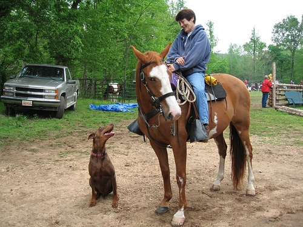

# Qwen3-VL-2B-Instruct-GPTQ-Int4-C512-P3584-CTX4095 部署指南

Qwen3-VL-2B-Instruct-GPTQ-Int4-C512-P3584-CTX4095 用于图像与视频帧理解。本页说明 M.2 算力卡的接入条件、部署步骤与结果检查方法。

> 已实测，效果仍需评估。[查看部署效果](#查看部署效果)。

## 准备运行环境

本页效果展示使用 **RK3576 + AX8850 16GB M.2**；其他容量或平台需重新确认模型能否加载并正确运行。

在连接算力卡的 Linux 主机终端执行，RK3576 使用 ARM64 环境。首次部署先完成[驱动与设备检查](../../usage/device-check.md)、[准备主机环境](../../getting-started/prepare.md)和[下载工具安装](../../usage/download-models.md#使用-hugging-face-下载)。已完成这些步骤可直接下载模型。

后文使用设备 0，运行前用 `axcl-smi` 确认设备可用。

## 下载模型与样例

本页使用 `AXERA-TECH/Qwen3-VL-2B-Instruct-GPTQ-Int4-C512-P3584-CTX4095` 的固定版本。下面下载本页选用的 34 个文件。

```bash
MODEL_DIR=~/edgeaccel/models/qwen3-vl-2b-instruct-gptq-int4-c512-p3584-ctx4095/ced30de327fc
mkdir -p "$MODEL_DIR"
~/edgeaccel/hf-env/bin/hf download AXERA-TECH/Qwen3-VL-2B-Instruct-GPTQ-Int4-C512-P3584-CTX4095 \
  --include "*" \
  --revision ced30de327fcd7580ac26ebd6d18a7fc6a2bb028 \
  --local-dir "$MODEL_DIR"
cd "$MODEL_DIR"
```

保留当前终端中的 `MODEL_DIR` 变量，后续命令沿用此目录。下载受阻或需要离线复制时，见[下载方式与文件校验](../../usage/download-models.md)。

## 准备配套程序

本例使用 RK3576 主机、AX8850 16GB M.2 算力卡和 AXCL 3.16。下载前为模型预留至少 4GB 存储空间；词嵌入读取约占 594 MiB 主机内存。程序依赖 OpenCV 4.6，当前结果仅覆盖 16GB 卡。

本仓库提供 Int4 权重，分词文件和样例取自固定版本的 [Qwen3-VL-2B 标准版](https://huggingface.co/AXERA-TECH/Qwen3-VL-2B-Instruct/tree/b88b51a9b583a5480717de7955a7b10a28dde9d4)。配套包已包含这些文件及来源校验记录，无需另行下载标准版模型权重。

下载[配套运行包](/examples/qwen3-vl2-c512-fixed-20261002.tar.gz)，保存到 `~/edgeaccel/`。保留前文设置的 `MODEL_DIR`，在连接算力卡的 Linux 主机执行：

```bash
cd ~/edgeaccel
tar -xzf qwen3-vl2-c512-fixed-20261002.tar.gz
chmod +x qwen3-vl2-c512-fixed/main_axcl_aarch64
ldd qwen3-vl2-c512-fixed/main_axcl_aarch64
python3 qwen3-vl2-c512-fixed/verify_models.py "$MODEL_DIR"
```

`ldd` 输出不应出现 `not found`，校验程序应输出 `Verified 34 model files`。校验失败时，重新下载对应固定版本文件后再运行。

运行包使用本地分词，无需启动 HTTP 分词服务。视觉编码器、28 个文本层和输出层在算力卡执行；分词、图像预处理和词嵌入读取在主机完成。入口固定使用设备 0 和 `top_k=1` 贪心解码。

## 运行图片问答

先选择 384 分辨率，在同一终端执行：

```bash
python3 ~/edgeaccel/qwen3-vl2-c512-fixed/run_model.py image \
  --model-dir "$MODEL_DIR" \
  --input ~/edgeaccel/qwen3-vl2-c512-fixed/companion/images/ssd_horse.jpg \
  --resolution 384 \
  --prompt 'Name the two animals in the foreground. Reply in one sentence.'
```

等待加载和推理完成，终端会输出回答并退出。程序应报告 `termination_reason=eos last_token=151645`。再用 640 分辨率运行街景描述：

```bash
python3 ~/edgeaccel/qwen3-vl2-c512-fixed/run_model.py image \
  --model-dir "$MODEL_DIR" \
  --input ~/edgeaccel/qwen3-vl2-c512-fixed/companion/images/ssd_car.jpg \
  --resolution 640 \
  --prompt '请用一句中文描述图片中的主要内容。'
```

`--resolution` 可选 `384` 或 `640`，分别加载仓库内对应的视觉编码器；文本权重相同。替换 `--input` 和 `--prompt` 可测试自己的单张图片。每条命令启动独立进程，完成后释放模型。

## 运行视频帧问答

样例包含八张已经抽取的 JPEG 帧。程序按文件名顺序、1 fps 解释帧序列，每两帧组成一个视觉组，共四组。这里的 1 fps 是输入配置，不代表原始视频的实际帧率。

```bash
python3 ~/edgeaccel/qwen3-vl2-c512-fixed/run_model.py video \
  --model-dir "$MODEL_DIR" \
  --input ~/edgeaccel/qwen3-vl2-c512-fixed/companion/video \
  --resolution 384 \
  --prompt '请用两句中文描述这些视频帧中动物的动作。'
```

将 `--resolution 384` 改为 `--resolution 640` 可使用另一视觉编码器。入口仅接受包含八张 JPEG 的目录；本例未覆盖 MP4 解码、实时视频、多轮问答或任意长度视频。

## 检查运行结果

每条推理命令完成后执行：

```bash
echo $?
axcl-smi
```

退出码应为 `0`，日志应包含真实 EOS 结束记录，设备列表不应继续显示该推理进程。`context-limit` 表示到达上下文上限，不能作为正常回答结束。对照输入核对对象、人数和动作，原始回答及本次核对结果见下方效果展示。

本轮进程耗时包含网络模型读取、加载和推理，不代表本地存储性能。实际 8GB 卡、更多输入和连续运行仍需独立验证。

## 查看配套源码

运行包包含固定源码、修改差异、编译信息、词表导出记录和文件校验值。程序基于 AXERA 的 AX-LLM 提交 `3be4cc3fee4a4c730ec7c9b8982ff4b398eefac7`，使用本页配套版本；请保持程序、分词文件和模型版本一致。


## 查看部署效果

**已运行，效果仍需评估** · RK3576 + AX8850 16GB M.2。以下输入与输出来自本页固定版本的实际运行。

已在 16GB M.2 算力卡完成 384 和 640 两种分辨率的图片问答与八帧视频问答，展示原始输出及核对结果。

**384 分辨率：五组图片问答**

以下展示固定官方输入及原始回答。每条问题使用独立进程；进程耗时包含网络读取、加载和推理。

<div className="model-effect-gallery">

<figure>

[](../../../static/validation/effects/qwen3-vl-2b-instruct-gptq-int4-c512-p3584-ctx4095-20261002/ssd_horse.jpg)

<figcaption>官方输入：骑乘者、马和狗</figcaption>
</figure>

<figure>

[](../../../static/validation/effects/qwen3-vl-2b-instruct-gptq-int4-c512-p3584-ctx4095-20261002/ssd_car.jpg)

<figcaption>官方输入：红色双层巴士与街道</figcaption>
</figure>

</div>

**示例 1：输入**

```text
Name the two animals in the foreground. Reply in one sentence.
```

**实际回复**

```text
The two animals in the foreground are a horse and a dog.
```

正确识别前景的马和狗。

**示例 2：输入**

```text
画面中有几个人清晰可见？只回答人数。
```

**实际回复**

```text
2
```

回答 2，与骑乘者和右侧红衣人物相符。

**示例 3：输入**

```text
请用一句中文描述图片中的主要内容。
```

**实际回复**

```text
一位女士站在一辆红色双层巴士前，巴士上写着“当你说‘更棒’时，事情会变得更棒”（Things get more exciting when you say 'yes'）的广告。
```

女士和红色双层巴士识别正确；广告语的中文翻译不准确，不能直接用于文字翻译任务。

**示例 4：输入**

```text
请用一句中文说出图片前景中的两种动物。
```

**实际回复**

```text
图片前景中的两种动物是马和狗。
```

中文正确识别前景的马和狗。

**示例 5：输入**

```text
Name the two animals in the foreground. Reply in one sentence.
```

**实际回复**

```text
The two animals in the foreground are a horse and a dog.
```

重复运行与首次英文回答一致；仅说明此固定输入两次一致。

| 问题 | 进程耗时 / s | 算力卡调用 |
| --- | --- | --- |
| 动物识别（英文） | 98.210 | 407 |
| 人数统计 | 94.861 | 59 |
| 街景描述（中文） | 103.695 | 1248 |
| 动物识别（中文） | 96.542 | 320 |
| 重复动物识别 | 96.553 | 407 |

**384 分辨率：两组八帧视频问答**

以下展示固定官方输入及原始回答。每条问题使用独立进程；进程耗时包含网络读取、加载和推理。

<div className="model-effect-gallery">

<figure>

[](../../../static/validation/effects/qwen3-vl-2b-instruct-gptq-int4-c512-p3584-ctx4095-20261002/frame_0000.jpg)

<figcaption>视频帧输入：第 1 帧</figcaption>
</figure>

<figure>

[](../../../static/validation/effects/qwen3-vl-2b-instruct-gptq-int4-c512-p3584-ctx4095-20261002/frame_0024.jpg)

<figcaption>视频帧输入：第 4 帧</figcaption>
</figure>

<figure>

[](../../../static/validation/effects/qwen3-vl-2b-instruct-gptq-int4-c512-p3584-ctx4095-20261002/frame_0056.jpg)

<figcaption>视频帧输入：第 8 帧</figcaption>
</figure>

</div>

**示例 1：输入**

```text
请用两句中文描述这些视频帧中动物的动作。
```

**实际回复**

```text
两只土拨鼠在山地草地上互相推搡，它们的前爪在空中挥舞，似乎在进行一场激烈的争斗。
```

描述了挥动前爪、相互推搡等可见动作；“激烈争斗”是模型推测，且没有按要求分成两句。

**示例 2：输入**

```text
Describe what the two animals are doing in these video frames. Use two sentences.
```

**实际回复**

```text
The two badgers are engaging in a playful fight, with one pushing the other with its front paws. The badger on the left is pushing the other badger's head with its front paw.
```

描述了前爪接触、推搡等动作；“playful fight”含意图推测，badgers 与中文“土拨鼠”的物种称呼不一致。

| 问题 | 进程耗时 / s | 算力卡调用 |
| --- | --- | --- |
| 动作描述（中文） | 103.523 | 931 |
| 动作描述（英文） | 106.723 | 1250 |

**640 分辨率：五组图片问答**

以下展示固定官方输入及原始回答。每条问题使用独立进程；进程耗时包含网络读取、加载和推理。

<div className="model-effect-gallery">

<figure>

[](../../../static/validation/effects/qwen3-vl-2b-instruct-gptq-int4-c512-p3584-ctx4095-20261002/ssd_horse.jpg)

<figcaption>官方输入：骑乘者、马和狗</figcaption>
</figure>

<figure>

[](../../../static/validation/effects/qwen3-vl-2b-instruct-gptq-int4-c512-p3584-ctx4095-20261002/ssd_car.jpg)

<figcaption>官方输入：红色双层巴士与街道</figcaption>
</figure>

</div>

**示例 1：输入**

```text
Name the two animals in the foreground. Reply in one sentence.
```

**实际回复**

```text
The two animals in the foreground are a horse and a dog.
```

正确识别前景的马和狗。

**示例 2：输入**

```text
画面中有几个人清晰可见？只回答人数。
```

**实际回复**

```text
2
```

回答 2，与画面中两名清晰可见的人物相符。

**示例 3：输入**

```text
请用一句中文描述图片中的主要内容。
```

**实际回复**

```text
一位女士站在一辆红色双层巴士前，背景是伦敦的街道。
```

女士和红色双层巴士识别正确；“伦敦”地名未经独立核实，此回答未测试广告文字翻译是否准确。

**示例 4：输入**

```text
请用一句中文说出图片前景中的两种动物。
```

**实际回复**

```text
图片前景中两种动物是马和狗。
```

中文正确识别前景的马和狗。

**示例 5：输入**

```text
Name the two animals in the foreground. Reply in one sentence.
```

**实际回复**

```text
The two animals in the foreground are a horse and a dog.
```

重复运行与首次英文回答一致；仅说明此固定输入两次一致。

| 问题 | 进程耗时 / s | 算力卡调用 |
| --- | --- | --- |
| 动物识别（英文） | 102.025 | 407 |
| 人数统计 | 98.880 | 59 |
| 街景描述（中文） | 101.125 | 494 |
| 动物识别（中文） | 99.730 | 320 |
| 重复动物识别 | 100.468 | 407 |

**640 分辨率：两组八帧视频问答**

以下展示固定官方输入及原始回答。每条问题使用独立进程；进程耗时包含网络读取、加载和推理。

<div className="model-effect-gallery">

<figure>

[](../../../static/validation/effects/qwen3-vl-2b-instruct-gptq-int4-c512-p3584-ctx4095-20261002/frame_0000.jpg)

<figcaption>视频帧输入：第 1 帧</figcaption>
</figure>

<figure>

[](../../../static/validation/effects/qwen3-vl-2b-instruct-gptq-int4-c512-p3584-ctx4095-20261002/frame_0024.jpg)

<figcaption>视频帧输入：第 4 帧</figcaption>
</figure>

<figure>

[](../../../static/validation/effects/qwen3-vl-2b-instruct-gptq-int4-c512-p3584-ctx4095-20261002/frame_0056.jpg)

<figcaption>视频帧输入：第 8 帧</figcaption>
</figure>

</div>

**示例 1：输入**

```text
请用两句中文描述这些视频帧中动物的动作。
```

**实际回复**

```text
两只动物在山地草地上互相推搡，它们的前爪在空中挥舞，似乎在进行一场激烈的互动。
```

前爪挥动和相互推搡与可见画面相符；没有按要求分成两句，“激烈的互动”属于概括性描述。

**示例 2：输入**

```text
Describe what the two animals are doing in these video frames. Use two sentences.
```

**实际回复**

```text
The two animals are play-fighting, with one of them jumping and the other responding with a playful leap. They are both facing each other, their paws raised in a playful interaction.
```

抬爪接触与画面相符；“play-fighting”和连续跳跃的描述未经独立确认，不能据此判断动作意图。

| 问题 | 进程耗时 / s | 算力卡调用 |
| --- | --- | --- |
| 动作描述（中文） | 116.384 | 900 |
| 动作描述（英文） | 117.634 | 1219 |

**使用时注意：**

- 384 街景回答存在广告语中文翻译错误；640 回答没有翻译广告，不能据此认定翻译问题已经解决。
- 384 视频中英文的物种称呼不一致；两种分辨率的中文视频回答均未遵循两句要求。

这些结果用于对照部署后的输出，未覆盖完整数据集精度或长期连续运行。

<details>
<summary>查看样例环境与运行耗时</summary>

环境：RK3576 + AX8850 16GB M.2。模型版本：`ced30de327fcd7580ac26ebd6d18a7fc6a2bb028`。

| 组件 | 版本或配置 |
| --- | --- |
| 主机 / 内核 | RK3576，约 4GB RAM，6.1.115-vendor-rk35xx |
| AXCL / 驱动 | V3.16.0_20260729180218 |
| 固件 / CMM | V3.16.0 / 15232 MiB |
| 运行方式 | 固定 AXCL C++ 配套程序 / AX-LLM 3be4cc3 + 本页修复 / 本地原生分词 |

| 指标 | 实测值 | 计时或统计范围 |
| --- | --- | --- |
| 输入覆盖 | 2 张图片 / 8 帧视频 | 每种分辨率 5 条图片问题、2 条视频问题，共 14 个独立进程。 |
| 算力卡执行 | 31 个 AXModel | 两种图像编码器、28 个文本层与输出层均执行并释放，共 8428 次调用。 |
| 视觉输入 | 384 × 384 / 640 × 640 | 单图 1 组、八帧视频 4 组视觉执行。 |

适用范围：

- 地点名称、玩耍或争斗意图，以及英文视频的连续跳跃描述未独立核实。
- 视频使用官方八张 JPEG，按文件名排序并以 1 fps 解释；未验证原始视频时基、MP4 解码或实时视频。
- 14 条问题均以 EOS=151645 结束。本次输入最多 1667 token；本例不包含多轮、长上下文和连续运行。
- 实际 8GB 卡仍需独立验证。进程耗时包含网络读取和加载，不代表本地存储性能；尚未完成所有中间张量的浮点对照。

</details>

遇到加载、内存或后端错误时，按[常见问题](../../usage/troubleshooting.md)处理。需要更换输入或接入业务时，按[检查输出与记录结果](../../reference/validation.md)保留自己的结果。

<details>
<summary>查看文件用途与版本信息</summary>

| 文件 / 目录内路径 | 用途 |
| --- | --- |
| [`Qwen3-VL-2B-Instruct-GPTQ-Int4-AX650-C512-P3584-CTX4095/Qwen3-VL-2B-Instruct_vision.axmodel`](https://huggingface.co/AXERA-TECH/Qwen3-VL-2B-Instruct-GPTQ-Int4-C512-P3584-CTX4095/blob/ced30de327fcd7580ac26ebd6d18a7fc6a2bb028/Qwen3-VL-2B-Instruct-GPTQ-Int4-AX650-C512-P3584-CTX4095/Qwen3-VL-2B-Instruct_vision.axmodel) | 编译模型；按目录区分芯片和规格 |
| [`Qwen3-VL-2B-Instruct-GPTQ-Int4-AX650-C512-P3584-CTX4095/Qwen3-VL-2B-Instruct_vision_640x640.axmodel`](https://huggingface.co/AXERA-TECH/Qwen3-VL-2B-Instruct-GPTQ-Int4-C512-P3584-CTX4095/blob/ced30de327fcd7580ac26ebd6d18a7fc6a2bb028/Qwen3-VL-2B-Instruct-GPTQ-Int4-AX650-C512-P3584-CTX4095/Qwen3-VL-2B-Instruct_vision_640x640.axmodel) | 编译模型；按目录区分芯片和规格 |
| [`Qwen3-VL-2B-Instruct-GPTQ-Int4-AX650-C512-P3584-CTX4095/qwen3_vl_text_p512_l0_together.axmodel`](https://huggingface.co/AXERA-TECH/Qwen3-VL-2B-Instruct-GPTQ-Int4-C512-P3584-CTX4095/blob/ced30de327fcd7580ac26ebd6d18a7fc6a2bb028/Qwen3-VL-2B-Instruct-GPTQ-Int4-AX650-C512-P3584-CTX4095/qwen3_vl_text_p512_l0_together.axmodel) | 编译模型；按目录区分芯片和规格 |
| [`Qwen3-VL-2B-Instruct-GPTQ-Int4-AX650-C512-P3584-CTX4095/qwen3_vl_text_p512_l10_together.axmodel`](https://huggingface.co/AXERA-TECH/Qwen3-VL-2B-Instruct-GPTQ-Int4-C512-P3584-CTX4095/blob/ced30de327fcd7580ac26ebd6d18a7fc6a2bb028/Qwen3-VL-2B-Instruct-GPTQ-Int4-AX650-C512-P3584-CTX4095/qwen3_vl_text_p512_l10_together.axmodel) | 编译模型；按目录区分芯片和规格 |
| [`Qwen3-VL-2B-Instruct-GPTQ-Int4-AX650-C512-P3584-CTX4095/qwen3_vl_text_p512_l11_together.axmodel`](https://huggingface.co/AXERA-TECH/Qwen3-VL-2B-Instruct-GPTQ-Int4-C512-P3584-CTX4095/blob/ced30de327fcd7580ac26ebd6d18a7fc6a2bb028/Qwen3-VL-2B-Instruct-GPTQ-Int4-AX650-C512-P3584-CTX4095/qwen3_vl_text_p512_l11_together.axmodel) | 编译模型；按目录区分芯片和规格 |

仓库提交：`ced30de327fcd7580ac26ebd6d18a7fc6a2bb028`。仓库中的 31 个 `.axmodel` 文件可能包括多个芯片、规格和分片。运行时使用本页指定的配套文件，完整列表见[固定版本目录](https://huggingface.co/AXERA-TECH/Qwen3-VL-2B-Instruct-GPTQ-Int4-C512-P3584-CTX4095/tree/ced30de327fcd7580ac26ebd6d18a7fc6a2bb028)。

</details>

<details>
<summary>补充说明与版本差异</summary>

- 保留该 GPTQ 量化版本的分片、embedding 和配置，不能与同系列非量化模型混放。
- 名称中的编译规格用于区分上下文与分块版本；不要仅修改 config.json 就视为扩大模型支持的上下文。

</details>

## 参考资料

- [常用术语](../../reference/glossary.md)：AXCL、CMM、分词器与推理指标。
- [固定版本文件表](https://huggingface.co/AXERA-TECH/Qwen3-VL-2B-Instruct-GPTQ-Int4-C512-P3584-CTX4095/tree/ced30de327fcd7580ac26ebd6d18a7fc6a2bb028)。
- [模型卡 / 使用说明](https://huggingface.co/AXERA-TECH/Qwen3-VL-2B-Instruct-GPTQ-Int4-C512-P3584-CTX4095/blob/ced30de327fcd7580ac26ebd6d18a7fc6a2bb028/README.md)。

返回[完整模型目录](../catalog.mdx)。
