# RAFT-stereo 部署指南

RAFT-stereo 用于深度估计。本页说明 M.2 算力卡的接入条件、部署步骤与结果检查方法。

> 已实测，效果仍需评估。[查看部署效果](#查看部署效果)。

## 准备运行环境

本页效果展示使用 **RK3576 + AX8850 16GB M.2**；其他容量或平台需重新确认模型能否加载并正确运行。

在连接算力卡的 Linux 主机终端执行，RK3576 使用 ARM64 环境。首次部署先完成[驱动与设备检查](../../usage/device-check.md)、[安装 PyAXEngine](../../usage/python.md)和[下载工具安装](../../usage/download-models.md#使用-hugging-face-下载)。已完成这些步骤可直接下载模型。

后文使用设备 0，运行前用 `axcl-smi` 确认设备可用。

## 下载模型与样例

本页使用 `AXERA-TECH/RAFT-stereo` 的固定版本。下面下载本页选用的 24 个文件。

```bash
MODEL_DIR=~/edgeaccel/models/raft-stereo/58fd067370fb
mkdir -p "$MODEL_DIR"
~/edgeaccel/hf-env/bin/hf download AXERA-TECH/RAFT-stereo \
  "README.md" \
  "infer.py" \
  "ax650/raft_steoro256x640_r1.axmodel" \
  "ax650/raft_steoro384x1280_r4.axmodel" \
  "examples/left/000051_11.png" \
  "examples/left/000058_11.png" \
  "examples/left/000059_10.png" \
  "examples/left/000121_10.png" \
  "examples/left/000164_10.png" \
  "examples/left/000167_11.png" \
  "examples/left/000172_11.png" \
  "examples/left/000179_10.png" \
  "examples/left/000193_10.png" \
  "examples/left/000195_10.png" \
  "examples/right/000051_11.png" \
  "examples/right/000058_11.png" \
  "examples/right/000059_10.png" \
  "examples/right/000121_10.png" \
  "examples/right/000164_10.png" \
  "examples/right/000167_11.png" \
  "examples/right/000172_11.png" \
  "examples/right/000179_10.png" \
  "examples/right/000193_10.png" \
  "examples/right/000195_10.png" \
  --revision 58fd067370fb50d3a3997978886403555ec342b6 \
  --local-dir "$MODEL_DIR"
cd "$MODEL_DIR"
```

保留当前终端中的 `MODEL_DIR` 变量，后续命令沿用此目录。下载受阻或需要离线复制时，见[下载方式与文件校验](../../usage/download-models.md)。

## 准备双目推理例程

在 RK3576 主机激活已安装 [PyAXEngine](../../usage/python.md) 的环境：

```bash
source ~/edgeaccel/python-env/bin/activate
python -m pip install 'numpy==1.26.4' 'opencv-python-headless==4.11.0.86' 'matplotlib==3.10.8'
python -c "import axengine; print(axengine.get_available_providers())"
```

确认包含 `AXCLRTExecutionProvider`。下载 [RAFT-Stereo 算力卡例程](../../../static/examples/raft_stereo_card.py)，保存为 `~/edgeaccel/raft_stereo_card.py`。

本页使用官方 AX650 目录中的两份权重。文件名中的 `steoro` 沿用上游命名，不要自行改为 `stereo`。

| 选项 | 权重 | 输入宽×高 |
| --- | --- | --- |
| `r1` | `raft_steoro256x640_r1.axmodel` | 640×256 |
| `r4` | `raft_steoro384x1280_r4.axmodel` | 1280×384 |

## 生成两种规格的视差图

保持下载步骤中的 `MODEL_DIR`。先运行 `r1`，结束后再运行 `r4`：

```bash
python ~/edgeaccel/raft_stereo_card.py \
  --model-dir "$MODEL_DIR" --variant r1 \
  --output ~/edgeaccel/results/raft-r1

python ~/edgeaccel/raft_stereo_card.py \
  --model-dir "$MODEL_DIR" --variant r4 \
  --output ~/edgeaccel/results/raft-r4
```

输出目录需要尚不存在。每个规格处理 `examples/left` 和 `examples/right` 中同名的 10 对图片，每对重复两次。

例程沿用官方 RGB、uint8、NHWC 图像处理方式，并显式选择算力卡后端。输出视差缩放回原图尺寸，数值乘以“原图宽度 / 模型输入宽度”。输入左右图不可交换，尺寸必须一致。

## 查看视差结果

打开输出目录中的 `*-disparity.png`，对照同名 `*-left.png`、`*-right.png`。

| 文件 | 内容 |
| --- | --- |
| `*-left.png`、`*-right.png` | 实际左右目输入 |
| `*-disparity.png` | 本次视差图，统一采用 0–256 像素色阶 |
| `*-raw.npz` | 原始模型输出及恢复到原图尺寸的像素视差 |
| `deployment-result.json` | 输入校验、尺寸、两次一致性、耗时和视差统计 |

蓝色表示较小视差，红色表示较大视差；超出 256 的值只在显示时截断，原始数组仍完整保存。视差不是米制距离，实际测距需要已标定、已校正的双目相机和对应参数。

完成后，记录中的 `completed` 应为 `true`，具有 10 对输入结果，重复输出一致且数值有限。以下展示两种规格的全部实测结果；车辆边缘、遮挡和路面异常需结合参考视差进一步判断。


## 查看部署效果

**已运行，效果仍需评估** · RK3576 + AX8850 16GB M.2。以下输入与输出来自本页固定版本的实际运行。

16GB 算力卡完成两规格、10 对双目图，共 20 份视差输出。按原图尺度比较，r1 与 r4 每组平均绝对差为 3.467–39.374 像素；这只是规格间差异，尚无标注支持精度排名。

**000051_11.png**

左侧近车轮廓在两份输出中均可辨，r1 的车辆和右侧边缘具有更高视差值。 色阶固定为 0–256 原图像素，蓝色较小、红色较大；不是米制距离。

<div className="model-effect-gallery">

<figure>

[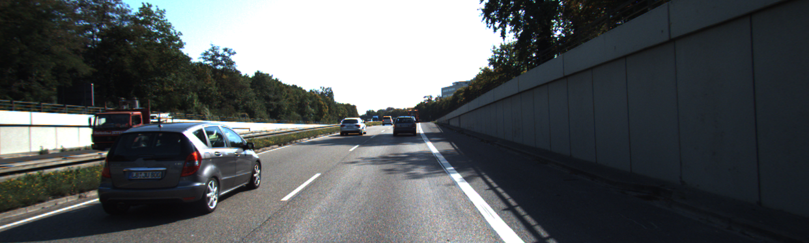](../../../static/validation/effects/raft-stereo-20260928/000051_11-left.webp)

<figcaption>实际左目 · 000051_11</figcaption>
</figure>

<figure>

[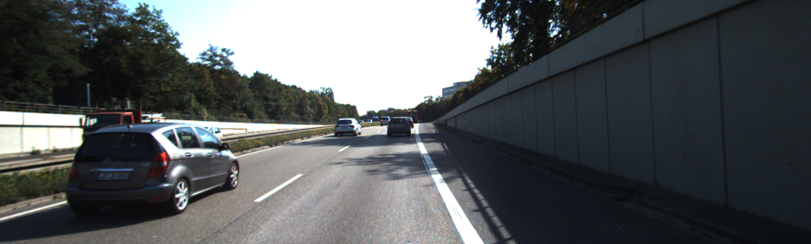](../../../static/validation/effects/raft-stereo-20260928/000051_11-right.webp)

<figcaption>实际右目 · 000051_11</figcaption>
</figure>

<figure>

[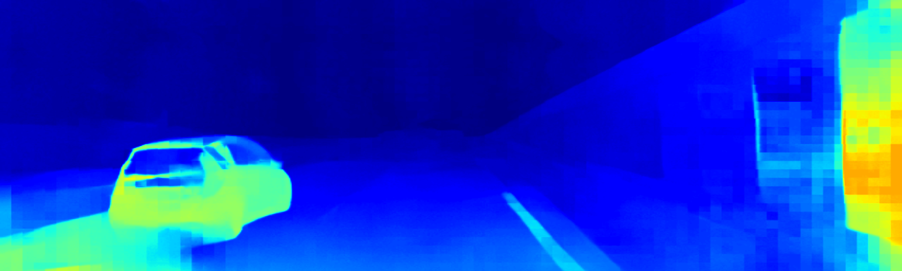](../../../static/validation/effects/raft-stereo-20260928/000051_11-r1.webp)

<figcaption>r1 · 本次像素视差</figcaption>
</figure>

<figure>

[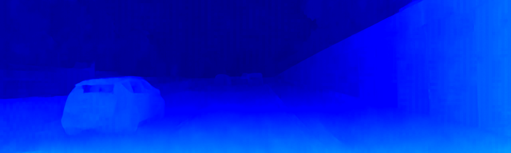](../../../static/validation/effects/raft-stereo-20260928/000051_11-r4.webp)

<figcaption>r4 · 本次像素视差</figcaption>
</figure>

</div>

| 规格 | 视差中位数 / px | 95% 分位 / px | 两次推理 / ms |
| --- | --- | --- | --- |
| r1 | 28.61 | 135.19 | 35.247 / 31.158 |
| r4 | 31.03 | 58.71 | 139.686 / 135.380 |

**000058_11.png**

远近路面存在颜色梯度；r1 左侧车辆附近呈块状区域，r4 该区域过渡更平缓。 色阶固定为 0–256 原图像素，蓝色较小、红色较大；不是米制距离。

<div className="model-effect-gallery">

<figure>

[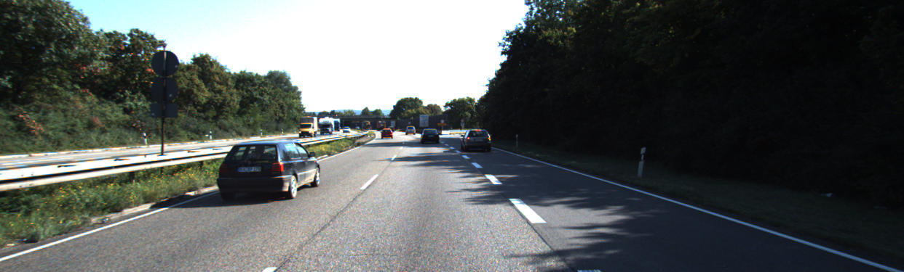](../../../static/validation/effects/raft-stereo-20260928/000058_11-left.webp)

<figcaption>实际左目 · 000058_11</figcaption>
</figure>

<figure>

[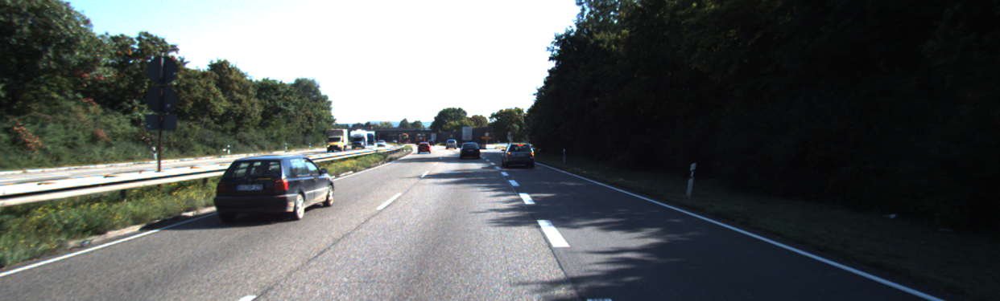](../../../static/validation/effects/raft-stereo-20260928/000058_11-right.webp)

<figcaption>实际右目 · 000058_11</figcaption>
</figure>

<figure>

[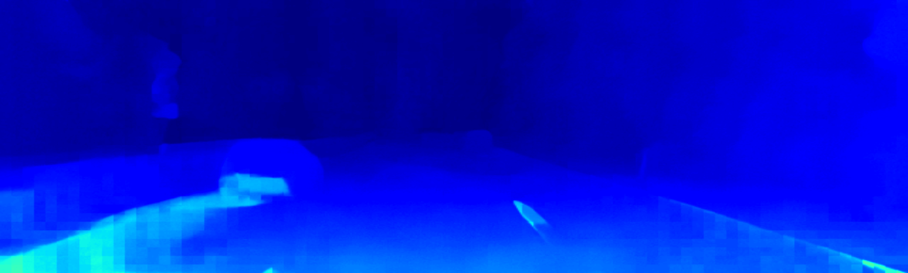](../../../static/validation/effects/raft-stereo-20260928/000058_11-r1.webp)

<figcaption>r1 · 本次像素视差</figcaption>
</figure>

<figure>

[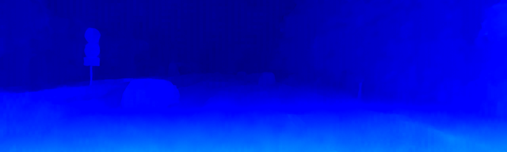](../../../static/validation/effects/raft-stereo-20260928/000058_11-r4.webp)

<figcaption>r4 · 本次像素视差</figcaption>
</figure>

</div>

| 规格 | 视差中位数 / px | 95% 分位 / px | 两次推理 / ms |
| --- | --- | --- | --- |
| r1 | 21.18 | 62.91 | 30.707 / 30.435 |
| r4 | 21.27 | 58.35 | 136.123 / 135.711 |

**000059_10.png**

左侧近车在两份输出中均形成区域；r1 与 r4 的近车视差数值明显不同。 色阶固定为 0–256 原图像素，蓝色较小、红色较大；不是米制距离。

<div className="model-effect-gallery">

<figure>

[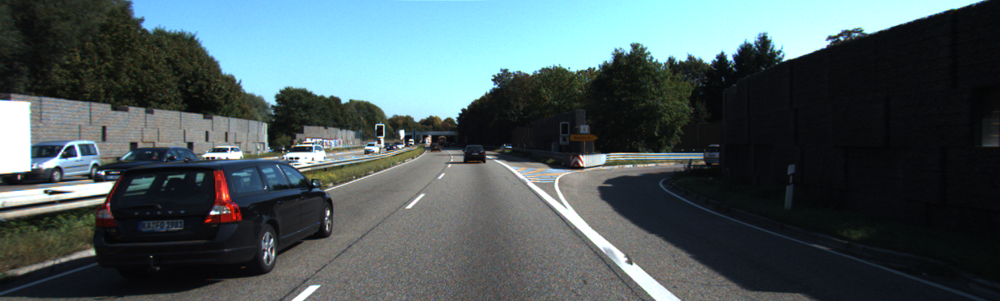](../../../static/validation/effects/raft-stereo-20260928/000059_10-left.webp)

<figcaption>实际左目 · 000059_10</figcaption>
</figure>

<figure>

[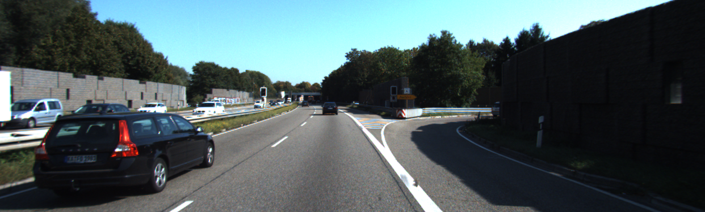](../../../static/validation/effects/raft-stereo-20260928/000059_10-right.webp)

<figcaption>实际右目 · 000059_10</figcaption>
</figure>

<figure>

[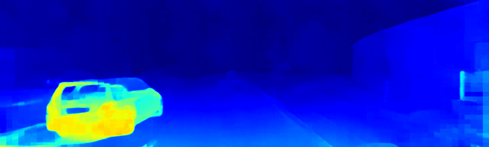](../../../static/validation/effects/raft-stereo-20260928/000059_10-r1.webp)

<figcaption>r1 · 本次像素视差</figcaption>
</figure>

<figure>

[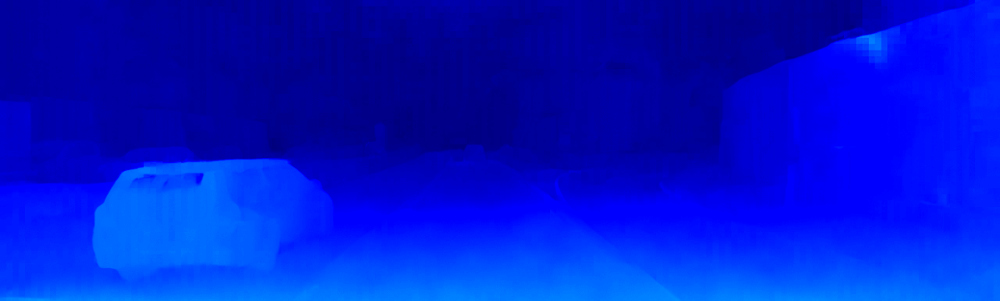](../../../static/validation/effects/raft-stereo-20260928/000059_10-r4.webp)

<figcaption>r4 · 本次像素视差</figcaption>
</figure>

</div>

| 规格 | 视差中位数 / px | 95% 分位 / px | 两次推理 / ms |
| --- | --- | --- | --- |
| r1 | 21.43 | 112.99 | 30.672 / 30.595 |
| r4 | 21.47 | 58.91 | 135.674 / 135.449 |

**000121_10.png**

r1 下方路面出现较大的高视差区域，r4 同处颜色较低；不能仅凭色图认定哪份更准确。 色阶固定为 0–256 原图像素，蓝色较小、红色较大；不是米制距离。

<div className="model-effect-gallery">

<figure>

[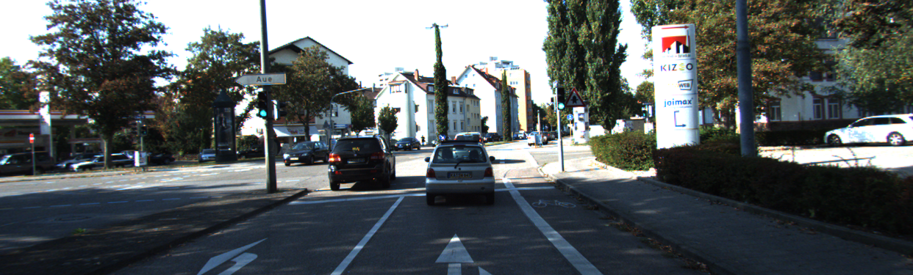](../../../static/validation/effects/raft-stereo-20260928/000121_10-left.webp)

<figcaption>实际左目 · 000121_10</figcaption>
</figure>

<figure>

[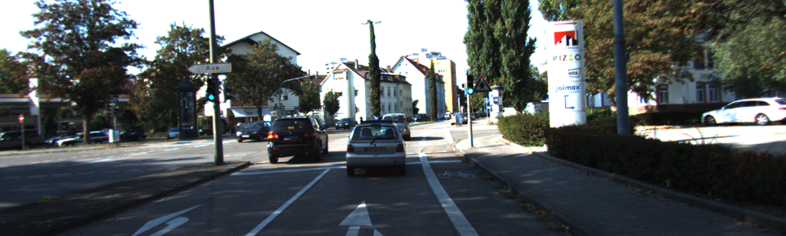](../../../static/validation/effects/raft-stereo-20260928/000121_10-right.webp)

<figcaption>实际右目 · 000121_10</figcaption>
</figure>

<figure>

[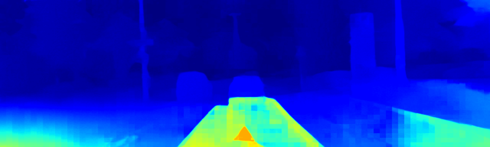](../../../static/validation/effects/raft-stereo-20260928/000121_10-r1.webp)

<figcaption>r1 · 本次像素视差</figcaption>
</figure>

<figure>

[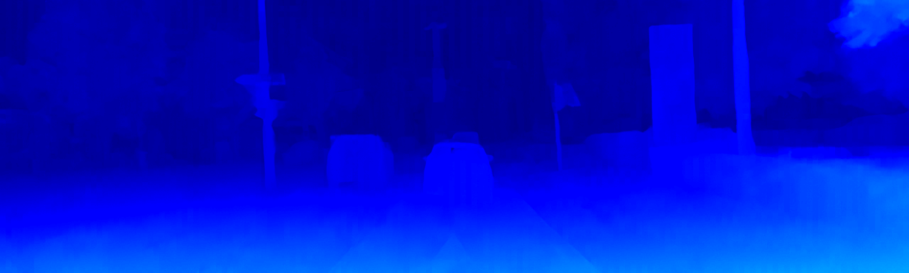](../../../static/validation/effects/raft-stereo-20260928/000121_10-r4.webp)

<figcaption>r4 · 本次像素视差</figcaption>
</figure>

</div>

| 规格 | 视差中位数 / px | 95% 分位 / px | 两次推理 / ms |
| --- | --- | --- | --- |
| r1 | 15.09 | 115.45 | 28.072 / 27.847 |
| r4 | 15.30 | 58.57 | 135.798 / 135.741 |

**000164_10.png**

车辆与右侧行人附近可见局部结构；小目标和阴影边界需标注数据复核。 色阶固定为 0–256 原图像素，蓝色较小、红色较大；不是米制距离。

<div className="model-effect-gallery">

<figure>

[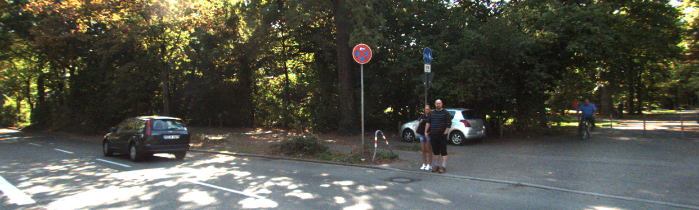](../../../static/validation/effects/raft-stereo-20260928/000164_10-left.webp)

<figcaption>实际左目 · 000164_10</figcaption>
</figure>

<figure>

[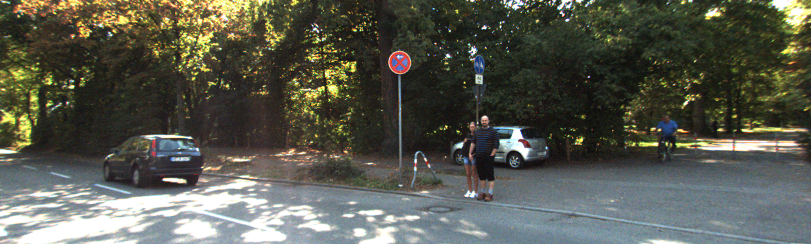](../../../static/validation/effects/raft-stereo-20260928/000164_10-right.webp)

<figcaption>实际右目 · 000164_10</figcaption>
</figure>

<figure>

[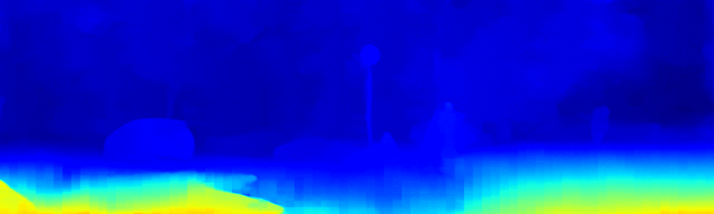](../../../static/validation/effects/raft-stereo-20260928/000164_10-r1.webp)

<figcaption>r1 · 本次像素视差</figcaption>
</figure>

<figure>

[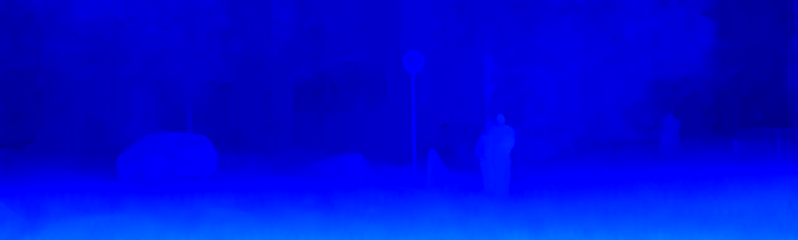](../../../static/validation/effects/raft-stereo-20260928/000164_10-r4.webp)

<figcaption>r4 · 本次像素视差</figcaption>
</figure>

</div>

| 规格 | 视差中位数 / px | 95% 分位 / px | 两次推理 / ms |
| --- | --- | --- | --- |
| r1 | 18.59 | 130.40 | 30.674 / 30.538 |
| r4 | 19.94 | 52.38 | 129.505 / 130.763 |

**000167_11.png**

左侧近车和右侧立柱均形成可辨区域；两规格近处数值差异明显。 色阶固定为 0–256 原图像素，蓝色较小、红色较大；不是米制距离。

<div className="model-effect-gallery">

<figure>

[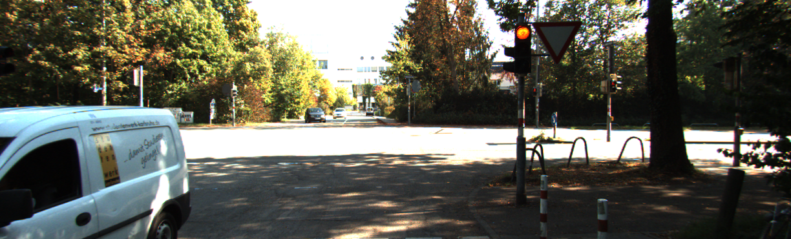](../../../static/validation/effects/raft-stereo-20260928/000167_11-left.webp)

<figcaption>实际左目 · 000167_11</figcaption>
</figure>

<figure>

[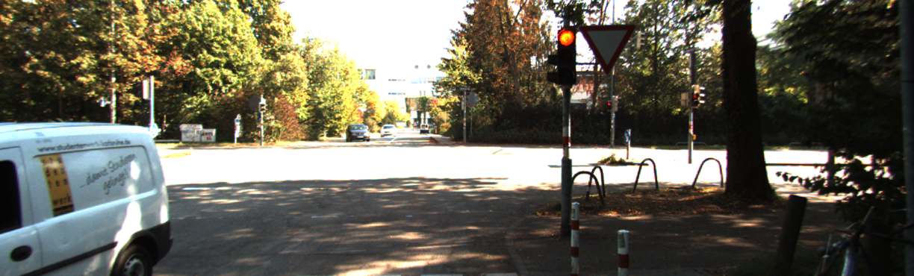](../../../static/validation/effects/raft-stereo-20260928/000167_11-right.webp)

<figcaption>实际右目 · 000167_11</figcaption>
</figure>

<figure>

[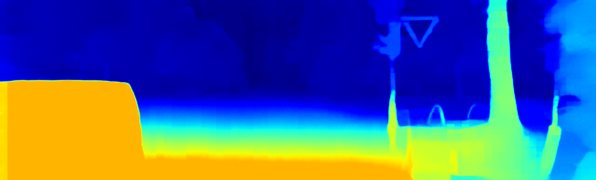](../../../static/validation/effects/raft-stereo-20260928/000167_11-r1.webp)

<figcaption>r1 · 本次像素视差</figcaption>
</figure>

<figure>

[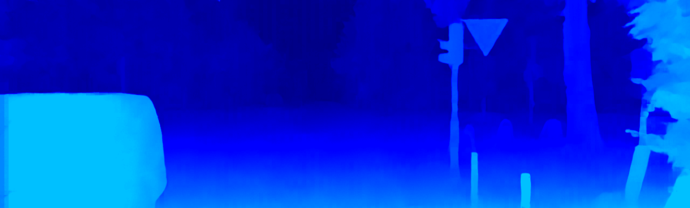](../../../static/validation/effects/raft-stereo-20260928/000167_11-r4.webp)

<figcaption>r4 · 本次像素视差</figcaption>
</figure>

</div>

| 规格 | 视差中位数 / px | 95% 分位 / px | 两次推理 / ms |
| --- | --- | --- | --- |
| r1 | 34.99 | 183.37 | 30.520 / 30.437 |
| r4 | 23.66 | 80.07 | 133.675 / 133.212 |

**000172_11.png**

前车轮廓可见，r1 车前路面有明显块状变化。 色阶固定为 0–256 原图像素，蓝色较小、红色较大；不是米制距离。

<div className="model-effect-gallery">

<figure>

[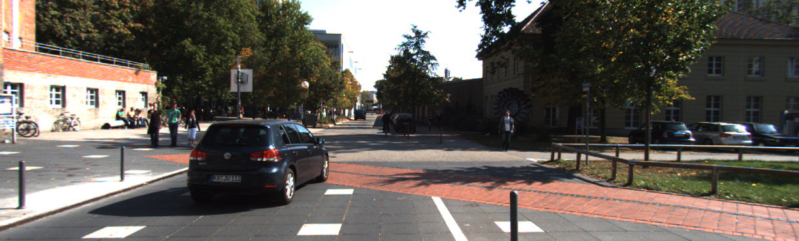](../../../static/validation/effects/raft-stereo-20260928/000172_11-left.webp)

<figcaption>实际左目 · 000172_11</figcaption>
</figure>

<figure>

[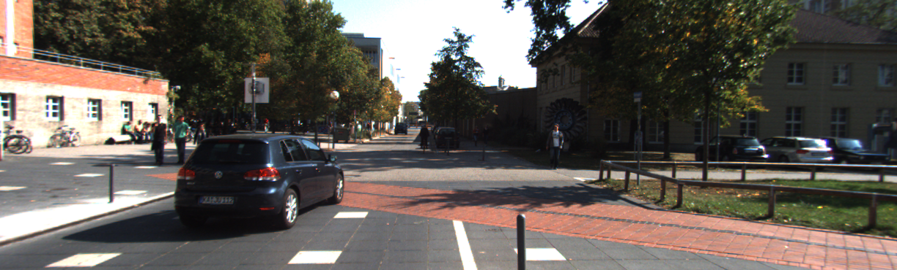](../../../static/validation/effects/raft-stereo-20260928/000172_11-right.webp)

<figcaption>实际右目 · 000172_11</figcaption>
</figure>

<figure>

[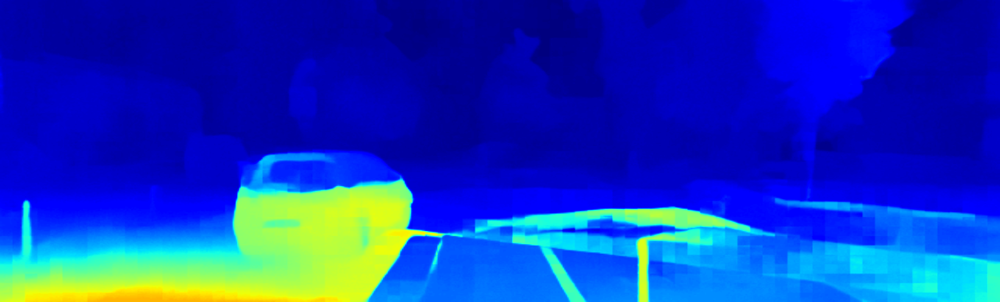](../../../static/validation/effects/raft-stereo-20260928/000172_11-r1.webp)

<figcaption>r1 · 本次像素视差</figcaption>
</figure>

<figure>

[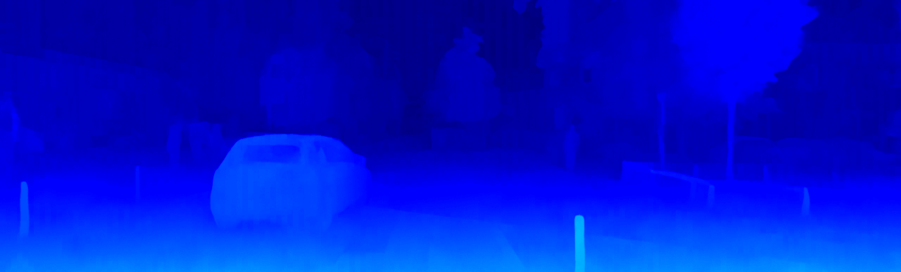](../../../static/validation/effects/raft-stereo-20260928/000172_11-r4.webp)

<figcaption>r4 · 本次像素视差</figcaption>
</figure>

</div>

| 规格 | 视差中位数 / px | 95% 分位 / px | 两次推理 / ms |
| --- | --- | --- | --- |
| r1 | 16.37 | 144.76 | 30.408 / 30.152 |
| r4 | 16.55 | 60.07 | 129.553 / 130.639 |

**000179_10.png**

近处行人、车站立面和远处街道呈现不同视差区域；遮挡边界未做精度评测。 色阶固定为 0–256 原图像素，蓝色较小、红色较大；不是米制距离。

<div className="model-effect-gallery">

<figure>

[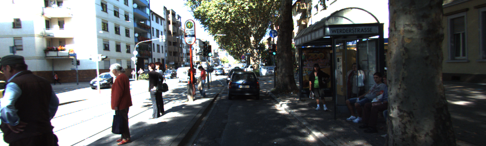](../../../static/validation/effects/raft-stereo-20260928/000179_10-left.webp)

<figcaption>实际左目 · 000179_10</figcaption>
</figure>

<figure>

[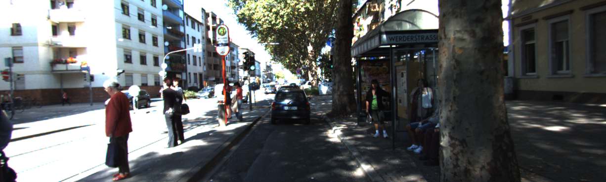](../../../static/validation/effects/raft-stereo-20260928/000179_10-right.webp)

<figcaption>实际右目 · 000179_10</figcaption>
</figure>

<figure>

[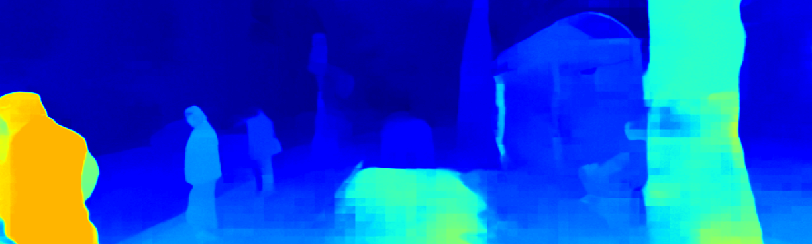](../../../static/validation/effects/raft-stereo-20260928/000179_10-r1.webp)

<figcaption>r1 · 本次像素视差</figcaption>
</figure>

<figure>

[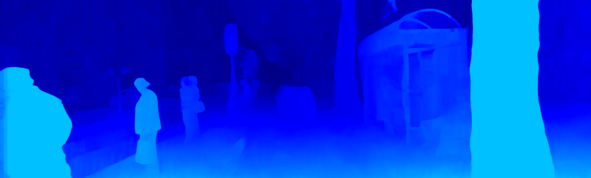](../../../static/validation/effects/raft-stereo-20260928/000179_10-r4.webp)

<figcaption>r4 · 本次像素视差</figcaption>
</figure>

</div>

| 规格 | 视差中位数 / px | 95% 分位 / px | 两次推理 / ms |
| --- | --- | --- | --- |
| r1 | 36.04 | 173.30 | 30.718 / 30.338 |
| r4 | 35.03 | 80.20 | 133.930 / 133.181 |

**000193_10.png**

r1 下方路面高视差区域明显，r4 路面梯度更平缓；实际误差尚无参考视差验证。 色阶固定为 0–256 原图像素，蓝色较小、红色较大；不是米制距离。

<div className="model-effect-gallery">

<figure>

[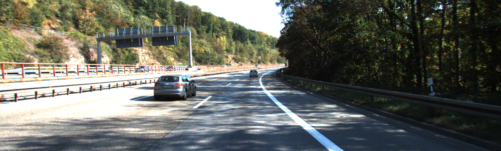](../../../static/validation/effects/raft-stereo-20260928/000193_10-left.webp)

<figcaption>实际左目 · 000193_10</figcaption>
</figure>

<figure>

[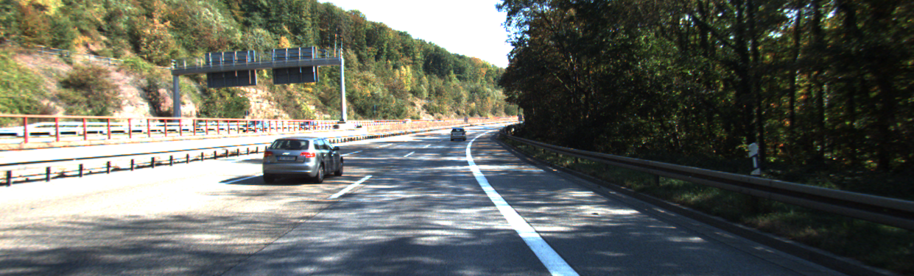](../../../static/validation/effects/raft-stereo-20260928/000193_10-right.webp)

<figcaption>实际右目 · 000193_10</figcaption>
</figure>

<figure>

[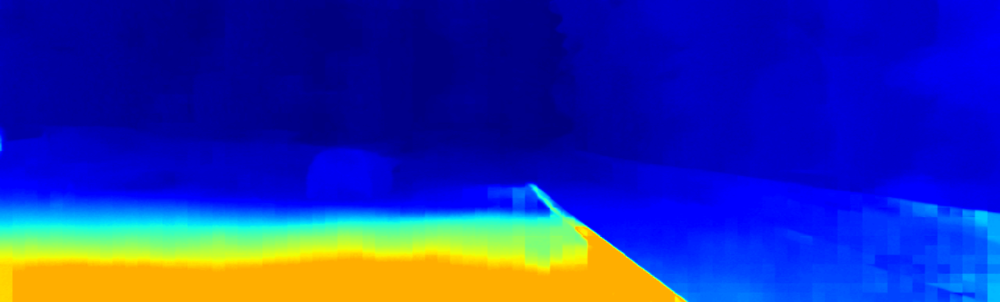](../../../static/validation/effects/raft-stereo-20260928/000193_10-r1.webp)

<figcaption>r1 · 本次像素视差</figcaption>
</figure>

<figure>

[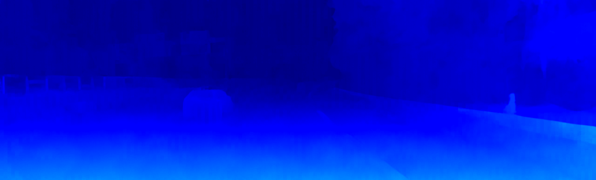](../../../static/validation/effects/raft-stereo-20260928/000193_10-r4.webp)

<figcaption>r4 · 本次像素视差</figcaption>
</figure>

</div>

| 规格 | 视差中位数 / px | 95% 分位 / px | 两次推理 / ms |
| --- | --- | --- | --- |
| r1 | 17.46 | 185.91 | 30.442 / 30.286 |
| r4 | 19.59 | 59.86 | 133.687 / 133.105 |

**000195_10.png**

左侧红车和右侧道路标牌可辨，r1 底部道路存在块状高视差区域。 色阶固定为 0–256 原图像素，蓝色较小、红色较大；不是米制距离。

<div className="model-effect-gallery">

<figure>

[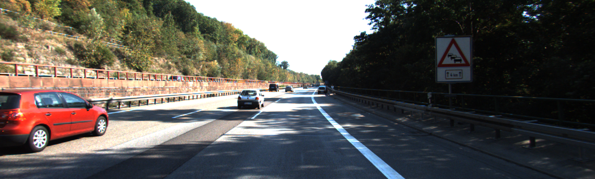](../../../static/validation/effects/raft-stereo-20260928/000195_10-left.webp)

<figcaption>实际左目 · 000195_10</figcaption>
</figure>

<figure>

[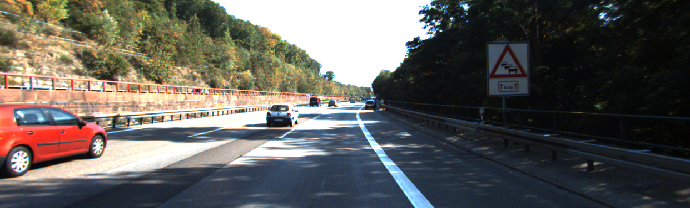](../../../static/validation/effects/raft-stereo-20260928/000195_10-right.webp)

<figcaption>实际右目 · 000195_10</figcaption>
</figure>

<figure>

[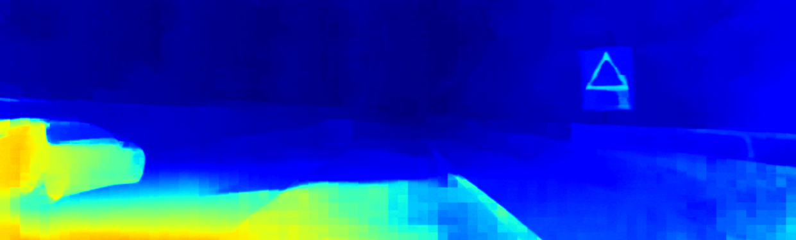](../../../static/validation/effects/raft-stereo-20260928/000195_10-r1.webp)

<figcaption>r1 · 本次像素视差</figcaption>
</figure>

<figure>

[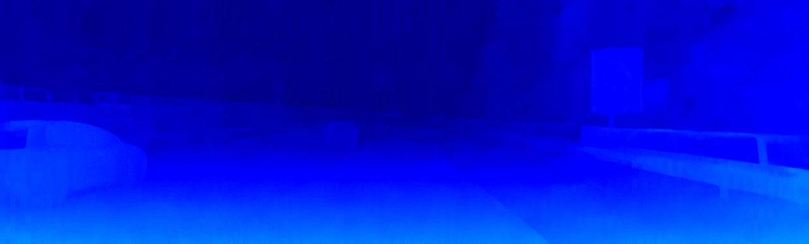](../../../static/validation/effects/raft-stereo-20260928/000195_10-r4.webp)

<figcaption>r4 · 本次像素视差</figcaption>
</figure>

</div>

| 规格 | 视差中位数 / px | 95% 分位 / px | 两次推理 / ms |
| --- | --- | --- | --- |
| r1 | 19.66 | 149.56 | 30.688 / 30.361 |
| r4 | 22.91 | 59.07 | 133.784 / 133.306 |

**比较两规格的原图视差**

两规格均先把输出双线性缩放至原图尺寸，再乘以原图宽度 / 模型输入宽度，并按官方流程取绝对值。下表直接比较保存的原图视差数组，没有重新归一化、拟合比例或裁剪数值。平均差和 95% 分位差均不是标注 EPE；r4 画面较平滑不能证明其更准确。色图统一为 0–256 原图像素，本次 20 份结果均没有超过色阶上限的像素。

| 图片组 | r1 / r4 平均绝对差 / 原图 px | 95% 分位差 / 原图 px |
| --- | --- | --- |
| 000051_11.png | 14.255 | 83.314 |
| 000058_11.png | 3.467 | 12.839 |
| 000059_10.png | 9.253 | 64.800 |
| 000121_10.png | 10.611 | 67.707 |
| 000164_10.png | 12.575 | 79.438 |
| 000167_11.png | 39.374 | 120.393 |
| 000172_11.png | 14.739 | 93.157 |
| 000179_10.png | 13.765 | 98.133 |
| 000193_10.png | 22.243 | 127.390 |
| 000195_10.png | 16.205 | 96.474 |

**使用时注意：**

- 结果为像素视差，未用标注计算 EPE / D1，也未用相机标定验证绝对距离。
- r1 局部路面和车辆存在块状或高视差区域，两规格平均绝对差为 3.467–39.374 原图像素。缺少标注及 CPU 参考，不能判断差异来源或认定哪种规格更准确。

这些结果用于对照部署后的输出，未覆盖完整数据集精度或长期连续运行。

<details>
<summary>查看样例环境与运行耗时</summary>

环境：RK3576 + AX8850 16GB M.2。模型版本：`58fd067370fb50d3a3997978886403555ec342b6`。

| 组件 | 版本或配置 |
| --- | --- |
| 主机 / 内核 | RK3576，约 4GB RAM，6.1.115-vendor-rk35xx |
| AXCL / 驱动 | V3.16.0_20260729180218 |
| 固件 / CMM | V3.16.0 / 15232 MiB |
| Python 推理 | PyAXEngine 0.1.3.rc3 / NumPy 1.26.4 / OpenCV 4.11.0 |
| 输入 | 两路 RGB uint8 NHWC；r1 640×256，r4 1280×384 |

| 指标 | 实测值 | 计时或统计范围 |
| --- | --- | --- |
| r1 AXCL 推理平均耗时 | 30.515 ms（20 次） | 10 对输入，各重复两次 session.run；包括传输，不含模型加载、缩放与保存，未剔除首轮。 |
| r4 AXCL 推理平均耗时 | 133.895 ms（20 次） | 10 对输入，各重复两次 session.run；包括传输，不含模型加载、缩放与保存，未剔除首轮。 |

适用范围：

- 仅测试 AX650 权重与静态图；真实 8GB、摄像头同步与连续视频待验证。

</details>

遇到加载、内存或后端错误时，按[常见问题](../../usage/troubleshooting.md)处理。需要更换输入或接入业务时，按[检查输出与记录结果](../../reference/validation.md)保留自己的结果。

<details>
<summary>查看文件用途与版本信息</summary>

| 文件 / 目录内路径 | 用途 |
| --- | --- |
| [`infer.py`](https://huggingface.co/AXERA-TECH/RAFT-stereo/blob/58fd067370fb50d3a3997978886403555ec342b6/infer.py) | Python 程序 / 前后处理 |
| [`ax650/raft_steoro256x640_r1.axmodel`](https://huggingface.co/AXERA-TECH/RAFT-stereo/blob/58fd067370fb50d3a3997978886403555ec342b6/ax650/raft_steoro256x640_r1.axmodel) | 编译模型；按目录区分芯片和规格 |
| [`ax650/raft_steoro384x1280_r4.axmodel`](https://huggingface.co/AXERA-TECH/RAFT-stereo/blob/58fd067370fb50d3a3997978886403555ec342b6/ax650/raft_steoro384x1280_r4.axmodel) | 编译模型；按目录区分芯片和规格 |
| [`config.json`](https://huggingface.co/AXERA-TECH/RAFT-stereo/blob/58fd067370fb50d3a3997978886403555ec342b6/config.json) | 运行配置 |

仓库提交：`58fd067370fb50d3a3997978886403555ec342b6`。仓库中的 6 个 `.axmodel` 文件可能包括多个芯片、规格和分片。运行时使用本页指定的配套文件，完整列表见[固定版本目录](https://huggingface.co/AXERA-TECH/RAFT-stereo/tree/58fd067370fb50d3a3997978886403555ec342b6)。

</details>

<details>
<summary>补充说明与版本差异</summary>

- 输入为经过校正的左右图像对。先检查左右顺序与视差方向；换算物理深度还需要焦距和基线参数。

</details>

## 参考资料

- [常用术语](../../reference/glossary.md)：AXCL、CMM、分词器与推理指标。
- [固定版本文件表](https://huggingface.co/AXERA-TECH/RAFT-stereo/tree/58fd067370fb50d3a3997978886403555ec342b6)。
- [模型卡 / 使用说明](https://huggingface.co/AXERA-TECH/RAFT-stereo/blob/58fd067370fb50d3a3997978886403555ec342b6/README.md)。
- [主要程序入口：infer.py](https://huggingface.co/AXERA-TECH/RAFT-stereo/blob/58fd067370fb50d3a3997978886403555ec342b6/infer.py)。
- [ModelScope 对应资源](https://modelscope.cn/models/AXERA-TECH/RAFT-stereo)。不同平台的 revision 不通用，另行记录版本。

返回[完整模型目录](../catalog.mdx)。
