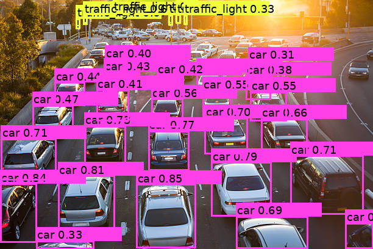

# RF-DETR 部署指南

RF-DETR 用于目标检测。本页说明 M.2 算力卡的接入条件、部署步骤与结果检查方法。

> 已实测，效果仍需评估。[查看部署效果](#查看部署效果)。

## 准备运行环境

本页效果展示使用 **RK3576 + AX8850 16GB M.2**；其他容量或平台需重新确认模型能否加载并正确运行。

在连接算力卡的 Linux 主机终端执行，RK3576 使用 ARM64 环境。首次部署先完成[驱动与设备检查](../../usage/device-check.md)、[安装 PyAXEngine](../../usage/python.md)和[下载工具安装](../../usage/download-models.md#使用-hugging-face-下载)。已完成这些步骤可直接下载模型。

后文使用设备 0，运行前用 `axcl-smi` 确认设备可用。

## 下载模型与样例

本页使用 `AXERA-TECH/RF-DETR` 的固定版本。下面下载本页选用的 5 个文件。

```bash
MODEL_DIR=~/edgeaccel/models/rf-detr/b18cd74e6e7c
mkdir -p "$MODEL_DIR"
~/edgeaccel/hf-env/bin/hf download AXERA-TECH/RF-DETR \
  "README.md" \
  "onnx/detr.axmodel" \
  "src/infer.py" \
  "asserts/test.jpg" \
  "onnx/config.json" \
  --revision b18cd74e6e7c1df8f86e4a56e020faeb412a0b26 \
  --local-dir "$MODEL_DIR"
cd "$MODEL_DIR"
```

保留当前终端中的 `MODEL_DIR` 变量，后续命令沿用此目录。下载受阻或需要离线复制时，见[下载方式与文件校验](../../usage/download-models.md)。

## 安装例程依赖

在 RK3576 主机激活已安装 PyAXEngine 的虚拟环境：

```bash
source ~/edgeaccel/python-env/bin/activate
python -m pip install 'numpy==1.26.4' 'opencv-python-headless==4.11.0.86' 'pillow==11.3.0'
```

下载 [vision_card.py](../../../static/examples/vision_card.py)，保存到 `$MODEL_DIR`。例程指定 `AXCLRTExecutionProvider`，使用本页固定版本的权重和样例，并保存本次输出。

## 检测图片中的车辆与信号灯

```bash
cd "$MODEL_DIR"
python vision_card.py --model-dir . --task rf-detr --variant default \
  --output results/traffic
```

输入为 `asserts/test.jpg`，使用官方缩放、后处理和 COCO 类别映射，阈值为 0.3。同一图片连续推理 3 次，`results/traffic/output.png` 保存最后一次检测图，`deployment-result.json` 保留三次框坐标与分数。

先检查车辆框与图像位置是否对应，再检查远处小目标。候选框数量不是图片中目标数量的人工真值。


## 查看部署效果

**已运行，效果仍需评估** · RK3576 + AX8850 16GB M.2。以下输入与输出来自本页固定版本的实际运行。

道路图在阈值 0.3 下得到 25 个 car 和 6 个 traffic_light 候选，三次框坐标与分数一致；右侧外车道仍有可见车辆未检出，本次效果核对未通过。候选数量不代表道路真实车辆数。

**道路图片检测**

阈值 0.3，输出 31 个候选，其中 car 25 个、traffic_light 6 个。近处多辆车有对应框，右侧外车道可见车辆未框出。三次候选坐标和分数一致，未建立完整道路目标标注，不能计算整图召回率。

<div className="model-effect-gallery">

<figure>

[](../../../static/validation/effects/rf-detr-20260924/rf-detr-default/input.webp)

<figcaption>官方道路输入</figcaption>
</figure>

<figure>

[](../../../static/validation/effects/rf-detr-20260924/rf-detr-default/output.webp)

<figcaption>本次车辆与信号灯检测结果</figcaption>
</figure>

</div>

| 类别 | 候选框数 |
| --- | --- |
| car | 25 |
| traffic_light | 6 |

**使用时注意：**

- 只检查一张道路图片，未使用人工标注计算 mAP，低分候选仍需人工复核。
- 结论限于 RK3576 + AX8850 16GB 的上述固定样例，不等同于 8GB 容量验证或长期稳定性测试。

这些结果用于对照部署后的输出，未覆盖完整数据集精度或长期连续运行。

<details>
<summary>查看样例环境与运行耗时</summary>

环境：RK3576 + AX8850 16GB M.2。模型版本：`b18cd74e6e7c1df8f86e4a56e020faeb412a0b26`。

| 组件 | 版本或配置 |
| --- | --- |
| 主机系统 | Ubuntu 24.04 / Armbian 25.11.0-trunk，aarch64，主机内存约 4GB |
| 内核 | 6.1.115-vendor-rk35xx |
| AXCL / 驱动 | V3.16.0_20260729180218 |
| 固件 / CMM | V3.16.0；CMM 总量 15232MiB |
| Python / PyAXEngine | Python 3.12；官方 0.1.3.rc3 wheel；AXCLRTExecutionProvider |
| NumPy / OpenCV / Pillow | 1.26.4 / 4.11.0.86 / 11.3.0 |
| Torch / Torchvision | 2.5.1 / 0.20.1 |
| 图文前处理 | Transformers 4.51.3 / Tokenizers 0.21.4；ftfy 6.3.1 / regex 2025.9.18 |
| VAD SDK | silero-vad-axera 0.1.2，复用 SileroAx；权重来自页面固定仓库提交 |
| C++ 检测 | axcl-samples cbfa4c76891758983ca2b0c99c11d6621d59af39 / OpenCV 4.6.0 |

| 指标 | 实测值 | 计时或统计范围 |
| --- | --- | --- |
| rf-detr-default / detr.axmodel | 30.878 ms（3 次平均） | AXCL session.run 调用，含输入输出传输；不含模型加载和前后处理，未剔除首轮。 |

</details>

遇到加载、内存或后端错误时，按[常见问题](../../usage/troubleshooting.md)处理。需要更换输入或接入业务时，按[检查输出与记录结果](../../reference/validation.md)保留自己的结果。

<details>
<summary>查看文件用途与版本信息</summary>

| 文件 / 目录内路径 | 用途 |
| --- | --- |
| [`src/infer.py`](https://huggingface.co/AXERA-TECH/RF-DETR/blob/b18cd74e6e7c1df8f86e4a56e020faeb412a0b26/src/infer.py) | Python 程序 / 前后处理 |
| [`onnx/detr.axmodel`](https://huggingface.co/AXERA-TECH/RF-DETR/blob/b18cd74e6e7c1df8f86e4a56e020faeb412a0b26/onnx/detr.axmodel) | 编译模型；按目录区分芯片和规格 |
| [`asserts/test.jpg`](https://huggingface.co/AXERA-TECH/RF-DETR/blob/b18cd74e6e7c1df8f86e4a56e020faeb412a0b26/asserts/test.jpg) | 示例输入 |
| [`onnx/config.json`](https://huggingface.co/AXERA-TECH/RF-DETR/blob/b18cd74e6e7c1df8f86e4a56e020faeb412a0b26/onnx/config.json) | 运行配置 |
| [`tools/requirements.txt`](https://huggingface.co/AXERA-TECH/RF-DETR/blob/b18cd74e6e7c1df8f86e4a56e020faeb412a0b26/tools/requirements.txt) | Python 依赖清单 |

仓库提交：`b18cd74e6e7c1df8f86e4a56e020faeb412a0b26`。仓库中的 1 个 `.axmodel` 文件可能包括多个芯片、规格和分片。运行时使用本页指定的配套文件，完整列表见[固定版本目录](https://huggingface.co/AXERA-TECH/RF-DETR/tree/b18cd74e6e7c1df8f86e4a56e020faeb412a0b26)。

</details>

## 参考资料

- [常用术语](../../reference/glossary.md)：AXCL、CMM、分词器与推理指标。
- [固定版本文件表](https://huggingface.co/AXERA-TECH/RF-DETR/tree/b18cd74e6e7c1df8f86e4a56e020faeb412a0b26)。
- [模型卡 / 使用说明](https://huggingface.co/AXERA-TECH/RF-DETR/blob/b18cd74e6e7c1df8f86e4a56e020faeb412a0b26/README.md)。
- [主要程序入口：src/infer.py](https://huggingface.co/AXERA-TECH/RF-DETR/blob/b18cd74e6e7c1df8f86e4a56e020faeb412a0b26/src/infer.py)。

返回[完整模型目录](../catalog.mdx)。
