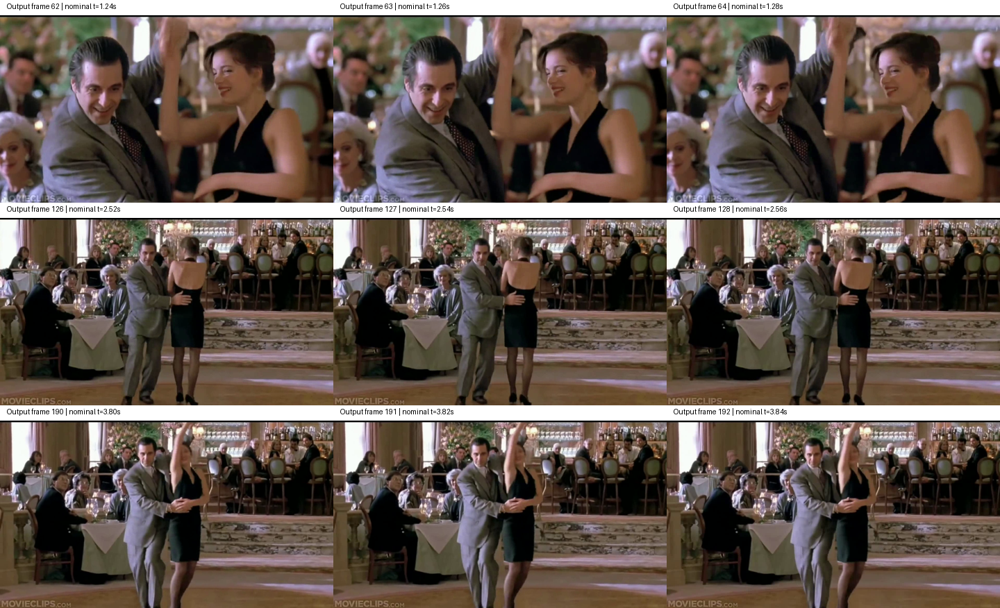

# RIFE.axera 部署指南

RIFE.axera 用于视频处理。本页说明 M.2 算力卡的接入条件、部署步骤与结果检查方法。

> 已实测，效果仍需评估。[查看部署效果](#查看部署效果)。

## 准备运行环境

本页效果展示使用 **RK3576 + AX8850 16GB M.2**；其他容量或平台需重新确认模型能否加载并正确运行。

在连接算力卡的 Linux 主机终端执行，RK3576 使用 ARM64 环境。首次部署先完成[驱动与设备检查](../../usage/device-check.md)、[安装 PyAXEngine](../../usage/python.md)和[下载工具安装](../../usage/download-models.md#使用-hugging-face-下载)。已完成这些步骤可直接下载模型。

后文使用设备 0，运行前用 `axcl-smi` 确认设备可用。

## 下载模型与样例

本页使用 `AXERA-TECH/RIFE.axera` 的固定版本。下面下载本页选用的 6 个文件。

```bash
MODEL_DIR=~/edgeaccel/models/rife-axera/c3220f49ad89
mkdir -p "$MODEL_DIR"
~/edgeaccel/hf-env/bin/hf download AXERA-TECH/RIFE.axera \
  "README.md" \
  "requirements.txt" \
  "run_axmodel.py" \
  "ms_ssim.py" \
  "video/demo.mp4" \
  "model/rife_x2_720p.axmodel" \
  --revision c3220f49ad89a3138edd70f4a5792cef4e16e0ad \
  --local-dir "$MODEL_DIR"
cd "$MODEL_DIR"
```

保留当前终端中的 `MODEL_DIR` 变量，后续命令沿用此目录。下载受阻或需要离线复制时，见[下载方式与文件校验](../../usage/download-models.md)。

## 准备视频处理环境

在 RK3576 主机激活已安装 [PyAXEngine](../../usage/python.md) 的环境，安装视频和相似度计算依赖：

```bash
source ~/edgeaccel/python-env/bin/activate
python -m pip install 'numpy==1.26.4' 'opencv-python-headless==4.11.0.86' 'torch==2.5.1' tqdm
python -c "import axengine; print(axengine.get_available_providers())"
```

确认输出包含 `AXCLRTExecutionProvider`。下载 [RIFE 算力卡例程](../../../static/examples/rife_card.py)，保存为 `~/edgeaccel/rife_card.py`。

## 生成插帧视频

保持下载步骤中的 `MODEL_DIR`，先运行 720p 规格：

```bash
python ~/edgeaccel/rife_card.py \
  --model-dir "$MODEL_DIR" \
  --resolution 720p \
  --output ~/edgeaccel/results/rife-720p
```

例程读取官方 `video/demo.mp4`，采用官方脚本的帧相似度判断、RGB 浮点输入、补边和结果裁剪流程。完整模型在算力卡执行，只将最终图像取回主机。视频帧队列限制为 2，写入线程结束后才关闭输出文件，避免主机积压大量图像。本例固定使用上述 PyAXEngine 0.1.3.rc3。

本页已验证范围为 `rife_x2_720p.axmodel`，输入为 1280×720。官方仓库另有 1080p 和 4K 权重，目前未在本页环境完成推理，不能直接沿用 720p 的验证结论。输出目录需要尚不存在。

## 打开本次输出

在桌面视频播放器中打开结果目录中的 `interpolated.mp4`，查看插帧后的运动。官方样例包含 128 帧、帧率为 25 fps；本次输出应能解码为 255 帧、50 fps。

| 文件 | 内容 |
| --- | --- |
| `interpolated.mp4` | 本次完整插帧视频，不包含音轨 |
| `left.png`、`right.png` | 第一次实际 NPU 调用的两张输入帧 |
| `middle.png` | 该次 NPU 调用生成的中间帧 |
| `deployment-result.json` | 文件校验、分辨率、帧数、调用次数与耗时 |

例程额外重复第一次 NPU 调用，核对输出一致性；这次重复不写入视频。50 fps 是输出视频的播放帧率，不能用来表示处理速度。实际推理调用和整段处理耗时见下方实测记录。

下方网页视频由本次输入与输出转码为 H.264，保留尺寸、帧率和帧数，不包含音轨；三张静态帧图以无损格式保存。


## 查看部署效果

**已运行，效果仍需评估** · RK3576 + AX8850 16GB M.2。以下输入与输出来自本页固定版本的实际运行。

16GB 算力卡完成 720p 视频插帧：128 帧、25 fps 输入生成 255 帧、50 fps 输出，完整视频可解码。5.12 秒输入处理耗时 110.808 秒，约为视频时长的 21.64 倍；当前流程不具备实时处理能力。插帧精度仍待真实中间帧评测。

**720p 完整视频插帧**

输入、原始输出和网页转码视频均已完整解码，帧数分别为 128、255、128、255。下方三张无损图片取自第一次实际 NPU 调用，分别是该次调用的两张输入和生成结果。官方流程会依据相似度替换近似静止帧、处理切镜，因此这组输入不应简单解释为相邻原视频帧，也不能据此逐帧推断整段输出来源。人物转动时的模糊在输入中已经存在，插帧并不等于去模糊。

<div className="model-effect-gallery">

<figure>

[](../../../static/validation/effects/rife-axera-20260928/left.webp)

<figcaption>首次调用 · 输入图 A</figcaption>
</figure>

<figure>

[](../../../static/validation/effects/rife-axera-20260928/middle.webp)

<figcaption>首次调用 · 生成结果</figcaption>
</figure>

<figure>

[](../../../static/validation/effects/rife-axera-20260928/right.webp)

<figcaption>首次调用 · 输入图 B</figcaption>
</figure>

</div>

| 项目 | 输入 | 输出 |
| --- | --- | --- |
| 画面尺寸 | 1280×720 | 1280×720 |
| 帧数 | 128 | 255 |
| 播放帧率 | 25 fps | 50 fps |

| 性能项目 | 实测值 | 统计范围 |
| --- | --- | --- |
| 输入视频时长 | 5.120 s | 128 帧 / 25 fps |
| 整段处理耗时 | 110.808 s | 含读取、前后处理、相似度判断、一次额外重复调用及编码；不含模型加载 |
| 处理耗时 / 输入时长 | 21.64 倍 | 此流程非实时 |
| 按输出帧数折算的处理速度 | 2.30 帧/s | 255 / 110.808；包含输入帧及生成帧，非 NPU 调用频率 |
| 结果播放帧率 | 50 fps | 播放器显示速度，非推理吞吐 |

官方输入 · 25 fps / 128 帧

<video className="model-effect-video" controls playsInline preload="metadata" src="/validation/effects/rife-axera-20260928/input-25fps.mp4" aria-label="官方输入 · 25 fps / 128 帧"></video>

[下载视频](../../../static/validation/effects/rife-axera-20260928/input-25fps.mp4)

本次插帧结果 · 50 fps / 255 帧

<video className="model-effect-video" controls playsInline preload="metadata" src="/validation/effects/rife-axera-20260928/720p-50fps.mp4" aria-label="本次插帧结果 · 50 fps / 255 帧"></video>

[下载视频](../../../static/validation/effects/rife-axera-20260928/720p-50fps.mp4)

**查看输出中的连续运动帧**

图中每行按顺序展示输出视频的三个相邻帧，相邻标称时刻相差 0.02 秒。三处样例可以辨认人物抬手、转身和身体位置的连续变化；运动边缘仍有模糊。图片来自已编码的实际结果视频，不能作为无损原始张量或真实中间帧标注；这些局部观察不代表完整时序精度通过。

<div className="model-effect-gallery">

<figure>

[](../../../static/validation/effects/rife-axera-20260928/output-sequence-contact.png)

<figcaption>实际输出的三组连续帧：62–64、126–128、190–192（从 0 开始计数，点击放大）</figcaption>
</figure>

</div>

**使用时注意：**

- 仅 720p 权重完成本页视频验证；1080p 和 4K 未通过当前软件与硬件组合验证。
- 50 fps 是结果播放帧率；5.12 秒输入处理耗时 110.808 秒，当前流程非实时。缺少真实中间帧和完整逐调用记录，未评估插帧 PSNR/SSIM 或完整时序精度。

这些结果用于对照部署后的输出，未覆盖完整数据集精度或长期连续运行。

<details>
<summary>查看样例环境与运行耗时</summary>

环境：RK3576 + AX8850 16GB M.2。模型版本：`c3220f49ad89a3138edd70f4a5792cef4e16e0ad`。

| 组件 | 版本或配置 |
| --- | --- |
| 主机 / 内核 | RK3576，约 4GB RAM，6.1.115-vendor-rk35xx |
| AXCL / 驱动 | V3.16.0_20260729180218 |
| 固件 / CMM | V3.16.0 / 15232 MiB |
| Python 推理 | PyAXEngine 0.1.3.rc3 / NumPy 1.26.4 / OpenCV 4.11.0 / Torch 2.5.1 |
| 输入 | 两张 RGB 帧拼接为 float32 [1,6,768,1280]，补边至 128 倍数 |

| 指标 | 实测值 | 计时或统计范围 |
| --- | --- | --- |
| AXCL 推理调用平均耗时 | 324.408 ms（177 次） | session.run 墙钟，包含输入与最终图像传输；不含模型加载、相似度计算和视频编解码，未剔除首轮，额外重复调用不计入平均值。 |
| 整段处理耗时 | 110.808 s | 包含视频读取、前后处理、相似度判断、一次额外重复推理和输出编码；不含模型加载及结果复核解码。 |

适用范围：

- 网页视频由实际输出转为 H.264，保留尺寸、帧率和帧数，移除音轨；静态帧图为无损保存。
- 仅在 16GB 卡验证，真实 8GB 回归待完成。

</details>

遇到加载、内存或后端错误时，按[常见问题](../../usage/troubleshooting.md)处理。需要更换输入或接入业务时，按[检查输出与记录结果](../../reference/validation.md)保留自己的结果。

<details>
<summary>查看文件用途与版本信息</summary>

| 文件 / 目录内路径 | 用途 |
| --- | --- |
| [`gradio_demo.py`](https://huggingface.co/AXERA-TECH/RIFE.axera/blob/c3220f49ad89a3138edd70f4a5792cef4e16e0ad/gradio_demo.py) | Python 程序 / 前后处理 |
| [`run_axmodel.py`](https://huggingface.co/AXERA-TECH/RIFE.axera/blob/c3220f49ad89a3138edd70f4a5792cef4e16e0ad/run_axmodel.py) | Python 程序 / 前后处理 |
| [`model/rife_x2_1080p.axmodel`](https://huggingface.co/AXERA-TECH/RIFE.axera/blob/c3220f49ad89a3138edd70f4a5792cef4e16e0ad/model/rife_x2_1080p.axmodel) | 编译模型；按目录区分芯片和规格 |
| [`model/rife_x2_4k.axmodel`](https://huggingface.co/AXERA-TECH/RIFE.axera/blob/c3220f49ad89a3138edd70f4a5792cef4e16e0ad/model/rife_x2_4k.axmodel) | 编译模型；按目录区分芯片和规格 |
| [`model/rife_x2_720p.axmodel`](https://huggingface.co/AXERA-TECH/RIFE.axera/blob/c3220f49ad89a3138edd70f4a5792cef4e16e0ad/model/rife_x2_720p.axmodel) | 编译模型；按目录区分芯片和规格 |
| [`assert/gradio_demo.JPG`](https://huggingface.co/AXERA-TECH/RIFE.axera/blob/c3220f49ad89a3138edd70f4a5792cef4e16e0ad/assert/gradio_demo.JPG) | 配套资源 |
| [`build_config.json`](https://huggingface.co/AXERA-TECH/RIFE.axera/blob/c3220f49ad89a3138edd70f4a5792cef4e16e0ad/build_config.json) | 运行配置 |
| [`config.json`](https://huggingface.co/AXERA-TECH/RIFE.axera/blob/c3220f49ad89a3138edd70f4a5792cef4e16e0ad/config.json) | 运行配置 |
| [`requirements.txt`](https://huggingface.co/AXERA-TECH/RIFE.axera/blob/c3220f49ad89a3138edd70f4a5792cef4e16e0ad/requirements.txt) | Python 依赖清单 |

仓库提交：`c3220f49ad89a3138edd70f4a5792cef4e16e0ad`。仓库中的 3 个 `.axmodel` 文件可能包括多个芯片、规格和分片。运行时使用本页指定的配套文件，完整列表见[固定版本目录](https://huggingface.co/AXERA-TECH/RIFE.axera/tree/c3220f49ad89a3138edd70f4a5792cef4e16e0ad)。

</details>

<details>
<summary>补充说明与版本差异</summary>

- 插帧需要相邻帧与插值时刻。核对输出帧顺序、倍帧关系和视频时基，避免只有画面平滑但播放速度变化。

</details>

## 参考资料

- [常用术语](../../reference/glossary.md)：AXCL、CMM、分词器与推理指标。
- [固定版本文件表](https://huggingface.co/AXERA-TECH/RIFE.axera/tree/c3220f49ad89a3138edd70f4a5792cef4e16e0ad)。
- [模型卡 / 使用说明](https://huggingface.co/AXERA-TECH/RIFE.axera/blob/c3220f49ad89a3138edd70f4a5792cef4e16e0ad/README.md)。
- [主要程序入口：gradio_demo.py](https://huggingface.co/AXERA-TECH/RIFE.axera/blob/c3220f49ad89a3138edd70f4a5792cef4e16e0ad/gradio_demo.py)。
- [ModelScope 对应资源](https://modelscope.cn/models/AXERA-TECH/RIFE.axera)。不同平台的 revision 不通用，另行记录版本。

返回[完整模型目录](../catalog.mdx)。
