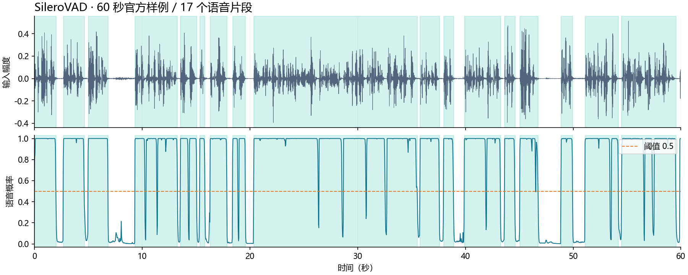

# SileroVAD 部署指南

SileroVAD 用于语音活动检测与分段。本页说明 M.2 算力卡的接入条件、部署步骤与结果检查方法。

> 已实测，效果仍需评估。[查看部署效果](#查看部署效果)。

## 准备运行环境

本页效果展示使用 **RK3576 + AX8850 16GB M.2**；其他容量或平台需重新确认模型能否加载并正确运行。

在连接算力卡的 Linux 主机终端执行，RK3576 使用 ARM64 环境。首次部署先完成[驱动与设备检查](../../usage/device-check.md)、[安装 PyAXEngine](../../usage/python.md)和[下载工具安装](../../usage/download-models.md#使用-hugging-face-下载)。已完成这些步骤可直接下载模型。

后文使用设备 0，运行前用 `axcl-smi` 确认设备可用。

## 下载模型与样例

本页使用 `AXERA-TECH/SileroVAD` 的固定版本。下面下载本页选用的 6 个文件。

```bash
MODEL_DIR=~/edgeaccel/models/silerovad/b0983d011a38
mkdir -p "$MODEL_DIR"
~/edgeaccel/hf-env/bin/hf download AXERA-TECH/SileroVAD \
  "README.md" \
  "StreamVAD.py" \
  "main.py" \
  "requirements.txt" \
  "models/silero_vad_ax650.axmodel" \
  "demo.wav" \
  --revision b0983d011a38dad39589a7e5930bb9fa9bc9dc56 \
  --local-dir "$MODEL_DIR"
cd "$MODEL_DIR"
```

保留当前终端中的 `MODEL_DIR` 变量，后续命令沿用此目录。下载受阻或需要离线复制时，见[下载方式与文件校验](../../usage/download-models.md)。

## 安装例程依赖

在 RK3576 主机激活已安装 PyAXEngine 的虚拟环境：

```bash
source ~/edgeaccel/python-env/bin/activate
python -m pip install 'numpy==1.26.4' 'opencv-python-headless==4.11.0.86' 'pillow==11.3.0'
```

下载 [vision_card.py](../../../static/examples/vision_card.py)，保存到 `$MODEL_DIR`。例程指定 `AXCLRTExecutionProvider`，使用本页固定版本的权重和样例，并保存本次输出。

## 准备语音分块例程

下载固定版本的上游 Python SDK，只提取源码，不安装其板端依赖：

```bash
cd "$MODEL_DIR"
python -m pip download --no-deps --dest sdk-download 'silero-vad-axera==0.1.2'
python -m zipfile -e sdk-download/silero_vad_axera-0.1.2-py3-none-any.whl silero_sdk
```

本页从 SDK 复用 `SileroAx` 的状态与上下文处理，显式传入本仓库的 `models/silero_vad_ax650.axmodel`，不使用 SDK 自带权重。

## 检测语音片段

```bash
python vision_card.py --model-dir . --task silero-vad --variant audio60 \
  --output results/vad
```

输入 `demo.wav` 为 16 kHz、单声道、PCM16。每帧 512 个采样点（32 ms），语音阈值 0.5，最短语音 250 ms，连续静音达到 200 ms 后结束片段。末尾不足一帧时补零，输出片段按原音频范围截取。

`results/vad/segment-*.wav` 为语音片段；`deployment-result.json` 保存逐帧概率和以秒为单位的起止时间。可逐段播放核对是否漏掉首尾。这里的分段规则由本例程实现，与上游 `StreamVAD` 的时间戳和尾段处理不同，不做语音转写或说话人识别。


## 查看部署效果

**已运行，效果仍需评估** · RK3576 + AX8850 16GB M.2。以下输入与输出来自本页固定版本的实际运行。

60 秒录音输出 17 段、合计 47.680 秒，所有片段的 PCM 与原录音对应区间一致。分段保留了 43 个低于阈值的短间隙帧，过滤了 3 个达到阈值的帧；这些时长和计数尚无人工标注验证。

**语音概率与分段**

橙色虚线是阈值 0.5，浅绿色区域为本次输出的 17 个语音片段。下方可试听原始录音和前三个片段。 17 段合计 47.680 秒，截取的 PCM 与输入对应区间一致。分段会连接短暂的低分数间隙，并过滤过短的候选片段，因此保留时长不等于高于阈值的帧数，更不等于人工标注的真实语音时长。

<div className="model-effect-gallery">

<figure>

[](../../../static/validation/effects/silerovad-20260924/silero-vad-audio60/timeline.webp)

<figcaption>60 秒输入波形、语音概率与分段位置</figcaption>
</figure>

</div>

| 片段 | 起点 / 秒 | 终点 / 秒 | 时长 / 秒 |
| --- | --- | --- | --- |
| 1 | 0.032 | 2.016 | 1.984 |
| 2 | 2.688 | 4.640 | 1.952 |
| 3 | 4.992 | 6.848 | 1.856 |
| 4 | 9.344 | 13.280 | 3.936 |
| 5 | 13.568 | 15.072 | 1.504 |
| 6 | 15.360 | 15.840 | 0.480 |
| 7 | 16.320 | 17.888 | 1.568 |
| 8 | 18.400 | 19.584 | 1.184 |
| 9 | 20.352 | 35.552 | 15.200 |
| 10 | 35.776 | 37.600 | 1.824 |
| 11 | 37.984 | 38.912 | 0.928 |
| 12 | 39.904 | 43.264 | 3.360 |
| 13 | 43.648 | 44.608 | 0.960 |
| 14 | 45.056 | 46.752 | 1.696 |
| 15 | 48.864 | 49.952 | 1.088 |
| 16 | 51.104 | 54.208 | 3.104 |
| 17 | 54.496 | 59.552 | 5.056 |

| 检查项 | 本次结果 |
| --- | --- |
| 达到 0.5 阈值的帧 | 1450 / 1875 |
| 输出片段总时长 | 47.680 s |
| 片段内低于阈值的帧 | 43 帧 / 1.376 s |
| 未纳入片段的达阈值帧 | 3 帧 / 0.096 s |
| 分段规则的整帧粒度 | 最短语音 8 帧（256 ms）；连续静音 7 帧（224 ms）后关闭片段 |
| 截取音频核对 | 17 段 PCM 均与输入对应区间一致 |
| 尾帧补零 | 本次 60 秒样例无需补零，非整帧输入仍待实测 |

官方输入 · 60 秒

<audio controls preload="metadata" src="/validation/effects/silerovad-20260924/silero-vad-audio60/input.wav" aria-label="官方输入 · 60 秒"></audio>

[下载音频](../../../static/validation/effects/silerovad-20260924/silero-vad-audio60/input.wav)

本次语音片段 1

<audio controls preload="metadata" src="/validation/effects/silerovad-20260924/silero-vad-audio60/segment-01.wav" aria-label="本次语音片段 1"></audio>

[下载音频](../../../static/validation/effects/silerovad-20260924/silero-vad-audio60/segment-01.wav)

本次语音片段 2

<audio controls preload="metadata" src="/validation/effects/silerovad-20260924/silero-vad-audio60/segment-02.wav" aria-label="本次语音片段 2"></audio>

[下载音频](../../../static/validation/effects/silerovad-20260924/silero-vad-audio60/segment-02.wav)

本次语音片段 3

<audio controls preload="metadata" src="/validation/effects/silerovad-20260924/silero-vad-audio60/segment-03.wav" aria-label="本次语音片段 3"></audio>

[下载音频](../../../static/validation/effects/silerovad-20260924/silero-vad-audio60/segment-03.wav)

**使用时注意：**

- 尚无人工语音起止标注，未计算漏检或误检率；未测试实时麦克风和 AX630C 权重。
- 结论限于 RK3576 + AX8850 16GB 的上述固定样例，不等同于 8GB 容量验证或长期稳定性测试。

这些结果用于对照部署后的输出，未覆盖完整数据集精度或长期连续运行。

<details>
<summary>查看样例环境与运行耗时</summary>

环境：RK3576 + AX8850 16GB M.2。模型版本：`b0983d011a38dad39589a7e5930bb9fa9bc9dc56`。

| 组件 | 版本或配置 |
| --- | --- |
| 主机系统 | Ubuntu 24.04 / Armbian 25.11.0-trunk，aarch64，主机内存约 4GB |
| 内核 | 6.1.115-vendor-rk35xx |
| AXCL / 驱动 | V3.16.0_20260729180218 |
| 固件 / CMM | V3.16.0；CMM 总量 15232MiB |
| Python / PyAXEngine | Python 3.12；官方 0.1.3.rc3 wheel；AXCLRTExecutionProvider |
| NumPy / OpenCV / Pillow | 1.26.4 / 4.11.0.86 / 11.3.0 |
| Torch / Torchvision | 2.5.1 / 0.20.1 |
| 图文前处理 | Transformers 4.51.3 / Tokenizers 0.21.4；ftfy 6.3.1 / regex 2025.9.18 |
| VAD SDK | silero-vad-axera 0.1.2，复用 SileroAx；权重来自页面固定仓库提交 |
| C++ 检测 | axcl-samples cbfa4c76891758983ca2b0c99c11d6621d59af39 / OpenCV 4.6.0 |

| 指标 | 实测值 | 计时或统计范围 |
| --- | --- | --- |
| silero-vad-audio60 / silero_vad_ax650.axmodel | 2.919 ms（1875 次平均） | AXCL session.run 调用，含输入输出传输；不含模型加载和前后处理，未剔除首轮。 |

</details>

遇到加载、内存或后端错误时，按[常见问题](../../usage/troubleshooting.md)处理。需要更换输入或接入业务时，按[检查输出与记录结果](../../reference/validation.md)保留自己的结果。

<details>
<summary>查看文件用途与版本信息</summary>

| 文件 / 目录内路径 | 用途 |
| --- | --- |
| [`gradio_app.py`](https://huggingface.co/AXERA-TECH/SileroVAD/blob/b0983d011a38dad39589a7e5930bb9fa9bc9dc56/gradio_app.py) | Python 程序 / 前后处理 |
| [`main.py`](https://huggingface.co/AXERA-TECH/SileroVAD/blob/b0983d011a38dad39589a7e5930bb9fa9bc9dc56/main.py) | Python 程序 / 前后处理 |
| [`models/silero_vad_ax650.axmodel`](https://huggingface.co/AXERA-TECH/SileroVAD/blob/b0983d011a38dad39589a7e5930bb9fa9bc9dc56/models/silero_vad_ax650.axmodel) | 编译模型；按目录区分芯片和规格 |
| [`config.json`](https://huggingface.co/AXERA-TECH/SileroVAD/blob/b0983d011a38dad39589a7e5930bb9fa9bc9dc56/config.json) | 运行配置 |
| [`demo.wav`](https://huggingface.co/AXERA-TECH/SileroVAD/blob/b0983d011a38dad39589a7e5930bb9fa9bc9dc56/demo.wav) | 示例输入 |
| [`requirements.txt`](https://huggingface.co/AXERA-TECH/SileroVAD/blob/b0983d011a38dad39589a7e5930bb9fa9bc9dc56/requirements.txt) | Python 依赖清单 |

仓库提交：`b0983d011a38dad39589a7e5930bb9fa9bc9dc56`。仓库中的 2 个 `.axmodel` 文件可能包括多个芯片、规格和分片。运行时使用本页指定的配套文件，完整列表见[固定版本目录](https://huggingface.co/AXERA-TECH/SileroVAD/tree/b0983d011a38dad39589a7e5930bb9fa9bc9dc56)。

</details>

<details>
<summary>补充说明与版本差异</summary>

- 仓库内 C++ 示例依赖板端 AX runtime；本页 M.2 部署使用已实测的 AXCL Python 路径。

</details>

## 参考资料

- [常用术语](../../reference/glossary.md)：AXCL、CMM、分词器与推理指标。
- [固定版本文件表](https://huggingface.co/AXERA-TECH/SileroVAD/tree/b0983d011a38dad39589a7e5930bb9fa9bc9dc56)。
- [模型卡 / 使用说明](https://huggingface.co/AXERA-TECH/SileroVAD/blob/b0983d011a38dad39589a7e5930bb9fa9bc9dc56/README.md)。
- [主要程序入口：gradio_app.py](https://huggingface.co/AXERA-TECH/SileroVAD/blob/b0983d011a38dad39589a7e5930bb9fa9bc9dc56/gradio_app.py)。
- [ModelScope 对应资源](https://modelscope.cn/models/AXERA-TECH/SileroVAD)。不同平台的 revision 不通用，另行记录版本。

返回[完整模型目录](../catalog.mdx)。
