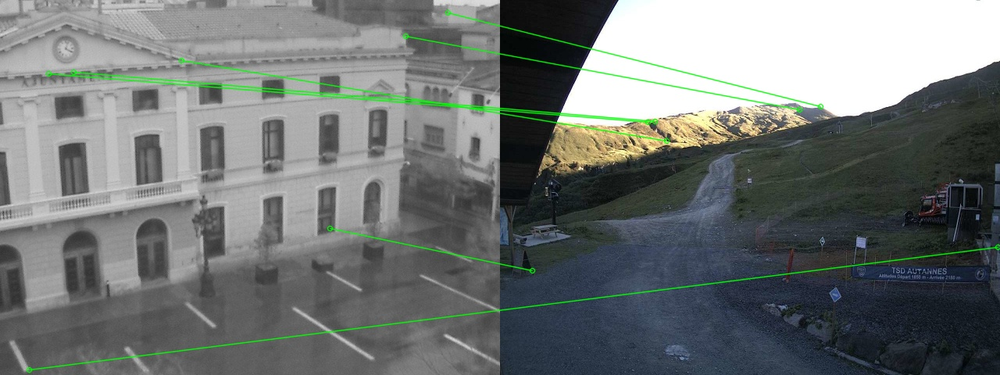

# superpoint 部署指南

superpoint 用于图像特征提取。本页说明 M.2 算力卡的接入条件、部署步骤与结果检查方法。本页选择 `ax650/compiled.axmodel`。

> 已实测，效果仍需评估。[查看部署效果](#查看部署效果)。

## 准备运行环境

本页效果展示使用 **RK3576 DshanPi A1 + AX8850 8GB M.2**；其他容量或平台需重新确认模型能否加载并正确运行。

在连接算力卡的 Linux 主机终端执行，RK3576 使用 ARM64 环境。首次部署先完成[驱动与设备检查](../../usage/device-check.md)、[安装 PyAXEngine](../../usage/python.md)和[下载工具安装](../../usage/download-models.md#使用-hugging-face-下载)。已完成这些步骤可直接下载模型。

后文使用设备 0，运行前用 `axcl-smi` 确认设备可用。

## 下载模型与样例

本页使用 `AXERA-TECH/superpoint` 的固定版本。下面下载本页选用的 4 个文件。

```bash
MODEL_DIR=~/edgeaccel/models/superpoint/ee048caa6487
mkdir -p "$MODEL_DIR"
~/edgeaccel/hf-env/bin/hf download AXERA-TECH/superpoint \
  "infer.py" \
  "ax650/compiled.axmodel" \
  "1.ppm" \
  "2.ppm" \
  --revision ee048caa6487d312cea7493ae535eee4b1fcbf70 \
  --local-dir "$MODEL_DIR"
cd "$MODEL_DIR"
```

保留当前终端中的 `MODEL_DIR` 变量，后续命令沿用此目录。下载受阻或需要离线复制时，见[下载方式与文件校验](../../usage/download-models.md)。

## 配置 Python 后端

激活已安装 PyAXEngine 的主机虚拟环境。先检查可用 provider：

```bash
source ~/edgeaccel/python-env/bin/activate
python -c "import axengine; print(axengine.get_available_providers())"
```

必须包含 `AXCLRTExecutionProvider`。保留已安装的 PyAXEngine，按下面命令安装本例依赖。

在已激活的环境中安装该入口直接使用的依赖；以下依赖用于本页的命令行示例：

```bash
python -m pip install numpy==1.26.4 ml-dtypes==0.5.3 opencv-python-headless==4.11.0.86
```


按本页已核对的修改配置 AXCL 后端。脚本在首次修改前保留 `.upstream` 备份；原表达式不匹配时停止，避免误改其他版本。

```bash
cd "$MODEL_DIR"
python - <<'PY'
from pathlib import Path
edits = [
    {"path": "infer.py", "old": "axe.InferenceSession(model)", "new": "axe.InferenceSession(model, providers=[\"AXCLRTExecutionProvider\"])"}
]
for edit in edits:
    path = Path(edit.get("path", "infer.py"))
    source = path.read_text(encoding="utf-8")
    if edit["old"] not in source:
        assert edit["new"] in source, f"补丁目标不匹配：{path}"
        continue
    backup = path.with_name(path.name + ".upstream")
    if not backup.exists():
        backup.write_text(source, encoding="utf-8")
    path.write_text(source.replace(edit["old"], edit["new"]), encoding="utf-8")
    print(f"已修改 {path}")
PY
```

重新下载原始源码后，需要再次执行此修改。

## 运行模型

在模型根目录执行，输入与权重使用该提交的实际路径：

```bash
cd "$MODEL_DIR"
test -s ax650/compiled.axmodel
test -s 1.ppm
set -o pipefail
python infer.py --model ax650/compiled.axmodel --img1 1.ppm --img2 2.ppm --output matches.jpg 2>&1 | tee run.log
```

日志中的实际执行后端应为 `AXCLRTExecutionProvider`。检查 `matches.jpg` 是本次新生成的文件，内容与输入相符。使用仓库现成结果图或只检查程序退出码均不足以判断效果。

参数依据：[`infer.py` 源码](https://huggingface.co/AXERA-TECH/superpoint/blob/ee048caa6487d312cea7493ae535eee4b1fcbf70/infer.py)。

## 查看部署效果

**已运行，效果仍需评估** · 2026-09-23 · RK3576 DshanPi A1 + AX8850 8GB M.2。以下输入与输出来自本页固定版本的实际运行。

AXCL 完成两张图的特征提取，日志分别记录 1830、1395 个关键点并生成 matches.jpg。但输出左侧是建筑街景、右侧是山地道路，明显不是同一场景，图上的跨图绿线不能视为正确对应；本次只能确认程序和特征提取基本运行，匹配正确性不通过。

点击图片可查看原尺寸。

<div className="model-effect-gallery">

<figure>

[](../../../static/validation/effects/superpoint/outputs/matches.jpg)

<figcaption>实际输出</figcaption>
</figure>

</div>

**使用时注意：**

- 这组输入不是已知同场景图对，显示的连线存在明显跨场景误匹配，不能写成特征匹配正确或视觉里程计可用。
- 未提供真值单应矩阵、对应点标注或几何一致性结果，未计算 matching accuracy、inlier ratio 或重复率。

这些结果用于对照部署后的输出，未覆盖完整数据集精度或长期连续运行。

<details>
<summary>查看样例环境与运行耗时</summary>

环境：RK3576 DshanPi A1 + AX8850 8GB M.2。日期：2026-09-23。模型版本：`ee048caa6487d312cea7493ae535eee4b1fcbf70`。

| 组件 | 版本或配置 |
| --- | --- |
| 主机系统 | Ubuntu 24.04 / Armbian 25.11.0-trunk，aarch64 |
| 内核 | 6.1.115-vendor-rk35xx |
| AXCL / 驱动 | V3.16.0_20260729180218 |
| 固件 / CMM | V3.16.0；CMM 总量 7040 MiB，空闲基线占用 18 MiB |
| C++ 视觉示例提交 | cbfa4c76891758983ca2b0c99c11d6621d59af39 |
| Python 后端 | Python 3.12.3；PyAXEngine 0.1.3.rc3 发布的 0.1.3 wheel；NumPy 1.26.4 / ml-dtypes 0.5.3 |
| AX-LLM 提交 | 8501c22b940f8c5804cb35044c5ffc136918b8f1；Release / AXCL / Linux aarch64 |

| 指标 | 实测值 | 计时或统计范围 |
| --- | --- | --- |
| 第一张图关键点数 | 1830 | run.log；仅检测数量，不是正确匹配数量 |
| 第二张图关键点数 | 1395 | run.log；仅检测数量，不是正确匹配数量 |
| 第一张图 session.run 时延 | 63.98 | 毫秒；主机墙钟，包含 AXCL 调用及复制，排除张量统计 |
| 第二张图 session.run 时延 | 60.09 | 毫秒；主机墙钟，包含 AXCL 调用及复制，排除张量统计 |
| 模型推理尺寸 | 640×480 | run.log 与输入张量 [1,1,480,640]，按宽×高 |
| 匹配可视化尺寸 | 1280×480 | matches.jpg 实际文件头，左右两幅不同场景图拼接 |
| session.run：compiled.axmodel | 62.030 ms / 2 次 | 实际 AXCL Python 调用墙钟，含数据复制；不含返回后的张量统计。含首次调用，非统一预热基准；多阶段模型各自计时 |

适用范围：

- 这组输入不是已知同场景图对，显示的连线存在明显跨场景误匹配，不能写成特征匹配正确或视觉里程计可用。
- 未提供真值单应矩阵、对应点标注或几何一致性结果，未计算 matching accuracy、inlier ratio 或重复率。
- 需要另取具有重叠视野的同场景图对，并配合几何验证后才能评价匹配效果。
- 工具不能直接展示原始 PPM 格式，本次对输入内容的人工核对依据真正输出 matches.jpg 的两幅完整场景；未修改或转换原始测试文件。
- 运行源码包含显式 AXCL 后端或本页说明的适配修改；result.json 保存逐项替换及修改后 SHA256。

</details>

遇到加载、内存或后端错误时，按[常见问题](../../usage/troubleshooting.md)处理。需要更换输入或接入业务时，按[检查输出与记录结果](../../reference/validation.md)保留自己的结果。

<details>
<summary>查看文件用途与版本信息</summary>

| 文件 / 目录内路径 | 用途 |
| --- | --- |
| [`infer.py`](https://huggingface.co/AXERA-TECH/superpoint/blob/ee048caa6487d312cea7493ae535eee4b1fcbf70/infer.py) | Python 程序 / 前后处理 |
| [`ax650/compiled.axmodel`](https://huggingface.co/AXERA-TECH/superpoint/blob/ee048caa6487d312cea7493ae535eee4b1fcbf70/ax650/compiled.axmodel) | 编译模型；按目录区分芯片和规格 |
| [`1.ppm`](https://huggingface.co/AXERA-TECH/superpoint/blob/ee048caa6487d312cea7493ae535eee4b1fcbf70/1.ppm) | 示例输入 |
| [`2.ppm`](https://huggingface.co/AXERA-TECH/superpoint/blob/ee048caa6487d312cea7493ae535eee4b1fcbf70/2.ppm) | 示例输入 |

仓库提交：`ee048caa6487d312cea7493ae535eee4b1fcbf70`。仓库中的 2 个 `.axmodel` 文件可能包括多个芯片、规格和分片。运行时使用本页指定的配套文件，完整列表见[固定版本目录](https://huggingface.co/AXERA-TECH/superpoint/tree/ee048caa6487d312cea7493ae535eee4b1fcbf70)。

</details>

<details>
<summary>补充说明与版本差异</summary>

- 输入 1.ppm 与 2.ppm 两张图，输出特征匹配图。不能将特征点数量直接当作匹配精度。

</details>

## 参考资料

- [常用术语](../../reference/glossary.md)：AXCL、CMM、分词器与推理指标。
- [固定版本文件表](https://huggingface.co/AXERA-TECH/superpoint/tree/ee048caa6487d312cea7493ae535eee4b1fcbf70)。
- [模型卡 / 使用说明](https://huggingface.co/AXERA-TECH/superpoint/blob/ee048caa6487d312cea7493ae535eee4b1fcbf70/README.md)。
- [主要程序入口：infer.py](https://huggingface.co/AXERA-TECH/superpoint/blob/ee048caa6487d312cea7493ae535eee4b1fcbf70/infer.py)。

返回[完整模型目录](../catalog.mdx)。
