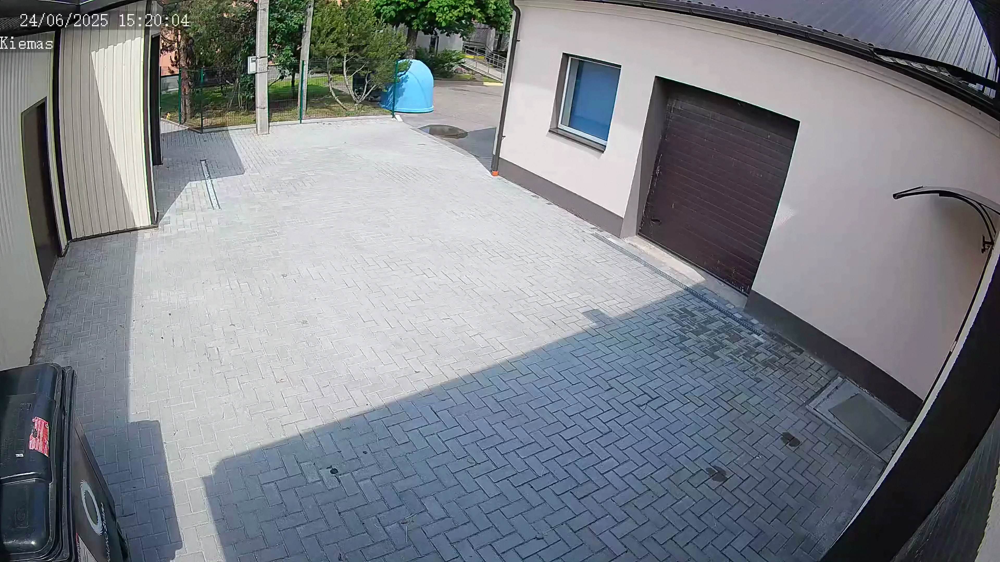
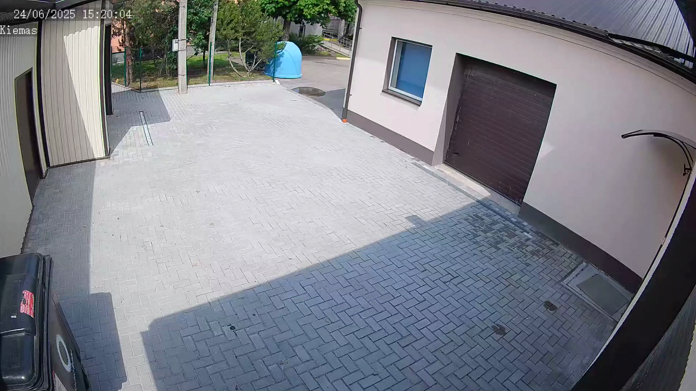

# SuperResolution 部署指南

SuperResolution 用于图像超分辨率。本页说明 M.2 算力卡的接入条件、部署步骤与结果检查方法。

> 已实测，效果仍需评估。[查看部署效果](#查看部署效果)。

## 准备运行环境

本页效果展示使用 **RK3576 + AX8850 16GB M.2**；其他容量或平台需重新确认模型能否加载并正确运行。

在连接算力卡的 Linux 主机终端执行，RK3576 使用 ARM64 环境。首次部署先完成[驱动与设备检查](../../usage/device-check.md)、[安装 PyAXEngine](../../usage/python.md)和[下载工具安装](../../usage/download-models.md#使用-hugging-face-下载)。已完成这些步骤可直接下载模型。

后文使用设备 0，运行前用 `axcl-smi` 确认设备可用。

## 下载模型与样例

本页使用 `AXERA-TECH/SuperResolution` 的固定版本。下面下载本页选用的 10 个文件。

```bash
MODEL_DIR=~/edgeaccel/models/superresolution/4b9163681800
mkdir -p "$MODEL_DIR"
~/edgeaccel/hf-env/bin/hf download AXERA-TECH/SuperResolution \
  "README.md" \
  "python/common.py" \
  "python/imgproc.py" \
  "python/run_axmodel.py" \
  "python/gradio_demo.py" \
  "model_convert/axmodel/edsr_baseline_x2_1.axmodel" \
  "model_convert/axmodel/edsr_baseline_x2_2k.axmodel" \
  "model_convert/axmodel/espcn_x2_T9.axmodel" \
  "model_convert/axmodel/espcn_x2_T9_2k.axmodel" \
  "video/test_1920x1080.mp4" \
  --revision 4b9163681800096ca7af49062273bbebe0152ecb \
  --local-dir "$MODEL_DIR"
cd "$MODEL_DIR"
```

保留当前终端中的 `MODEL_DIR` 变量，后续命令沿用此目录。下载受阻或需要离线复制时，见[下载方式与文件校验](../../usage/download-models.md)。

## 安装例程依赖

在 RK3576 主机激活已安装 PyAXEngine 的虚拟环境：

```bash
source ~/edgeaccel/python-env/bin/activate
python -m pip install 'numpy==1.26.4' 'opencv-python-headless==4.11.0.86' 'pillow==11.3.0'
```

下载 [vision_card.py](../../../static/examples/vision_card.py)，保存到 `$MODEL_DIR`。例程指定 `AXCLRTExecutionProvider`，使用本页固定版本的权重和样例，并保存本次输出。

本例还需要以下前处理依赖：

```bash
python -m pip install 'torch==2.5.1' 'torchvision==0.20.1'
```

## 运行 EDSR 与 ESPCN

```bash
cd "$MODEL_DIR"
for name in edsr edsr-2k espcn espcn-2k; do
  python vision_card.py --model-dir . --task super-resolution --variant "$name" \
    --output "results/$name" || break
done
```

例程读取官方 `video/test_1920x1080.mp4` 的第一帧，按权重的固定输入尺寸缩放，同一帧运行 3 次。EDSR 保持官方示例的 BGR、0–255 输入；ESPCN 运行亮度通道网络，再与插值后的色度通道合成。

| 参数 | 输入宽×高 | 输出宽×高 |
| --- | --- | --- |
| `edsr`、`espcn` | 1920×1080 | 3840×2160 |
| `edsr-2k`、`espcn-2k` | 1280×720 | 2560×1440 |

每个目录包含 `input.png`、`output.png` 和 `deployment-result.json`。放大查看文字、地砖边缘与颜色。本页展示固定帧推理，尚未验证整段视频的连续处理和帧率。


## 查看部署效果

**已运行，效果仍需评估** · 2026-09-24 · RK3576 + AX8850 16GB M.2。以下输入与输出来自本页固定版本的实际运行。

EDSR 与 ESPCN 的四个 AX650 权重均取得输出，分别覆盖 1080p→4K 和 720p→1440p。

**EDSR**

输入 1920×1080，输出 3840×2160；保留输入与本次超分辨率结果，页面图片使用无损 WebP 编码。未使用高分辨率真值计算 PSNR/SSIM。

<div className="model-effect-gallery">

<figure>

[](../../../static/validation/effects/superresolution-20260924/super-resolution-edsr/input.webp)

<figcaption>输入 · 1920×1080</figcaption>
</figure>

<figure>

[](../../../static/validation/effects/superresolution-20260924/super-resolution-edsr/output.webp)

<figcaption>EDSR 输出 · 3840×2160</figcaption>
</figure>

</div>

**EDSR-2K**

输入 1280×720，输出 2560×1440；保留输入与本次超分辨率结果，页面图片使用无损 WebP 编码。未使用高分辨率真值计算 PSNR/SSIM。

<div className="model-effect-gallery">

<figure>

[](../../../static/validation/effects/superresolution-20260924/super-resolution-edsr-2k/input.webp)

<figcaption>输入 · 1280×720</figcaption>
</figure>

<figure>

[](../../../static/validation/effects/superresolution-20260924/super-resolution-edsr-2k/output.webp)

<figcaption>EDSR-2K 输出 · 2560×1440</figcaption>
</figure>

</div>

**ESPCN**

输入 1920×1080，输出 3840×2160；保留输入与本次超分辨率结果，页面图片使用无损 WebP 编码。未使用高分辨率真值计算 PSNR/SSIM。

<div className="model-effect-gallery">

<figure>

[](../../../static/validation/effects/superresolution-20260924/super-resolution-espcn/input.webp)

<figcaption>输入 · 1920×1080</figcaption>
</figure>

<figure>

[](../../../static/validation/effects/superresolution-20260924/super-resolution-espcn/output.webp)

<figcaption>ESPCN 输出 · 3840×2160</figcaption>
</figure>

</div>

**ESPCN-2K**

输入 1280×720，输出 2560×1440；保留输入与本次超分辨率结果，页面图片使用无损 WebP 编码。未使用高分辨率真值计算 PSNR/SSIM。

<div className="model-effect-gallery">

<figure>

[](../../../static/validation/effects/superresolution-20260924/super-resolution-espcn-2k/input.webp)

<figcaption>输入 · 1280×720</figcaption>
</figure>

<figure>

[](../../../static/validation/effects/superresolution-20260924/super-resolution-espcn-2k/output.webp)

<figcaption>ESPCN-2K 输出 · 2560×1440</figcaption>
</figure>

</div>

**使用时注意：**

- 每个权重只重复处理官方视频第一帧 3 次；未验证整段视频吞吐，也未测仓库内 AX620 目标。
- 结论限于 RK3576 + AX8850 16GB 的上述固定样例，不等同于 8GB 容量验证或长期稳定性测试。

这些结果用于对照部署后的输出，未覆盖完整数据集精度或长期连续运行。

<details>
<summary>查看样例环境与运行耗时</summary>

环境：RK3576 + AX8850 16GB M.2。日期：2026-09-24。模型版本：`4b9163681800096ca7af49062273bbebe0152ecb`。

| 组件 | 版本或配置 |
| --- | --- |
| 主机系统 | Ubuntu 24.04 / Armbian 25.11.0-trunk，aarch64，主机内存约 4GB |
| 内核 | 6.1.115-vendor-rk35xx |
| AXCL / 驱动 | V3.16.0_20260729180218 |
| 固件 / CMM | V3.16.0；CMM 总量 15232MiB |
| Python / PyAXEngine | Python 3.12；官方 0.1.3.rc3 wheel；AXCLRTExecutionProvider |
| NumPy / OpenCV / Pillow | 1.26.4 / 4.11.0.86 / 11.3.0 |
| Torch / Torchvision | 2.5.1 / 0.20.1 |
| 图文前处理 | Transformers 4.51.3 / Tokenizers 0.21.4；ftfy 6.3.1 / regex 2025.9.18 |
| VAD SDK | silero-vad-axera 0.1.2，复用 SileroAx；权重来自页面固定仓库提交 |
| C++ 检测 | axcl-samples cbfa4c76891758983ca2b0c99c11d6621d59af39 / OpenCV 4.6.0 |

| 指标 | 实测值 | 计时或统计范围 |
| --- | --- | --- |
| super-resolution-edsr / edsr_baseline_x2_1.axmodel | 1144.683 ms（3 次平均） | AXCL session.run 调用，含输入输出传输；不含模型加载和前后处理，未剔除首轮。 |
| super-resolution-edsr-2k / edsr_baseline_x2_2k.axmodel | 592.762 ms（3 次平均） | AXCL session.run 调用，含输入输出传输；不含模型加载和前后处理，未剔除首轮。 |
| super-resolution-espcn / espcn_x2_T9.axmodel | 186.977 ms（3 次平均） | AXCL session.run 调用，含输入输出传输；不含模型加载和前后处理，未剔除首轮。 |
| super-resolution-espcn-2k / espcn_x2_T9_2k.axmodel | 88.902 ms（3 次平均） | AXCL session.run 调用，含输入输出传输；不含模型加载和前后处理，未剔除首轮。 |

适用范围：

- 每个权重只重复处理官方视频第一帧 3 次；未验证整段视频吞吐，也未测仓库内 AX620 目标。
- 结论限于 RK3576 + AX8850 16GB 的上述固定样例，不等同于 8GB 容量验证或长期稳定性测试。

</details>

遇到加载、内存或后端错误时，按[常见问题](../../usage/troubleshooting.md)处理。需要更换输入或接入业务时，按[检查输出与记录结果](../../reference/validation.md)保留自己的结果。

<details>
<summary>查看文件用途与版本信息</summary>

| 文件 / 目录内路径 | 用途 |
| --- | --- |
| [`python/gradio_demo.py`](https://huggingface.co/AXERA-TECH/SuperResolution/blob/4b9163681800096ca7af49062273bbebe0152ecb/python/gradio_demo.py) | Python 程序 / 前后处理 |
| [`python/run_axmodel.py`](https://huggingface.co/AXERA-TECH/SuperResolution/blob/4b9163681800096ca7af49062273bbebe0152ecb/python/run_axmodel.py) | Python 程序 / 前后处理 |
| [`model_convert/axmodel/620/edsr_x2_small_1.axmodel`](https://huggingface.co/AXERA-TECH/SuperResolution/blob/4b9163681800096ca7af49062273bbebe0152ecb/model_convert/axmodel/620/edsr_x2_small_1.axmodel) | 编译模型；按目录区分芯片和规格 |
| [`model_convert/axmodel/620/edsr_x2_small_2.axmodel`](https://huggingface.co/AXERA-TECH/SuperResolution/blob/4b9163681800096ca7af49062273bbebe0152ecb/model_convert/axmodel/620/edsr_x2_small_2.axmodel) | 编译模型；按目录区分芯片和规格 |
| [`model_convert/axmodel/edsr_baseline_x2_1.axmodel`](https://huggingface.co/AXERA-TECH/SuperResolution/blob/4b9163681800096ca7af49062273bbebe0152ecb/model_convert/axmodel/edsr_baseline_x2_1.axmodel) | 编译模型；按目录区分芯片和规格 |
| [`model_convert/axmodel/edsr_baseline_x2_2k.axmodel`](https://huggingface.co/AXERA-TECH/SuperResolution/blob/4b9163681800096ca7af49062273bbebe0152ecb/model_convert/axmodel/edsr_baseline_x2_2k.axmodel) | 编译模型；按目录区分芯片和规格 |
| [`model_convert/axmodel/espcn_x2_T9.axmodel`](https://huggingface.co/AXERA-TECH/SuperResolution/blob/4b9163681800096ca7af49062273bbebe0152ecb/model_convert/axmodel/espcn_x2_T9.axmodel) | 编译模型；按目录区分芯片和规格 |
| [`assert/gradio_demo.jpg`](https://huggingface.co/AXERA-TECH/SuperResolution/blob/4b9163681800096ca7af49062273bbebe0152ecb/assert/gradio_demo.jpg) | 示例输入 |
| [`config.json`](https://huggingface.co/AXERA-TECH/SuperResolution/blob/4b9163681800096ca7af49062273bbebe0152ecb/config.json) | 运行配置 |
| [`python/requirements.txt`](https://huggingface.co/AXERA-TECH/SuperResolution/blob/4b9163681800096ca7af49062273bbebe0152ecb/python/requirements.txt) | Python 依赖清单 |

仓库提交：`4b9163681800096ca7af49062273bbebe0152ecb`。仓库中的 6 个 `.axmodel` 文件可能包括多个芯片、规格和分片。运行时使用本页指定的配套文件，完整列表见[固定版本目录](https://huggingface.co/AXERA-TECH/SuperResolution/tree/4b9163681800096ca7af49062273bbebe0152ecb)。

</details>

## 参考资料

- [常用术语](../../reference/glossary.md)：AXCL、CMM、分词器与推理指标。
- [固定版本文件表](https://huggingface.co/AXERA-TECH/SuperResolution/tree/4b9163681800096ca7af49062273bbebe0152ecb)。
- [模型卡 / 使用说明](https://huggingface.co/AXERA-TECH/SuperResolution/blob/4b9163681800096ca7af49062273bbebe0152ecb/README.md)。
- [主要程序入口：python/gradio_demo.py](https://huggingface.co/AXERA-TECH/SuperResolution/blob/4b9163681800096ca7af49062273bbebe0152ecb/python/gradio_demo.py)。

返回[完整模型目录](../catalog.mdx)。
