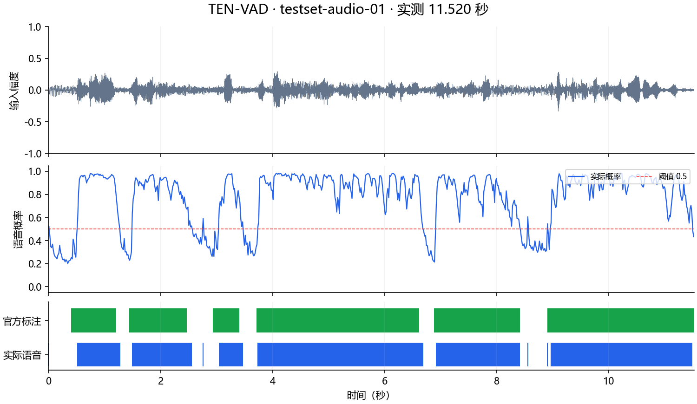
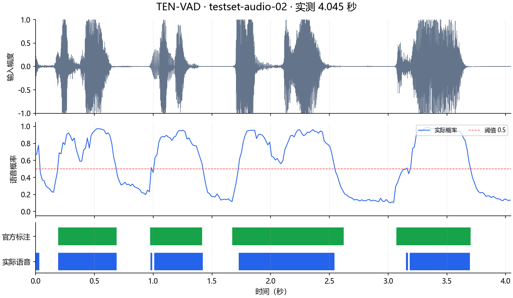
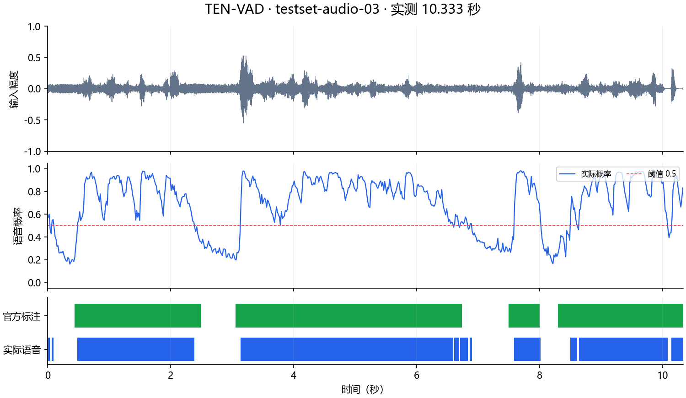
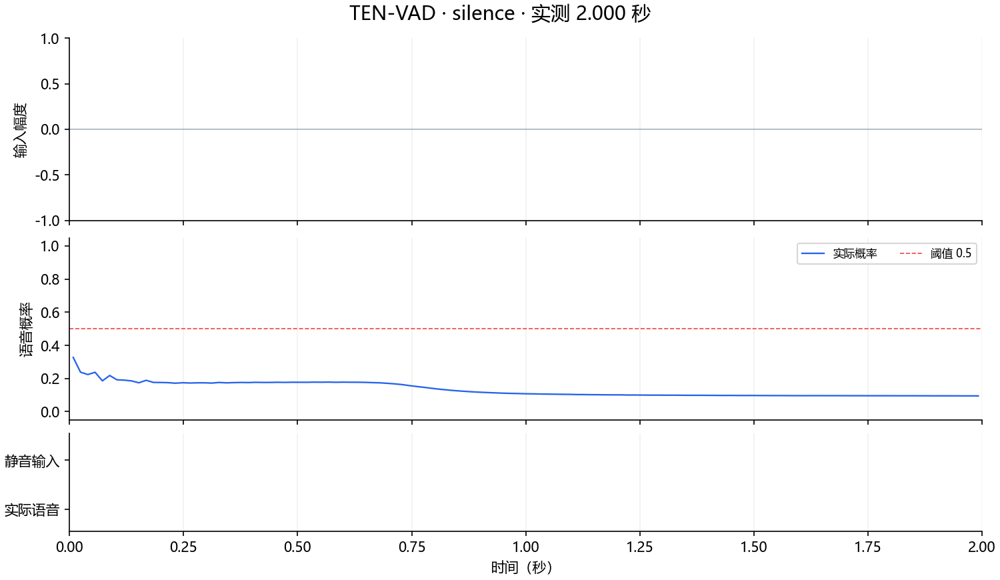

# ten-vad 部署指南

ten-vad 用于语音活动检测。本页说明 M.2 算力卡的接入条件、部署步骤与结果检查方法。

> 已实测，效果仍需评估。[查看部署效果](#查看部署效果)。

## 准备运行环境

本页效果展示使用 **RK3576 + AX8850 16GB M.2**；其他容量或平台需重新确认模型能否加载并正确运行。

在连接算力卡的 Linux 主机终端执行，RK3576 使用 ARM64 环境。首次部署先完成[驱动与设备检查](../../usage/device-check.md)、[准备主机环境](../../getting-started/prepare.md)和[下载工具安装](../../usage/download-models.md#使用-hugging-face-下载)。已完成这些步骤可直接下载模型。

后文使用设备 0，运行前用 `axcl-smi` 确认设备可用。

## 下载模型与样例

本页使用 `AXERA-TECH/ten-vad` 的固定版本。下面下载本页选用的 9 个文件。

```bash
MODEL_DIR=~/edgeaccel/models/ten-vad/8ec863e2de22
mkdir -p "$MODEL_DIR"
~/edgeaccel/hf-env/bin/hf download AXERA-TECH/ten-vad \
  "README.md" \
  "models/axmodel/ten-vad-ax650.axmodel" \
  "models/original/ten-vad.onnx" \
  "testset/testset-audio-01.scv" \
  "testset/testset-audio-01.wav" \
  "testset/testset-audio-02.scv" \
  "testset/testset-audio-02.wav" \
  "testset/testset-audio-03.scv" \
  "testset/testset-audio-03.wav" \
  --revision 8ec863e2de22f93305f2927d5b7c8d5d31a021ee \
  --local-dir "$MODEL_DIR"
cd "$MODEL_DIR"
```

保留当前终端中的 `MODEL_DIR` 变量，后续命令沿用此目录。下载受阻或需要离线复制时，见[下载方式与文件校验](../../usage/download-models.md)。

## 编译 AXCL 运行库

在 RK3576 主机安装编译工具和 NumPy。此示例通过原生 AXCL C++ 接口运行模型，Python 负责读取音频和保存结果。

```bash
sudo apt-get update
sudo apt-get install -y git cmake g++ python3-venv
python3 -m venv ~/edgeaccel/ten-vad-env
source ~/edgeaccel/ten-vad-env/bin/activate
python -m pip install 'numpy==1.26.4'
mkdir -p ~/edgeaccel/src
git clone https://github.com/AXERA-TECH/ten-vad.axera.git ~/edgeaccel/src/ten-vad
git -C ~/edgeaccel/src/ten-vad checkout 666ae7ce649e5ed8a813ada3666d612292db626d
```

下载 [AXCL 适配脚本](../../../static/examples/ten_vad_axcl_patch.py) 和 [音频处理示例](../../../static/examples/ten_vad_card.py)，分别保存为 `~/edgeaccel/ten_vad_axcl_patch.py`、`~/edgeaccel/ten_vad_card.py`。

在干净的固定版本源码上执行一次适配，再编译：

```bash
python ~/edgeaccel/ten_vad_axcl_patch.py ~/edgeaccel/src/ten-vad
cmake -S ~/edgeaccel/src/ten-vad -B ~/edgeaccel/src/ten-vad/build-axcl \
  -DCMAKE_BUILD_TYPE=Release
cmake --build ~/edgeaccel/src/ten-vad/build-axcl -j2
```

成功后生成 `build-axcl/libten_vad.so`。适配保留官方 STFT、音高估计、特征提取和状态更新，仅将模型后端替换为 AXCL，并补充错误与数值检查。保留源码中的 `LICENSE`、`NOTICES`；源码许可与模型卡信息分别见各自仓库。

## 运行语音活动检测

保持上文的 `MODEL_DIR` 变量，使用新的输出目录运行：

```bash
python ~/edgeaccel/ten_vad_card.py \
  --model-dir "$MODEL_DIR" \
  --library ~/edgeaccel/src/ten-vad/build-axcl/libten_vad.so \
  --output ~/edgeaccel/results/ten-vad-01
```

默认处理官方 `testset-audio-01.wav` 至 `03.wav` 和生成的 2 秒静音，每份输入重建状态后运行两次。输入为 **16 kHz、16-bit PCM、单声道**；帧移 256 点，即 16 ms，阈值为 0.5。末尾不足一帧时补零，导出的音频保持原始长度。

检查 `result.json` 中 `completed` 为 `true`，每份输入的 `repeatExact` 为 `true`。程序遇到加载失败、非有限数值或重复结果不一致时退出并报错。再次执行时更换输出目录，避免覆盖结果。

处理自己的音频时，在命令末尾增加 `--input /绝对路径/录音.wav`，可重复指定多个文件。

## 查看语音区间与试听

`result.json` 保存逐帧概率、语音标志、以秒为单位的 `voiceSegments` 和实际耗时。每份输入对应以下文件：

| 文件 | 用途 |
| --- | --- |
| `*-input.wav` | 本次原始音频 |
| `*-gated.wav` | 按语音标志将非语音帧置零，便于试听 |
| `*-repeat1-trace.f32`、`*-repeat2-trace.f32` | 核对模型输入、输出和循环状态的原始数值 |

置零试听保留原始时长，未做去噪、边界平滑或语音片段拼接。短语音、停顿和片段边缘仍可能误判；接入业务时可根据场景增加起止缓冲，再用独立音频评估。

输入旁存在同名官方 `.scv` 标注时，示例按 16 ms 帧中心计算精确率、召回率和 F1，不补偿算法延迟。这些数值仅覆盖实际输入，不代表完整测试集结果。

可选的 ONNX 数值对照在 CPU 上执行，与算力卡推理分开记录：

```bash
python -m pip install 'onnxruntime==1.20.1'
python ~/edgeaccel/ten_vad_card.py \
  --model-dir "$MODEL_DIR" \
  --library ~/edgeaccel/src/ten-vad/build-axcl/libten_vad.so \
  --output ~/edgeaccel/results/ten-vad-02 \
  --onnx-reference
```

对照使用与 NPU 相同的特征及输入循环状态逐步计算，不是独立状态的完整 ONNX 流式评测；其耗时不计入下方模型处理耗时。


## 查看部署效果

**已运行，效果仍需评估** · RK3576 + AX8850 16GB M.2。以下输入与输出来自本页固定版本的实际运行。

三段官方录音的 1619 帧合并评分：误检 38 帧、漏检 81 帧，F1 为 95.20%；还存在 7 段所有帧中心都落在非语音标注中的短触发。两秒静音未触发，完整数据集与持续服务仍待验证。

**testset-audio-01**

官方音频，按 16 ms 帧中心与官方标注比较，未补偿算法延迟；蓝色为实际语音区间，绿色为标注。存在 22 帧误检、25 帧漏检。 下表单列短触发与补零数量；“非语音标注中的段”按帧中心判断，未做延迟对齐。置零试听保留原时间轴，并经 PCM 核对；它只将未触发帧置零，不进行音频降噪。

<div className="model-effect-gallery">

<figure>

[](../../../static/validation/effects/ten-vad-20260928/testset-audio-01-timeline.png)

<figcaption>testset-audio-01 · 输入波形、概率与语音区间</figcaption>
</figure>

</div>

| 项目 | 实际值 |
| --- | --- |
| 音频时长 / 帧数 | 11.520 s / 720 |
| 两次完整加载、处理与释放耗时 | 5.135 s / 4.580 s |
| 两次单帧处理平均耗时 | 6.088 ms / 5.315 ms |
| 两次单帧处理 P95 | 7.073 ms / 6.522 ms |
| 语音帧数 | 583 / 720 |
| 重复结果 | 逐帧概率、标志和原始模型张量一致 |
| 精确率 / 召回率 / F1 | 96.23% / 95.73% / 95.98% |
| 误检 / 漏检帧数 | 22 / 25 |
| 与 ONNX 单步概率平均 / 最大绝对差 | 0.000642 / 0.010531 |
| 与 ONNX 单步阈值判断不一致 | 1 / 720 |

| 分段与尾帧检查 | 本次结果 |
| --- | --- |
| 输出连续语音段 | 10 |
| 仅一帧的语音段 | 4 |
| 全部帧中心落在非语音标注中的段 | 0.000–0.016 s、2.752–2.768 s、8.544–8.560 s |
| 尾帧补零采样点 | 0 |
| 纳入标注评分的帧 | 720 |

| 前三段录音合并评分 | 实际值 |
| --- | --- |
| 评分帧数 | 1619（不重复计入复测和静音） |
| TP / FP / FN / TN | 1179 / 38 / 81 / 321 |
| 精确率 / 召回率 / F1 | 96.88% / 93.57% / 95.20% |
| 方法 | 16 ms 帧中心；阈值 0.5；不补偿算法延迟 |

testset-audio-01 · 输入音频

<audio controls preload="metadata" src="/validation/effects/ten-vad-20260928/testset-audio-01-input.wav" aria-label="testset-audio-01 · 输入音频"></audio>

[下载音频](../../../static/validation/effects/ten-vad-20260928/testset-audio-01-input.wav)

testset-audio-01 · 按语音标志置零的试听

<audio controls preload="metadata" src="/validation/effects/ten-vad-20260928/testset-audio-01-gated.wav" aria-label="testset-audio-01 · 按语音标志置零的试听"></audio>

[下载音频](../../../static/validation/effects/ten-vad-20260928/testset-audio-01-gated.wav)

**testset-audio-02**

官方音频，按 16 ms 帧中心与官方标注比较，未补偿算法延迟；蓝色为实际语音区间，绿色为标注。存在 3 帧误检、15 帧漏检。 下表单列短触发与补零数量；“非语音标注中的段”按帧中心判断，未做延迟对齐。置零试听保留原时间轴，并经 PCM 核对；它只将未触发帧置零，不进行音频降噪。

<div className="model-effect-gallery">

<figure>

[](../../../static/validation/effects/ten-vad-20260928/testset-audio-02-timeline.png)

<figcaption>testset-audio-02 · 输入波形、概率与语音区间</figcaption>
</figure>

</div>

| 项目 | 实际值 |
| --- | --- |
| 音频时长 / 帧数 | 4.045 s / 253 |
| 两次完整加载、处理与释放耗时 | 1.736 s / 2.251 s |
| 两次单帧处理平均耗时 | 4.241 ms / 6.285 ms |
| 两次单帧处理 P95 | 5.883 ms / 8.885 ms |
| 语音帧数 | 144 / 253 |
| 重复结果 | 逐帧概率、标志和原始模型张量一致 |
| 精确率 / 召回率 / F1 | 97.92% / 90.38% / 94.00% |
| 误检 / 漏检帧数 | 3 / 15 |
| 与 ONNX 单步概率平均 / 最大绝对差 | 0.002977 / 0.079503 |
| 与 ONNX 单步阈值判断不一致 | 1 / 253 |

| 分段与尾帧检查 | 本次结果 |
| --- | --- |
| 输出连续语音段 | 7 |
| 仅一帧的语音段 | 2 |
| 全部帧中心落在非语音标注中的段 | 0.000–0.032 s |
| 尾帧补零采样点 | 48 |
| 纳入标注评分的帧 | 253 |

testset-audio-02 · 输入音频

<audio controls preload="metadata" src="/validation/effects/ten-vad-20260928/testset-audio-02-input.wav" aria-label="testset-audio-02 · 输入音频"></audio>

[下载音频](../../../static/validation/effects/ten-vad-20260928/testset-audio-02-input.wav)

testset-audio-02 · 按语音标志置零的试听

<audio controls preload="metadata" src="/validation/effects/ten-vad-20260928/testset-audio-02-gated.wav" aria-label="testset-audio-02 · 按语音标志置零的试听"></audio>

[下载音频](../../../static/validation/effects/ten-vad-20260928/testset-audio-02-gated.wav)

**testset-audio-03**

官方音频，按 16 ms 帧中心与官方标注比较，未补偿算法延迟；蓝色为实际语音区间，绿色为标注。存在 13 帧误检、41 帧漏检。 下表单列短触发与补零数量；“非语音标注中的段”按帧中心判断，未做延迟对齐。置零试听保留原时间轴，并经 PCM 核对；它只将未触发帧置零，不进行音频降噪。

<div className="model-effect-gallery">

<figure>

[](../../../static/validation/effects/ten-vad-20260928/testset-audio-03-timeline.png)

<figcaption>testset-audio-03 · 输入波形、概率与语音区间</figcaption>
</figure>

</div>

| 项目 | 实际值 |
| --- | --- |
| 音频时长 / 帧数 | 10.333 s / 646 |
| 两次完整加载、处理与释放耗时 | 3.926 s / 4.670 s |
| 两次单帧处理平均耗时 | 4.980 ms / 6.081 ms |
| 两次单帧处理 P95 | 6.714 ms / 7.702 ms |
| 语音帧数 | 490 / 646 |
| 重复结果 | 逐帧概率、标志和原始模型张量一致 |
| 精确率 / 召回率 / F1 | 97.35% / 92.08% / 94.64% |
| 误检 / 漏检帧数 | 13 / 41 |
| 与 ONNX 单步概率平均 / 最大绝对差 | 0.001120 / 0.111068 |
| 与 ONNX 单步阈值判断不一致 | 0 / 646 |

| 分段与尾帧检查 | 本次结果 |
| --- | --- |
| 输出连续语音段 | 11 |
| 仅一帧的语音段 | 0 |
| 全部帧中心落在非语音标注中的段 | 0.000–0.032 s、0.064–0.096 s、6.864–6.896 s |
| 尾帧补零采样点 | 43 |
| 纳入标注评分的帧 | 646 |

testset-audio-03 · 输入音频

<audio controls preload="metadata" src="/validation/effects/ten-vad-20260928/testset-audio-03-input.wav" aria-label="testset-audio-03 · 输入音频"></audio>

[下载音频](../../../static/validation/effects/ten-vad-20260928/testset-audio-03-input.wav)

testset-audio-03 · 按语音标志置零的试听

<audio controls preload="metadata" src="/validation/effects/ten-vad-20260928/testset-audio-03-gated.wav" aria-label="testset-audio-03 · 按语音标志置零的试听"></audio>

[下载音频](../../../static/validation/effects/ten-vad-20260928/testset-audio-03-gated.wav)

**silence**

生成的 2 秒全零音频，125 帧均未触发语音；每次仍实际执行 125 次 AXCL 推理。

<div className="model-effect-gallery">

<figure>

[](../../../static/validation/effects/ten-vad-20260928/silence-timeline.png)

<figcaption>silence · 输入波形、概率与语音区间</figcaption>
</figure>

</div>

| 项目 | 实际值 |
| --- | --- |
| 音频时长 / 帧数 | 2.000 s / 125 |
| 两次完整加载、处理与释放耗时 | 1.168 s / 1.332 s |
| 两次单帧处理平均耗时 | 4.128 ms / 5.438 ms |
| 两次单帧处理 P95 | 4.905 ms / 6.369 ms |
| 语音帧数 | 0 / 125 |
| 重复结果 | 逐帧概率、标志和原始模型张量一致 |
| 与 ONNX 单步概率平均 / 最大绝对差 | 0.016893 / 0.079263 |
| 与 ONNX 单步阈值判断不一致 | 0 / 125 |

| 分段与尾帧检查 | 本次结果 |
| --- | --- |
| 输出连续语音段 | 0 |
| 仅一帧的语音段 | 0 |
| 全部帧中心落在非语音标注中的段 | 不适用：生成静音 |
| 尾帧补零采样点 | 0 |
| 纳入标注评分的帧 | 不计入三段官方录音评分 |

silence · 输入音频

<audio controls preload="metadata" src="/validation/effects/ten-vad-20260928/silence-input.wav" aria-label="silence · 输入音频"></audio>

[下载音频](../../../static/validation/effects/ten-vad-20260928/silence-input.wav)

silence · 按语音标志置零的试听

<audio controls preload="metadata" src="/validation/effects/ten-vad-20260928/silence-gated.wav" aria-label="silence · 按语音标志置零的试听"></audio>

[下载音频](../../../static/validation/effects/ten-vad-20260928/silence-gated.wav)

**使用时注意：**

- 仅测试官方前三段音频与生成静音，未覆盖全部 30 段、实际麦克风、噪声变化或长时间连续输入。
- 存在短促误触发和片段边界漏检；置零试听未平滑边界，也不表示音频降噪。

这些结果用于对照部署后的输出，未覆盖完整数据集精度或长期连续运行。

<details>
<summary>查看样例环境与运行耗时</summary>

环境：RK3576 + AX8850 16GB M.2。模型版本：`8ec863e2de22f93305f2927d5b7c8d5d31a021ee`。

| 组件 | 版本或配置 |
| --- | --- |
| 主机 / 内核 | RK3576，约 4GB RAM，6.1.115-vendor-rk35xx |
| AXCL / 驱动 | V3.16.0_20260729180218 |
| 固件 / CMM | V3.16.0 / 15232 MiB |
| 运行方式 | GCC 13.3 原生 AXCL 运行库；Python 3.12 / NumPy 1.26.4 读取和保存音频 |
| 参考源代码 | AXERA-TECH/ten-vad.axera @ 666ae7ce；保留 DSP 并适配 AXCL 后端 |
| 数值对照 | ONNX Runtime 1.20.1 / CPUExecutionProvider，独立于 NPU 推理计时 |

| 指标 | 实测值 | 计时或统计范围 |
| --- | --- | --- |
| 三段官方音频的逐帧 F1 | 95.98% / 94.00% / 94.64% | 仅 testset-audio-01 至 03；16 ms 帧中心、阈值 0.5、未补偿算法延迟。 |

适用范围：

- ONNX 对照使用相同特征和 NPU 输入循环状态逐步比较，存在量化差异，不是全流程数值完全一致或独立 ONNX 流式对照。
- 耗时包括主机 DSP、AXCL 数据传输、推理和记录写入；离线样例处理快于音频时长，尚未验证实时音频采集和持续服务。
- 仅在 16GB 卡验证，8GB 容量与其他驱动版本待回归。

</details>

遇到加载、内存或后端错误时，按[常见问题](../../usage/troubleshooting.md)处理。需要更换输入或接入业务时，按[检查输出与记录结果](../../reference/validation.md)保留自己的结果。

<details>
<summary>查看文件用途与版本信息</summary>

| 文件 / 目录内路径 | 用途 |
| --- | --- |
| [`models/axmodel/ten-vad-ax650.axmodel`](https://huggingface.co/AXERA-TECH/ten-vad/blob/8ec863e2de22f93305f2927d5b7c8d5d31a021ee/models/axmodel/ten-vad-ax650.axmodel) | 编译模型；按目录区分芯片和规格 |

仓库提交：`8ec863e2de22f93305f2927d5b7c8d5d31a021ee`。仓库中的 1 个 `.axmodel` 文件可能包括多个芯片、规格和分片。运行时使用本页指定的配套文件，完整列表见[固定版本目录](https://huggingface.co/AXERA-TECH/ten-vad/tree/8ec863e2de22f93305f2927d5b7c8d5d31a021ee)。

</details>

## 参考资料

- [常用术语](../../reference/glossary.md)：AXCL、CMM、分词器与推理指标。
- [固定版本文件表](https://huggingface.co/AXERA-TECH/ten-vad/tree/8ec863e2de22f93305f2927d5b7c8d5d31a021ee)。
- [模型卡 / 使用说明](https://huggingface.co/AXERA-TECH/ten-vad/blob/8ec863e2de22f93305f2927d5b7c8d5d31a021ee/README.md)。
- [配套项目：AXERA-TECH/ten-vad.axera](https://github.com/AXERA-TECH/ten-vad.axera)。
- [配套项目：TEN-framework/ten-vad](https://github.com/TEN-framework/ten-vad)。

返回[完整模型目录](../catalog.mdx)。
