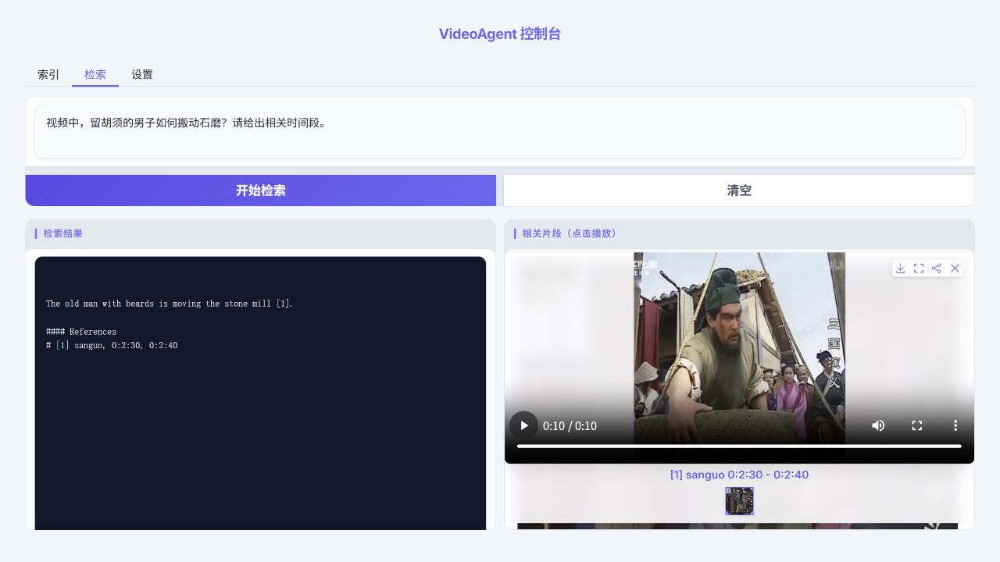

# VideoAgent-AX650N 部署指南

VideoAgent-AX650N 用于视频索引与问答。本页说明 M.2 算力卡的接入条件、部署步骤与结果检查方法。

> 已实测，效果仍需评估。[查看部署效果](#查看部署效果)。

## 准备 PC 和算力卡

本例将视频分段，提取语音、画面描述和向量，再根据问题返回回答及可播放的引用片段。

| 设备 | 本例用途与环境 |
| --- | --- |
| Windows PC | Python 3.12；运行网页、视频处理和分词器 |
| RK3576 | ARM64 Linux；安装 AXCL 3.16.0，连接 AX8850 16GB M.2 算力卡 |
| 算力卡 | 执行 SenseVoice、Qwen3-VL-2B、Qwen3-VL-Embedding-2B 和 Qwen3-1.7B |

先完成[驱动与设备检查](../../usage/device-check.md)。本页实测使用 **16GB 卡**，8GB 卡的完整组合尚未验证。PC 建议预留 25GB，用于约 9GB 模型、Python 环境、视频与索引；板端预留 2GB 用于软件依赖和日志。

为适应板端存储较小的情况，下面把模型保存在 PC，通过 SSH 和只读挂载供 RK3576 读取。保持两台设备的网络连接，PC 文件服务和 SSH 窗口在推理期间不能关闭。

## 下载配套程序

在 Windows PC 下载[VideoAgent M.2 配套包](/examples/videoagent-axcl-20261004.zip)，保存到“下载”目录，并将文件名设为 `videoagent-axcl-20261004.zip`。打开 PowerShell，检查文件：

```powershell
Get-FileHash "$HOME\Downloads\videoagent-axcl-20261004.zip" -Algorithm SHA256
```

SHA-256 应为 `8bc994adeb8b533f61b6f368333004e3e36f10bd711133572beb316794396010`。

```powershell
New-Item -ItemType Directory -Force "$HOME\edgeaccel" | Out-Null
Expand-Archive "$HOME\Downloads\videoagent-axcl-20261004.zip" "$HOME\edgeaccel"
Set-Location "$HOME\edgeaccel\videoagent-axcl"

py -3.12 -m venv .venv
.\.venv\Scripts\python.exe -m pip install torch==2.6.0 torchaudio==2.6.0 torchvision==0.21.0 --index-url https://download.pytorch.org/whl/cpu
.\.venv\Scripts\python.exe -m pip install -r requirements-pc.txt
.\.venv\Scripts\python.exe -m pip check
.\.venv\Scripts\python.exe run_pc.py --check-only
```

`pip check` 应无依赖冲突；最后一条命令检查应用文件、分词器和 FFmpeg，输出 `applicationFiles: 65`。PC 上的 PyTorch 用于数据处理，四个模型服务仍由算力卡执行。

配套包基于官方应用提交 `6a2c8e976059bd3bb945187b49e09651413ed7a8`，包含本页使用的 AXCL 适配、ARM64 运行程序及对应源码信息。不要混入其他版本的应用或运行时。

## 下载模型

继续在 PC 的配套程序目录执行：

```powershell
.\.venv\Scripts\python.exe download_models.py --models-dir .\models
```

脚本按固定提交下载下表文件，并逐文件校验 SHA-256。完成后输出 `verifiedFiles: 105`。下载中断可重复执行；代理配置见[模型下载方法](../../usage/download-models.md)。

| 目录 | 官方模型仓库 | 固定提交 |
| --- | --- | --- |
| `models\llm` | `AXERA-TECH/Qwen3-1.7B` | `f77a4ab10991c6476dafb111371960d6cdce5e6f` |
| `models\vlm` | `AXERA-TECH/Qwen3-VL-2B-Instruct-GPTQ-Int4` | `16fe252a65016ba1ad44e92a60cfc879462fac4c` |
| `models\embedding` | `AXERA-TECH/Qwen3-VL-Embedding-2B-AX650-C128_P1280_CTX1407` | `97ecf827ecfc3b07d35b74b852981d3415d14a1a` |
| `models\asr` | `M5Stack/SenseVoiceSmall-axmodel` | `7ef77b6d0fc6d578e7fca1d8e06f729794e4a868` |

离线复制后，可单独检查：

```powershell
.\.venv\Scripts\python.exe verify_models.py --models-dir .\models
```

## 准备板端服务

下面以 `baiwen@192.168.1.44` 为例。将用户名和 IP 改为实际 RK3576 地址。在 PC PowerShell 执行：

```powershell
$Board = "baiwen@192.168.1.44"
ssh $Board "mkdir -p ~/edgeaccel/videoagent"
scp -r .\board "$($Board):~/edgeaccel/videoagent/"
```

通过 SSH 登录 RK3576，在板端终端执行：

```bash
sudo apt update
sudo apt install -y python3-venv libopencv-dev libsndfile1 libgomp1 rclone fuse3
python3 -m venv ~/edgeaccel/videoagent/env
~/edgeaccel/videoagent/env/bin/python -m pip install \
  -r ~/edgeaccel/videoagent/board/requirements.txt
~/edgeaccel/videoagent/env/bin/python -m pip check
chmod +x ~/edgeaccel/videoagent/board/bin/axllm \
  ~/edgeaccel/videoagent/board/sherpa/bin/sherpa-onnx-offline
axcl-smi
```

确认算力卡可识别、散热正常，停止自己正在运行的其他推理服务后再启动本例。

## 连接 PC 模型目录

在 PC 的第一个 PowerShell 窗口启动只读文件服务：

```powershell
Set-Location "$HOME\edgeaccel\videoagent-axcl"
.\.venv\Scripts\python.exe serve_models.py --models-dir .\models
```

出现 `ready: true` 后保持窗口运行。另开一个 PC PowerShell 窗口，建立隧道：

```powershell
ssh -N -o ExitOnForwardFailure=yes -o ServerAliveInterval=15 -o ServerAliveCountMax=3 -R 127.0.0.1:18866:127.0.0.1:18865 -L 127.0.0.1:18910:127.0.0.1:18910 -L 127.0.0.1:18911:127.0.0.1:18911 -L 127.0.0.1:18912:127.0.0.1:18912 -L 127.0.0.1:18913:127.0.0.1:18913 baiwen@192.168.1.44
```

该窗口连接后通常没有输出，也需要保持运行。回到 RK3576 终端，挂载模型目录：

```bash
mkdir -p ~/edgeaccel/videoagent/models
env http_proxy= https_proxy= HTTP_PROXY= HTTPS_PROXY= ALL_PROXY= all_proxy= \
  rclone mount :http: ~/edgeaccel/videoagent/models \
  --http-url http://127.0.0.1:18866/ \
  --read-only --vfs-cache-mode off --buffer-size 0 \
  --vfs-read-chunk-size 8M --vfs-read-chunk-size-limit 32M \
  --config /dev/null --daemon --daemon-wait 20s

findmnt --mountpoint ~/edgeaccel/videoagent/models
```

输出应显示 `fuse.rclone` 和只读挂载选项。目录中应有 `llm`、`vlm`、`embedding`、`asr` 四个子目录。

## 启动模型与网页

在 RK3576 终端启动四个推理服务：

```bash
sudo ~/edgeaccel/videoagent/env/bin/python \
  ~/edgeaccel/videoagent/board/run_services.py \
  --models-dir ~/edgeaccel/videoagent/models
```

启动时会再次校验模型，随后依次加载。看到 `All four AXCL services ready` 后，在 PC 新开 PowerShell 窗口：

```powershell
Set-Location "$HOME\edgeaccel\videoagent-axcl"
.\.venv\Scripts\python.exe run_pc.py --work-dir .\working_dir
```

出现本地地址后，打开 [VideoAgent 控制台](http://127.0.0.1:7869/)。

1. 在“索引”页上传配套包内的 `application\videos\origin\sanguo.mp4`，点击“开始索引”。
2. 等待日志显示“全部索引完成”，点击“刷新”，确认已索引列表出现 `sanguo`。
3. 切换到“检索”页，输入“视频中，留胡须的男子如何搬动石磨？请给出相关时间段。”，点击“开始检索”。
4. 等待回答和引用片段出现，点击片段并播放，核对画面与回答是否相符。

程序按 10 秒分段，每段取 5 帧，文本块上限为 384 token。初次索引耗时包含语音识别、画面描述和向量编码；同一工作目录会保留索引。更换模型版本或调整索引参数后，使用新的 `--work-dir` 重新建立索引。

## 结束运行

先在 PC 网页程序窗口按 `Ctrl+C`，再在 RK3576 模型服务窗口按 `Ctrl+C`。确认 `axcl-smi` 中不再显示本例进程后，在 RK3576 卸载目录：

```bash
fusermount -u ~/edgeaccel/videoagent/models
```

最后在 PC 的 SSH 隧道和模型文件服务窗口分别按 `Ctrl+C`。保留 PC 的模型与工作目录，下次无需重新下载或重复建立相同索引。


## 查看部署效果

**已运行，效果仍需评估** · RK3576 + AX8850 16GB + Windows PC。以下输入与输出来自本页固定版本的实际运行。

完成原版网页的上传、空索引、问题检索和引用视频播放；配套包已在 16GB M.2 算力卡上实测。回答内容仍有语言与细节限制。

**在网页中检索石磨场景**

使用官方仓库的 sanguo.mp4（原视频约 181 秒，预处理后为 181.4 秒）从空目录建立索引，再在网页提交问题并播放引用视频。本次为 RK3576 + AX8850 16GB 卡的完整应用实测。

<div className="model-effect-gallery">

<figure>

[](../../../static/validation/effects/videoagent-ax650n-20261004/query-ui.jpg)

<figcaption>实际网页：中文问题、模型原始回答与播放完成的引用片段</figcaption>
</figure>

</div>

**示例 1：输入**

```text
视频中，留胡须的男子如何搬动石磨？请给出相关时间段。
```

**实际回复**

```text
The old man with beards is moving the stone mill [1]. 

#### References
# [1] sanguo, 0:2:30, 0:2:40
```

回答返回英文，定位到原视频 2:30–2:40，引用片段可以完整播放。画面包含男子搬动石磨的动作，但回答只说“正在搬动石磨”，没有说明搬动方法，也没有遵循中文提问的语言。以上保留原始回复。

| 检查项 | 本次结果 |
| --- | --- |
| 从空目录建立索引 | 约 538 秒；不含上传时的视频预处理 |
| 索引内容 | 18 个视频片段、18 个视频向量、5 个文本向量 |
| 向量维度 | 2048 |
| 引用片段 | 原视频 2:30–2:40，10 秒，可播放 |

模型返回的实际引用片段：2:30–2:40

<video className="model-effect-video" controls playsInline preload="metadata" src="/validation/effects/videoagent-ax650n-20261004/reference-150-160.mp4" aria-label="模型返回的实际引用片段：2:30–2:40"></video>

[下载视频](../../../static/validation/effects/videoagent-ax650n-20261004/reference-150-160.mp4)

输入视频：官方应用随附的 sanguo.mp4

<video className="model-effect-video" controls playsInline preload="metadata" src="/validation/effects/videoagent-ax650n-20261004/sanguo.mp4" aria-label="输入视频：官方应用随附的 sanguo.mp4"></video>

[下载视频](../../../static/validation/effects/videoagent-ax650n-20261004/sanguo.mp4)

**使用时注意：**

- 仅覆盖一段官方视频；不是通用检索准确率或长期稳定性测试。
- 本次中文问题返回英文，引用时间正确，但没有解释具体搬动方法。此前“视频开头”问题出现时间定位和物体描述错误，效果质量尚未通过。

这些结果用于对照部署后的输出，未覆盖完整数据集精度或长期连续运行。

<details>
<summary>查看样例环境与运行耗时</summary>

环境：RK3576 + AX8850 16GB + Windows PC。模型版本：`6a2c8e976059bd3bb945187b49e09651413ed7a8`。

| 组件 | 版本或配置 |
| --- | --- |
| 应用主机 | Windows PC / Python 3.12；WebUI、视频处理、分词 |
| 算力卡主机 | RK3576 / ARM64 Linux / 4GB 主机内存 |
| 算力卡 | AX8850 M.2 / 16GB；实际 8GB 卡未验证 |
| AXCL / 固件 | V3.16.0_20260729180218 / V3.16.0 |
| 模型存储 | PC 本地模型经 SSH 只读挂载；四类模型均在卡端推理 |

| 指标 | 实测值 | 计时或统计范围 |
| --- | --- | --- |
| 完整视频 | 约 181 秒 | 官方原视频；预处理后为 181.4 秒 |
| 索引耗时 | 约 538 秒 | 网页索引日志起止时间；含语音、画面描述、向量与文本块，不含上传预处理及模型加载 |
| 音频识别 | 18 次请求 / 19 次 NPU 执行 | 完整预处理音频 181.4 秒，16 kHz 单声道 |
| 实际执行模型 | 90 个权重文件 | Embedding 30、VLM 30、LLM 29、ASR 1；已核对执行与释放 |

适用范围：

- 仅实测 16GB 卡；不能据此判断 8GB 卡能否同时运行完整组合。
- 结果针对配套包固定版本；分段描述和文本块可能随推理结果变化，修改参数后需重新建立索引。

</details>

遇到加载、内存或后端错误时，按[常见问题](../../usage/troubleshooting.md)处理。需要更换输入或接入业务时，按[检查输出与记录结果](../../reference/validation.md)保留自己的结果。

<details>
<summary>查看文件用途与版本信息</summary>

| 文件 / 目录内路径 | 用途 |
| --- | --- |
| [`VideoAgent/_server/sherpa_asr_server.py`](https://huggingface.co/AXERA-TECH/VideoAgent-AX650N/blob/6a2c8e976059bd3bb945187b49e09651413ed7a8/VideoAgent/_server/sherpa_asr_server.py) | Python 程序 / 前后处理 |
| [`VideoAgent/_server/tokenizer_server.py`](https://huggingface.co/AXERA-TECH/VideoAgent-AX650N/blob/6a2c8e976059bd3bb945187b49e09651413ed7a8/VideoAgent/_server/tokenizer_server.py) | 旧版分词服务入口 |
| [`VideoAgent/_llm/tokenizer_model.py`](https://huggingface.co/AXERA-TECH/VideoAgent-AX650N/blob/6a2c8e976059bd3bb945187b49e09651413ed7a8/VideoAgent/_llm/tokenizer_model.py) | 旧版分词服务入口 |
| [`VideoAgent/_llm/tokenizer_model/Qwen/Qwen3-1.7B/tokenizer_config.json`](https://huggingface.co/AXERA-TECH/VideoAgent-AX650N/blob/6a2c8e976059bd3bb945187b49e09651413ed7a8/VideoAgent/_llm/tokenizer_model/Qwen/Qwen3-1.7B/tokenizer_config.json) | 运行配置 |
| [`VideoAgent/_llm/tokenizer_model/Qwen/Qwen3-4B-Instruct-2507/tokenizer_config.json`](https://huggingface.co/AXERA-TECH/VideoAgent-AX650N/blob/6a2c8e976059bd3bb945187b49e09651413ed7a8/VideoAgent/_llm/tokenizer_model/Qwen/Qwen3-4B-Instruct-2507/tokenizer_config.json) | 运行配置 |
| [`VideoAgent/_llm/tokenizer_model/Qwen/Qwen3-4B/tokenizer_config.json`](https://huggingface.co/AXERA-TECH/VideoAgent-AX650N/blob/6a2c8e976059bd3bb945187b49e09651413ed7a8/VideoAgent/_llm/tokenizer_model/Qwen/Qwen3-4B/tokenizer_config.json) | 运行配置 |
| [`config.json`](https://huggingface.co/AXERA-TECH/VideoAgent-AX650N/blob/6a2c8e976059bd3bb945187b49e09651413ed7a8/config.json) | 运行配置 |
| [`requirements.txt`](https://huggingface.co/AXERA-TECH/VideoAgent-AX650N/blob/6a2c8e976059bd3bb945187b49e09651413ed7a8/requirements.txt) | Python 依赖清单 |

仓库提交：`6a2c8e976059bd3bb945187b49e09651413ed7a8`。该提交没有预编译 `.axmodel` 文件。运行时使用本页指定的配套文件，完整列表见[固定版本目录](https://huggingface.co/AXERA-TECH/VideoAgent-AX650N/tree/6a2c8e976059bd3bb945187b49e09651413ed7a8)。

</details>

<details>
<summary>补充说明与版本差异</summary>

- 应用仓库本身不含 .axmodel；本页配套包固定四个模型仓库与运行时版本。PC 负责视频处理、网页和分词，RK3576 的算力卡执行语音识别、画面描述、向量编码和回答生成。
- 本页仅实测 16GB 卡的基础流程；检索精度、回答完整性和实际 8GB 卡容量另行评估。

</details>

## 参考资料

- [常用术语](../../reference/glossary.md)：AXCL、CMM、分词器与推理指标。
- [固定版本文件表](https://huggingface.co/AXERA-TECH/VideoAgent-AX650N/tree/6a2c8e976059bd3bb945187b49e09651413ed7a8)。
- [模型卡 / 使用说明](https://huggingface.co/AXERA-TECH/VideoAgent-AX650N/blob/6a2c8e976059bd3bb945187b49e09651413ed7a8/README.md)。
- [主要程序入口：VideoAgent/_server/sherpa_asr_server.py](https://huggingface.co/AXERA-TECH/VideoAgent-AX650N/blob/6a2c8e976059bd3bb945187b49e09651413ed7a8/VideoAgent/_server/sherpa_asr_server.py)。
- [配套项目：HKUDS/VideoRAG](https://github.com/HKUDS/VideoRAG)。

返回[完整模型目录](../catalog.mdx)。
