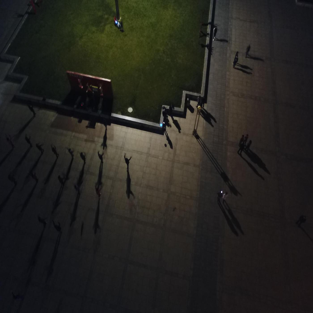
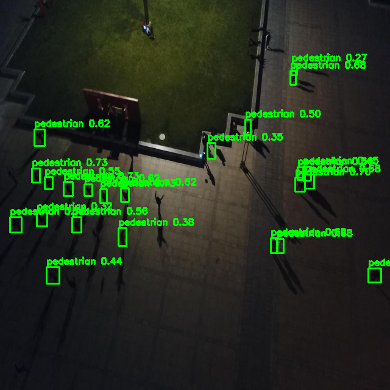
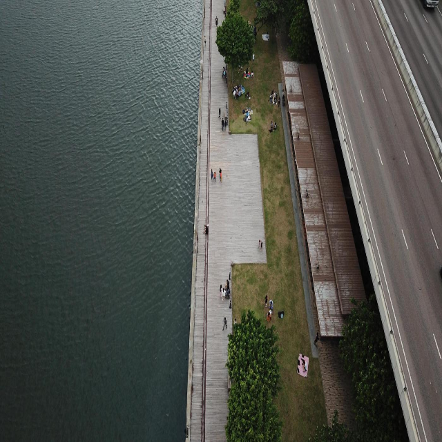
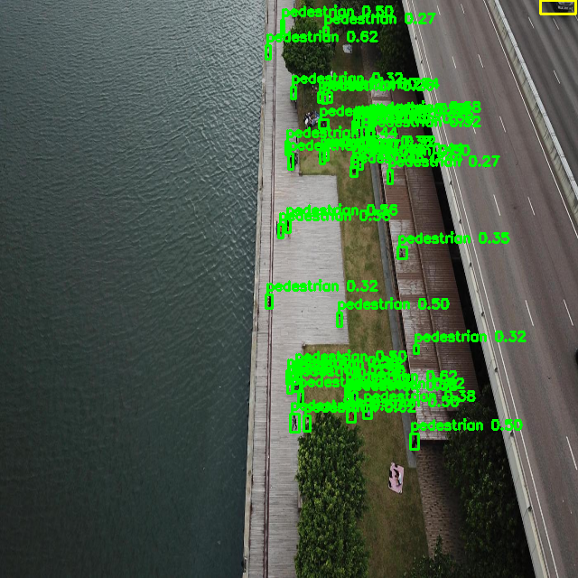

# visdrone-yolov11s 部署指南

visdrone-yolov11s 用于目标检测。本页说明 M.2 算力卡的接入条件、部署步骤与结果检查方法。

> 已实测，效果仍需评估。[查看部署效果](#查看部署效果)。

## 准备运行环境

本页效果展示使用 **RK3576 + AX8850 16GB M.2**；其他容量或平台需重新确认模型能否加载并正确运行。

在连接算力卡的 Linux 主机终端执行，RK3576 使用 ARM64 环境。首次部署先完成[驱动与设备检查](../../usage/device-check.md)、[安装 PyAXEngine](../../usage/python.md)和[下载工具安装](../../usage/download-models.md#使用-hugging-face-下载)。已完成这些步骤可直接下载模型。

后文使用设备 0，运行前用 `axcl-smi` 确认设备可用。

## 下载模型与样例

本页使用 `AXERA-TECH/visdrone-yolov11s` 的固定版本。下面下载本页选用的 17 个文件。

```bash
MODEL_DIR=~/edgeaccel/models/visdrone-yolov11s/cdf29a6bd81b
mkdir -p "$MODEL_DIR"
~/edgeaccel/hf-env/bin/hf download AXERA-TECH/visdrone-yolov11s \
  "README.md" \
  "cpp/lib/libdet.so" \
  "demo/demo_00.jpg" \
  "demo/demo_01.jpg" \
  "demo/demo_02.jpg" \
  "models/model.axmodel" \
  "models/model_meta.json" \
  "python/README.md" \
  "python/example.py" \
  "python/requirements.txt" \
  "python/visdrone_yolov26s_sdk/__init__.py" \
  "python/visdrone_yolov26s_sdk/inference.py" \
  "python/visdrone_yolov26s_sdk/postprocess.py" \
  "python/visdrone_yolov26s_sdk/preprocess.py" \
  "python/visdrone_yolov26s_sdk/pydet/__init__.py" \
  "python/visdrone_yolov26s_sdk/pydet/pyaxdev.py" \
  "python/visdrone_yolov26s_sdk/pydet/pydet.py" \
  --revision cdf29a6bd81b0980e68e6725abe0f8e1d52c6eb2 \
  --local-dir "$MODEL_DIR"
cd "$MODEL_DIR"
```

保留当前终端中的 `MODEL_DIR` 变量，后续命令沿用此目录。下载受阻或需要离线复制时，见[下载方式与文件校验](../../usage/download-models.md)。

## 准备算力卡例程

在 RK3576 主机激活已安装 PyAXEngine 的虚拟环境，安装图像处理依赖：

```bash
sudo apt install libopencv-dev
source ~/edgeaccel/python-env/bin/activate
python -m pip install 'numpy==1.26.4' 'opencv-python-headless==4.11.0.86'
cd "$MODEL_DIR"
ldd cpp/lib/libdet.so
```

依赖检查不能出现 `not found`。下载 [vision_card.py](../../../static/examples/vision_card.py)，保存到 `$MODEL_DIR`。例程先加载系统 OpenCV C++ 库，再加载官方 ARM64 `libdet.so`，以 `AxDeviceType.axcl_device` 显式选择 AXCL 设备 0。Python 的 `opencv-python` 包不能替代这里的系统 C++ 库。

## 检测航拍图片

```bash
cd "$MODEL_DIR"
python vision_card.py --model-dir . --task visdrone --variant official \
  --output results/official
```

例程按 `model_meta.json` 使用 11 个输出类别，阈值为 0.25。按固定版本前处理将图像直接缩放到 640×640，保留 BGR 通道顺序，由检测库执行 1/255 归一化。

三张图片各运行三次，保存缩放后的输入、`-output.png` 检测图和 `deployment-result.json`。输出目录必须尚不存在；再次运行时换一个目录名。

检查检测框、类别和分数，再对照原图评估漏检与误检。官方 SDK 单次结果结构最多容纳 64 个候选目标，密集航拍场景需要单独评估这项限制。记录的耗时包含检测库内部前后处理，不是纯 NPU 时间。


## 查看部署效果

**已运行，效果仍需评估** · RK3576 + AX8850 16GB M.2。以下输入与输出来自本页固定版本的实际运行。

三张航拍图分别输出 23、43、0 个候选，逐图重复三次的框、类别和分数一致；夜景中央举手人物未检出，部分栈道候选也无法从画面确认。本次效果核对未通过，城市图的空结果不代表无漏检。

**demo_00**

阈值 0.25，夜景输出 23 个 pedestrian 候选。中央举手人物没有对应框；昏暗区域和长阴影附近的低分候选还需标注核对。三次框、类别与分数一致，不代表完整检出。

<div className="model-effect-gallery">

<figure>

[](../../../static/validation/effects/visdrone-yolov11s-20260927/demo_00-input.webp)

<figcaption>本次输入 · demo_00</figcaption>
</figure>

<figure>

[](../../../static/validation/effects/visdrone-yolov11s-20260927/demo_00-output.webp)

<figcaption>本次检测结果 · demo_00</figcaption>
</figure>

</div>

| 类别 | 候选框数 |
| --- | --- |
| pedestrian | 23 |

**demo_01**

阈值 0.25，河岸图输出 43 个候选。部分人行区域有对应框，右侧木质栈道上的部分候选无法从当前图片确认，不将其直接视为正确目标。仍需配套标注判定误检与定位误差。

<div className="model-effect-gallery">

<figure>

[](../../../static/validation/effects/visdrone-yolov11s-20260927/demo_01-input.webp)

<figcaption>本次输入 · demo_01</figcaption>
</figure>

<figure>

[](../../../static/validation/effects/visdrone-yolov11s-20260927/demo_01-output.webp)

<figcaption>本次检测结果 · demo_01</figcaption>
</figure>

</div>

| 类别 | 候选框数 |
| --- | --- |
| pedestrian | 42 |
| truck | 1 |

**demo_02**

阈值 0.25，城市远景图输出 0 个候选；输出图与输入图像素相同。没有目标标注，无法据此判断所有远处小目标均被正确排除。

<div className="model-effect-gallery">

<figure>

[](../../../static/validation/effects/visdrone-yolov11s-20260927/demo_02-input.webp)

<figcaption>本次输入 · demo_02</figcaption>
</figure>

<figure>

[](../../../static/validation/effects/visdrone-yolov11s-20260927/demo_02-output.webp)

<figcaption>本次检测结果 · demo_02</figcaption>
</figure>

</div>

| 类别 | 候选框数 |
| --- | --- |


**使用时注意：**

- 只核对这三张航拍图，没有配套目标标注或 VisDrone 数据集 AP；重复一致和零候选都不能证明整体检测正确。当前最多 43 个候选，未触及 SDK 的 64 个保存上限，不能据此认定漏检由该上限造成。
- 仅在 RK3576 + AX8850 16GB 上验证；未测试 8GB、实时视频或长期运行。

这些结果用于对照部署后的输出，未覆盖完整数据集精度或长期连续运行。

<details>
<summary>查看样例环境与运行耗时</summary>

环境：RK3576 + AX8850 16GB M.2。模型版本：`cdf29a6bd81b0980e68e6725abe0f8e1d52c6eb2`。

| 组件 | 版本或配置 |
| --- | --- |
| 主机系统 | Ubuntu 24.04 / Armbian 25.11.0-trunk，aarch64，主机内存约 4GB |
| 内核 | 6.1.115-vendor-rk35xx |
| AXCL / 驱动 | V3.16.0_20260729180218 |
| 固件 / CMM | V3.16.0；CMM 总量 15232MiB |
| Python / PyAXEngine | Python 3.12；官方 0.1.3.rc3 wheel；AXCLRTExecutionProvider |
| NumPy / OpenCV / Pillow | 1.26.4 / 4.11.0.86 / 11.3.0 |
| Torch / Torchvision | 2.5.1 / 0.20.1 |
| RF-DETR bbox 后处理 | ONNX Runtime 1.20.1 / CPUExecutionProvider / intra-op 2、inter-op 1 |
| C++ 分割示例 | axcl-samples cbfa4c76891758983ca2b0c99c11d6621d59af39 / OpenCV 4.6.0 |

| 指标 | 实测值 | 计时或统计范围 |
| --- | --- | --- |
| model.axmodel | 31.455 ms（9 次平均） | 官方 libdet detect 调用，包含库内部的图像处理、数据传输、AXCL 推理和后处理；不含加载与画图，未剔除首轮。 |

</details>

遇到加载、内存或后端错误时，按[常见问题](../../usage/troubleshooting.md)处理。需要更换输入或接入业务时，按[检查输出与记录结果](../../reference/validation.md)保留自己的结果。

<details>
<summary>查看文件用途与版本信息</summary>

| 文件 / 目录内路径 | 用途 |
| --- | --- |
| [`python/example.py`](https://huggingface.co/AXERA-TECH/visdrone-yolov11s/blob/cdf29a6bd81b0980e68e6725abe0f8e1d52c6eb2/python/example.py) | Python 程序 / 前后处理 |
| [`models/model.axmodel`](https://huggingface.co/AXERA-TECH/visdrone-yolov11s/blob/cdf29a6bd81b0980e68e6725abe0f8e1d52c6eb2/models/model.axmodel) | 编译模型；按目录区分芯片和规格 |
| [`python/requirements.txt`](https://huggingface.co/AXERA-TECH/visdrone-yolov11s/blob/cdf29a6bd81b0980e68e6725abe0f8e1d52c6eb2/python/requirements.txt) | Python 依赖清单 |

仓库提交：`cdf29a6bd81b0980e68e6725abe0f8e1d52c6eb2`。仓库中的 1 个 `.axmodel` 文件可能包括多个芯片、规格和分片。运行时使用本页指定的配套文件，完整列表见[固定版本目录](https://huggingface.co/AXERA-TECH/visdrone-yolov11s/tree/cdf29a6bd81b0980e68e6725abe0f8e1d52c6eb2)。

</details>

## 参考资料

- [常用术语](../../reference/glossary.md)：AXCL、CMM、分词器与推理指标。
- [固定版本文件表](https://huggingface.co/AXERA-TECH/visdrone-yolov11s/tree/cdf29a6bd81b0980e68e6725abe0f8e1d52c6eb2)。
- [模型卡 / 使用说明](https://huggingface.co/AXERA-TECH/visdrone-yolov11s/blob/cdf29a6bd81b0980e68e6725abe0f8e1d52c6eb2/README.md)。
- [主要程序入口：python/example.py](https://huggingface.co/AXERA-TECH/visdrone-yolov11s/blob/cdf29a6bd81b0980e68e6725abe0f8e1d52c6eb2/python/example.py)。

返回[完整模型目录](../catalog.mdx)。
