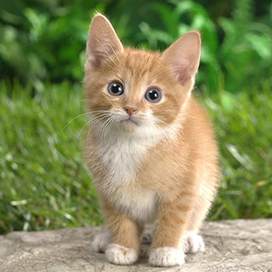

# ViT-L-14-336__axera 部署指南

ViT-L-14-336__axera 用于图文特征与检索。本页说明 M.2 算力卡的接入条件、部署步骤与结果检查方法。

> 已实测，效果仍需评估。[查看部署效果](#查看部署效果)。

## 准备运行环境

本页效果展示使用 **RK3576 + AX8850 16GB M.2**；其他容量或平台需重新确认模型能否加载并正确运行。

在连接算力卡的 Linux 主机终端执行，RK3576 使用 ARM64 环境。首次部署先完成[驱动与设备检查](../../usage/device-check.md)、[安装 PyAXEngine](../../usage/python.md)和[下载工具安装](../../usage/download-models.md#使用-hugging-face-下载)。已完成这些步骤可直接下载模型。

后文使用设备 0，运行前用 `axcl-smi` 确认设备可用。

## 下载模型与样例

本页使用 `AXERA-TECH/ViT-L-14-336__axera` 的固定版本。下面下载本页选用的 9 个文件。

```bash
MODEL_DIR=~/edgeaccel/models/vit-l-14-336-axera/d461cbe32299
mkdir -p "$MODEL_DIR"
~/edgeaccel/hf-env/bin/hf download AXERA-TECH/ViT-L-14-336__axera \
  "config.json" \
  "textual/merges.txt" \
  "textual/model.axmodel" \
  "textual/special_tokens_map.json" \
  "textual/tokenizer.json" \
  "textual/tokenizer_config.json" \
  "textual/vocab.json" \
  "visual/model.axmodel" \
  "visual/preprocess_cfg.json" \
  --revision d461cbe322991aaec35a359b0defc81356c8db46 \
  --local-dir "$MODEL_DIR"
cd "$MODEL_DIR"
```

保留当前终端中的 `MODEL_DIR` 变量，后续命令沿用此目录。下载受阻或需要离线复制时，见[下载方式与文件校验](../../usage/download-models.md)。

## 准备图文样例

本例在 RK3576 主机通过 AXCL 运行两份编码器，比较鸟、猫、狗三个固定候选。先按 [Python 接口](../../usage/python.md) 创建 `~/edgeaccel/python-env`，激活环境并确认后端：

```bash
source ~/edgeaccel/python-env/bin/activate
python -m pip install 'numpy==1.26.4' 'opencv-python-headless==4.11.0.86' 'Pillow==11.3.0' 'torch==2.5.1' 'torchvision==0.20.1'
python -c "import axengine; print(axengine.get_available_providers())"
```

输出须包含 `AXCLRTExecutionProvider`。获取官方样例固定提交，保留图片和两份词表：

```bash
SAMPLE_DIR=~/edgeaccel/src/clip-samples-8a330cf1
git clone --no-checkout https://github.com/AXERA-TECH/CLIP-ONNX-AX650-CPP.git "$SAMPLE_DIR"
git -C "$SAMPLE_DIR" checkout --detach 8a330cf1c3f7a881ba222f92d6485e5b6894f8d3
```

目录已存在时先核对提交再复用，不重复克隆。

本例沿用官方 `vocab.txt`，三个候选为 `bird`、`cat`、`dog`，起止符为 49406/49407、长度 77，剩余位置补零；当前入口用于复现固定候选。

## 运行两种图像处理方式

下载 [ViT 算力卡示例](../../../static/examples/vit_bundle_card.py)，保存为 `~/edgeaccel/vit_bundle_card.py`。保持前面下载步骤中的 `MODEL_DIR`，执行：

```bash
python ~/edgeaccel/vit_bundle_card.py \
  --model-dir "$MODEL_DIR" \
  --sample-dir "$SAMPLE_DIR" \
  --language en \
  --output ~/edgeaccel/results/vit-l-14-336-axera-01
```

输出目录须尚不存在。脚本先核对权重及词表 SHA256，图像和文本编码器均显式使用 AXCL。图像按以下两种方式分别运行，不混用结果：

1. 按随包 `visual/preprocess_cfg.json`：RGB，短边 bicubic 缩放至 336，再中心裁剪为 336×336。
2. 按既有官方 C++ 示例：RGB，线性直接缩放至 336×336。

两种方式均按随包 mean/std 标准化，每张图及每条文本重复两次。重复向量不一致、维度不匹配或输出非有限值时，程序停止并保留已写记录。

## 查看匹配与输入裁剪

输出目录内的 `deployment-result.json` 包含两组候选分数、最高分候选和编码耗时；`*-input.png` 为原图，`*-bundle-bicubic-center-crop.png` 为裁剪后的实际输入。`embeddings.npz` 保存原始向量，可自行复算。

检查 `completed` 为 `true`，并将分数与下方本次效果对照。候选内 softmax 不代表准确率；接入通用文本检索时还需要完整分词流程和独立质量评估。


## 查看部署效果

**已运行，效果仍需评估** · RK3576 + AX8850 16GB M.2。以下输入与输出来自本页固定版本的实际运行。

三张图与 bird、cat、dog 三个固定标签在两种前处理下均双向匹配正确；新增文字找图表由已保存的 AXCL 向量计算。仍未验证任意英文分词、浮点参考或大规模检索。

**随包配置：短边缩放与中心裁剪**

三个候选固定为 bird、cat、dog。三张图片的最高分依次为 bird、cat、dog。每个图文输入运行两次，原始向量逐项一致；下表为候选内相对分数。 用同一组已保存向量反向计算“文字找图片”，三个查询的首位均为对应图片。表中差值为首位与第二位图片的余弦分数之差；检索范围只有这三张图。当前入口使用固定标签分词规则，尚未验证任意句子的检索效果。

<div className="model-effect-gallery">

<figure>

[](../../../static/validation/effects/vit-l-14-336-axera-20260928/bird-input.png)

<figcaption>实际输入：bird.jpg</figcaption>
</figure>

<figure>

[](../../../static/validation/effects/vit-l-14-336-axera-20260928/cat-input.png)

<figcaption>实际输入：cat.jpg</figcaption>
</figure>

<figure>

[](../../../static/validation/effects/vit-l-14-336-axera-20260928/dog-chai-input.png)

<figcaption>实际输入：dog-chai.jpeg</figcaption>
</figure>

<figure>

[](../../../static/validation/effects/vit-l-14-336-axera-20260928/bird-crop.png)

<figcaption>实际送入编码器的裁剪图：bird.jpg</figcaption>
</figure>

<figure>

[](../../../static/validation/effects/vit-l-14-336-axera-20260928/cat-crop.png)

<figcaption>实际送入编码器的裁剪图：cat.jpg</figcaption>
</figure>

<figure>

[](../../../static/validation/effects/vit-l-14-336-axera-20260928/dog-chai-crop.png)

<figcaption>实际送入编码器的裁剪图：dog-chai.jpeg</figcaption>
</figure>

</div>

| 输入图片 | bird | cat | dog | 最高分候选 |
| --- | --- | --- | --- | --- |
| bird.jpg | 0.989356 | 0.005876 | 0.004767 | bird |
| cat.jpg | 0.005315 | 0.948024 | 0.046661 | cat |
| dog-chai.jpeg | 0.028139 | 0.015253 | 0.956607 | dog |

| 文字查询 | 排名第一的图片 | 余弦分数 | 第二名图片 | 领先差值 |
| --- | --- | --- | --- | --- |
| bird | bird.jpg | 0.200559 | dog-chai.jpeg | 0.029718 |
| cat | cat.jpg | 0.208035 | dog-chai.jpeg | 0.043319 |
| dog | dog-chai.jpeg | 0.206103 | cat.jpg | 0.028182 |

**官方 C++ 示例：直接缩放对照**

三个候选固定为 bird、cat、dog。三张图片的最高分依次为 bird、cat、dog。每个图文输入运行两次，原始向量逐项一致；下表为候选内相对分数。 用同一组已保存向量反向计算“文字找图片”，三个查询的首位均为对应图片。表中差值为首位与第二位图片的余弦分数之差；检索范围只有这三张图。当前入口使用固定标签分词规则，尚未验证任意句子的检索效果。

| 输入图片 | bird | cat | dog | 最高分候选 |
| --- | --- | --- | --- | --- |
| bird.jpg | 0.991869 | 0.005770 | 0.002361 | bird |
| cat.jpg | 0.004936 | 0.961482 | 0.033582 | cat |
| dog-chai.jpeg | 0.013075 | 0.021527 | 0.965398 | dog |

| 文字查询 | 排名第一的图片 | 余弦分数 | 第二名图片 | 领先差值 |
| --- | --- | --- | --- | --- |
| bird | bird.jpg | 0.233289 | dog-chai.jpeg | 0.065936 |
| cat | cat.jpg | 0.207668 | bird.jpg | 0.025847 |
| dog | dog-chai.jpeg | 0.210371 | cat.jpg | 0.036249 |

**使用时注意：**

- 只验证鸟、猫、狗三个固定候选，没有完整检索数据集或原始浮点模型精度对照。
- 分数为归一化向量余弦乘 100 后的候选内 softmax，不是准确率。

这些结果用于对照部署后的输出，未覆盖完整数据集精度或长期连续运行。

<details>
<summary>查看样例环境与运行耗时</summary>

环境：RK3576 + AX8850 16GB M.2。模型版本：`d461cbe322991aaec35a359b0defc81356c8db46`。

| 组件 | 版本或配置 |
| --- | --- |
| 主机 / 内核 | RK3576，约 4GB RAM，6.1.115-vendor-rk35xx |
| AXCL / 驱动 | V3.16.0_20260729180218 |
| 固件 / CMM | V3.16.0 / 15232 MiB |
| Python 推理 | Python 3.12 / PyAXEngine 0.1.3.rc3 / NumPy 1.26.4 / AXCLRTExecutionProvider |

| 指标 | 实测值 | 计时或统计范围 |
| --- | --- | --- |
| 文本编码平均耗时 | 8.590 ms | 三条固定候选各两次；session.run 包含传输，不含加载与分词。 |
| 图像编码平均耗时 | 80.933 ms | 三张图、两种处理方式、各两次；session.run，不含预处理。 |

适用范围：

- 固定候选使用官方 C++ 词表规则，不是任意文本的完整 BPE/WordPiece 服务。
- 两种图像处理分别记录；既有 CLIP/CN-CLIP 页的结果不能直接作为此部署包测试结果。
- 仅验证 16GB；8GB、长时间运行及其他输入仍需独立回归。

</details>

遇到加载、内存或后端错误时，按[常见问题](../../usage/troubleshooting.md)处理。需要更换输入或接入业务时，按[检查输出与记录结果](../../reference/validation.md)保留自己的结果。

<details>
<summary>查看文件用途与版本信息</summary>

| 文件 / 目录内路径 | 用途 |
| --- | --- |
| [`textual/model.axmodel`](https://huggingface.co/AXERA-TECH/ViT-L-14-336__axera/blob/d461cbe322991aaec35a359b0defc81356c8db46/textual/model.axmodel) | 编译模型；按目录区分芯片和规格 |
| [`visual/model.axmodel`](https://huggingface.co/AXERA-TECH/ViT-L-14-336__axera/blob/d461cbe322991aaec35a359b0defc81356c8db46/visual/model.axmodel) | 编译模型；按目录区分芯片和规格 |
| [`config.json`](https://huggingface.co/AXERA-TECH/ViT-L-14-336__axera/blob/d461cbe322991aaec35a359b0defc81356c8db46/config.json) | 运行配置 |
| [`textual/tokenizer_config.json`](https://huggingface.co/AXERA-TECH/ViT-L-14-336__axera/blob/d461cbe322991aaec35a359b0defc81356c8db46/textual/tokenizer_config.json) | 运行配置 |

仓库提交：`d461cbe322991aaec35a359b0defc81356c8db46`。仓库中的 2 个 `.axmodel` 文件可能包括多个芯片、规格和分片。运行时使用本页指定的配套文件，完整列表见[固定版本目录](https://huggingface.co/AXERA-TECH/ViT-L-14-336__axera/tree/d461cbe322991aaec35a359b0defc81356c8db46)。

</details>

<details>
<summary>补充说明与版本差异</summary>

- 此提交没有 README.md。已核对文件清单；运行参数和验收数据不能仅根据仓库名称补写。

</details>

## 参考资料

- [常用术语](../../reference/glossary.md)：AXCL、CMM、分词器与推理指标。
- [固定版本文件表](https://huggingface.co/AXERA-TECH/ViT-L-14-336__axera/tree/d461cbe322991aaec35a359b0defc81356c8db46)。

返回[完整模型目录](../catalog.mdx)。
