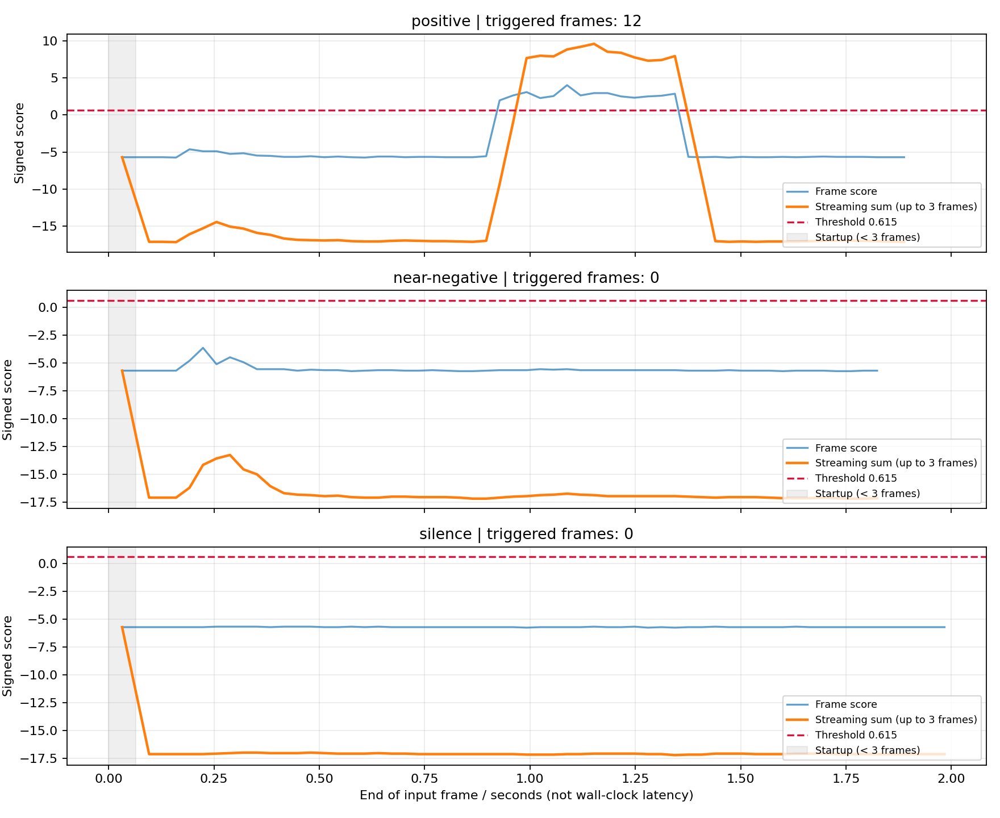

# WakeUp.axera 部署指南

WakeUp.axera 用于语音活动或唤醒检测。本页说明 M.2 算力卡的接入条件、部署步骤与结果检查方法。

> 已实测，效果仍需评估。[查看部署效果](#查看部署效果)。

## 准备运行环境

本页效果展示使用 **RK3576 + AX8850 16GB M.2**；其他容量或平台需重新确认模型能否加载并正确运行。

在连接算力卡的 Linux 主机终端执行，RK3576 使用 ARM64 环境。首次部署先完成[驱动与设备检查](../../usage/device-check.md)、[安装 PyAXEngine](../../usage/python.md)和[下载工具安装](../../usage/download-models.md#使用-hugging-face-下载)。已完成这些步骤可直接下载模型。

后文使用设备 0，运行前用 `axcl-smi` 确认设备可用。

## 下载模型与样例

本页使用 `AXERA-TECH/WakeUp.axera` 的固定版本。下面下载本页选用的 15 个文件。

```bash
MODEL_DIR=~/edgeaccel/models/wakeup-axera/139f25e18b0b
mkdir -p "$MODEL_DIR"
~/edgeaccel/hf-env/bin/hf download AXERA-TECH/WakeUp.axera \
  "NPU_ONLY_SDK.md" \
  "README.md" \
  "models/ax650/model.axmodel" \
  "models/ax650/model_meta.json" \
  "models/sample_nihao_aixin.wav" \
  "models/sample_nihao_qita.wav" \
  "python/demo.py" \
  "python/requirements.txt" \
  "python/wakeup_axera_sdk/__init__.py" \
  "python/wakeup_axera_sdk/detector.py" \
  "python/wakeup_axera_sdk/example.py" \
  "python/wakeup_axera_sdk/inference.py" \
  "python/wakeup_axera_sdk/postprocess.py" \
  "python/wakeup_axera_sdk/preprocess.py" \
  "python/wakeup_axera_sdk/requirements.txt" \
  --revision 139f25e18b0bce7af805f0f5dc34bd209fcf16b0 \
  --local-dir "$MODEL_DIR"
cd "$MODEL_DIR"
```

保留当前终端中的 `MODEL_DIR` 变量，后续命令沿用此目录。下载受阻或需要离线复制时，见[下载方式与文件校验](../../usage/download-models.md)。

## 安装 Python 依赖

本页在 RK3576 + AX8850 16GB M.2 算力卡上运行官方 WakeUp SDK，检测固定唤醒词“你好，爱芯”。主机处理音频特征，算力卡执行模型推理。

完成 [Python 接口](../../usage/python.md) 配置后，在 RK3576 主机执行：

```bash
source ~/edgeaccel/python-env/bin/activate
python -m pip install 'numpy==1.26.4'
python -c "import axengine; print(axengine.get_available_providers())"
```

输出须包含 `AXCLRTExecutionProvider`。使用上方固定版本下载步骤中的 AX650 模型和 Python SDK；本页示例显式选择 AXCL，适用于 M.2 算力卡。

## 运行语音唤醒

保留下载步骤中的 `$MODEL_DIR`。下载 [WakeUp 算力卡示例](../../../static/examples/wakeup_card.py)，保存为 `~/edgeaccel/wakeup_card.py`：

```bash
python ~/edgeaccel/wakeup_card.py \
  --model-dir "$MODEL_DIR" \
  --output ~/edgeaccel/results/wakeup-01
```

输出目录须尚不存在。程序依次处理官方正例、近似发音反例、正例重复和两秒静音，每段开始前重置特征窗口与分数缓存。运行结束后，`deployment-result.json` 中的 `completed: true` 表示全部输入处理完成，各段是否触发须查看 `streamTriggered`。

## 理解唤醒判定

本次正例“你好，爱芯”在录音的 0.992 秒处首次触发，最大流式滑动和为 9.580362；“你好，其他”和两秒静音均未触发。下方展示原始输入、实际分数曲线和逐段结果。

模型每 512 个采样点处理一帧，即 16 kHz 音频中的 32 ms。输出取唤醒通道最后一个位置的分数，最近三个分数相加后**严格大于 0.615**才触发。该分数可以为负，不是概率。阈值在官方代码中的名称不代表本次达到 95% 准确率。

流式接口在最初两帧使用已收到的分数求和；完整三帧判定从第三帧开始。因此表中分别列出“最大流式和”和“最大完整3帧和”，两者在反例和静音上会不同。本次两种判定的最终触发结论一致。

正例有 12 个触发帧，不能解释为唤醒了 12 次。应用接入灯光、语音助手或界面时，应自行设置事件合并或冷却时间。图中的首次触发位置是输入录音时间，不能当作系统响应延迟。

## 换成自己的录音

准备至少三帧长的 16 kHz、单声道、PCM16 WAV，执行：

```bash
python ~/edgeaccel/wakeup_card.py \
  --model-dir "$MODEL_DIR" \
  --audio ~/edgeaccel/audio/my-wakeup.wav \
  --threshold 0.615 \
  --output ~/edgeaccel/results/wakeup-custom-01
```

可重复传入 `--audio` 处理多段录音；每段独立重置状态。末尾不足 512 个采样点的部分按官方流程丢弃，数量记录在 `discardedTailSamples`。需要保留末尾语音时，可在录音结尾追加短静音后重新测试。

程序保存 `samples[].frames` 中的逐帧分数、滑动和及触发标记。`firstTriggerEndSeconds` 为 `null` 表示未触发。该模型检测固定唤醒词，更换录音不会改变模型词表。

业务接入前仍需测试真实人声、相似发音、远场及噪声，并用长时间背景录音统计误唤醒率。当前展示未完成麦克风实时链路、完整质量评测或真实 8GB 卡容量验收。


## 查看部署效果

**已运行，效果仍需评估** · RK3576 + AX8850 16GB M.2。以下输入与输出来自本页固定版本的实际运行。

正例及其重复各出现一段连续触发，共 12 帧，帧结束位置为 0.992–1.344 秒；近似发音反例与两秒静音未触发。

**正例、近似反例与静音**

正例及其重复输入均触发；近似发音反例和两秒静音均未触发。触发帧数不是独立唤醒次数，首次触发位置不是系统端到端响应延迟。 连续触发段按相邻触发帧归并：正例的 12 帧属于同一段。该归并仅用于阅读结果，应用层事件合并和冷却策略仍需验证；重复正例不代表新增说话人或环境。

<div className="model-effect-gallery">

<figure>

[](../../../static/validation/effects/wakeup-axera-20260928/score-curves.png)

<figcaption>实测分数曲线：蓝线为单帧分数，橙线为流式滑动和，红线为阈值0.615。横轴为录音时间。</figcaption>
</figure>

</div>

| 输入 | 时长 | 流式结果 | 触发帧数 | 首次触发位置 | 最大流式和 | 最大完整3帧和 |
| --- | --- | --- | --- | --- | --- | --- |
| 正例：你好，爱芯 | 1.896 s | 触发 | 12 | 0.992 s | 9.580362 | 9.580362 |
| 近似反例：你好，其他 | 1.848 s | 未触发 | 0 | — | -5.703658 | -13.278828 |
| 正例重复 | 1.896 s | 触发 | 12 | 0.992 s | 9.580362 | 9.580362 |
| 两秒静音 | 2.000 s | 未触发 | 0 | — | -5.703658 | -16.977293 |

| 输入 | 触发帧数 | 连续触发段数 | 触发帧结束位置 |
| --- | --- | --- | --- |
| 正例 | 12 | 1 | 0.992–1.344 s |
| 近似发音反例 | 0 | 0 | 未触发 |
| 正例重复 | 12 | 1 | 0.992–1.344 s |
| 两秒静音 | 0 | 0 | 未触发 |

**本次输入录音**

以下是实际参与推理的两段官方录音，未裁剪、未变速。模型仅输出检测分数，不生成语音。

正例：你好，爱芯：官方输入录音

<audio controls preload="metadata" src="/validation/effects/wakeup-axera-20260928/positive.wav" aria-label="正例：你好，爱芯：官方输入录音"></audio>

[下载音频](../../../static/validation/effects/wakeup-axera-20260928/positive.wav)

近似反例：你好，其他：官方输入录音

<audio controls preload="metadata" src="/validation/effects/wakeup-axera-20260928/near-negative.wav" aria-label="近似反例：你好，其他：官方输入录音"></audio>

[下载音频](../../../static/validation/effects/wakeup-axera-20260928/near-negative.wav)

**运行耗时与尾帧处理**

每帧512个采样点，末尾不足一帧的采样点按官方流程丢弃。文件处理时间包含CPU特征提取及证据压缩，不含加载；重复输入复用相同证据文件，不能据此推算加速比。

| 输入 | 完整帧数 | 丢弃尾部采样点 | 文件处理 / s |
| --- | --- | --- | --- |
| 正例：你好，爱芯 | 59 | 128 | 0.376296 |
| 近似反例：你好，其他 | 57 | 384 | 0.334618 |
| 正例重复 | 59 | 128 | 0.212462 |
| 两秒静音 | 62 | 256 | 0.335658 |

**使用时注意：**

- 这里只验证两段官方录音、一次重复与两秒静音；尚未覆盖真实人声、远场、噪声和长期误唤醒率。
- 阈值0.615的名称不能解释为本次达到95%准确率；输出为有正负值的分数，不是概率。

这些结果用于对照部署后的输出，未覆盖完整数据集精度或长期连续运行。

<details>
<summary>查看样例环境与运行耗时</summary>

环境：RK3576 + AX8850 16GB M.2。模型版本：`139f25e18b0bce7af805f0f5dc34bd209fcf16b0`。

| 组件 | 版本或配置 |
| --- | --- |
| 主机 / 内核 | RK3576，约 4GB RAM，6.1.115-vendor-rk35xx |
| AXCL / 驱动 | V3.16.0_20260729180218 |
| 固件 / CMM | V3.16.0 / 15232 MiB |
| Python 推理 | Python 3.12 / PyAXEngine 0.1.3.rc3 / NumPy 1.26.4 / AXCLRTExecutionProvider |

| 指标 | 实测值 | 计时或统计范围 |
| --- | --- | --- |
| 实际模型调用 | 237 次 | AX650权重，经AXCL在16GB M.2卡上实际运行。 |
| 平均AXCL调用 | 2.050011 ms | 含调用传输；不含CPU特征、模型加载和证据保存。 |
| 正例首次触发位置 | 0.992 s | 输入录音中触发帧的结束位置，不是端到端响应时间。 |
| 重复一致性 | 全部模型输入输出一致 | 正例重复一次；每段录音前清空特征窗口和分数缓存。 |

适用范围：

- 本次使用16GB卡；真实8GB容量、AX620E路径和麦克风连续输入仍待验证。

</details>

遇到加载、内存或后端错误时，按[常见问题](../../usage/troubleshooting.md)处理。需要更换输入或接入业务时，按[检查输出与记录结果](../../reference/validation.md)保留自己的结果。

<details>
<summary>查看文件用途与版本信息</summary>

| 文件 / 目录内路径 | 用途 |
| --- | --- |
| [`python/wakeup_axera_sdk/example.py`](https://huggingface.co/AXERA-TECH/WakeUp.axera/blob/139f25e18b0bce7af805f0f5dc34bd209fcf16b0/python/wakeup_axera_sdk/example.py) | Python 程序 / 前后处理 |
| [`models/ax650/model.axmodel`](https://huggingface.co/AXERA-TECH/WakeUp.axera/blob/139f25e18b0bce7af805f0f5dc34bd209fcf16b0/models/ax650/model.axmodel) | 编译模型；按目录区分芯片和规格 |
| [`python/requirements.txt`](https://huggingface.co/AXERA-TECH/WakeUp.axera/blob/139f25e18b0bce7af805f0f5dc34bd209fcf16b0/python/requirements.txt) | Python 依赖清单 |
| [`python/wakeup_axera_sdk/requirements.txt`](https://huggingface.co/AXERA-TECH/WakeUp.axera/blob/139f25e18b0bce7af805f0f5dc34bd209fcf16b0/python/wakeup_axera_sdk/requirements.txt) | Python 依赖清单 |
| [`run.sh`](https://huggingface.co/AXERA-TECH/WakeUp.axera/blob/139f25e18b0bce7af805f0f5dc34bd209fcf16b0/run.sh) | 启动或构建脚本 |

仓库提交：`139f25e18b0bce7af805f0f5dc34bd209fcf16b0`。仓库中的 2 个 `.axmodel` 文件可能包括多个芯片、规格和分片。运行时使用本页指定的配套文件，完整列表见[固定版本目录](https://huggingface.co/AXERA-TECH/WakeUp.axera/tree/139f25e18b0bce7af805f0f5dc34bd209fcf16b0)。

</details>

<details>
<summary>补充说明与版本差异</summary>

- 唤醒检测需同时测试目标词、相似词和环境噪声，分别记录漏检和误唤醒；不能只用一个正样本验收。

</details>

## 参考资料

- [常用术语](../../reference/glossary.md)：AXCL、CMM、分词器与推理指标。
- [固定版本文件表](https://huggingface.co/AXERA-TECH/WakeUp.axera/tree/139f25e18b0bce7af805f0f5dc34bd209fcf16b0)。
- [模型卡 / 使用说明](https://huggingface.co/AXERA-TECH/WakeUp.axera/blob/139f25e18b0bce7af805f0f5dc34bd209fcf16b0/README.md)。
- [主要程序入口：python/wakeup_axera_sdk/example.py](https://huggingface.co/AXERA-TECH/WakeUp.axera/blob/139f25e18b0bce7af805f0f5dc34bd209fcf16b0/python/wakeup_axera_sdk/example.py)。

返回[完整模型目录](../catalog.mdx)。
