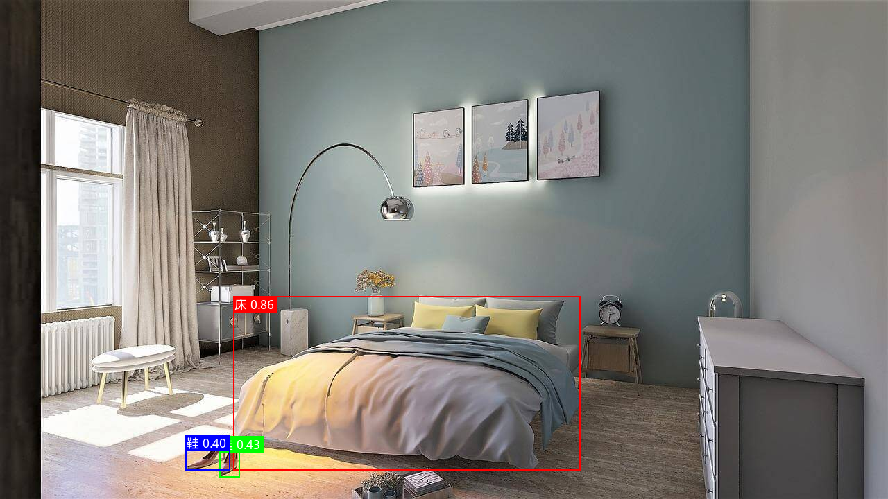

# WeDetect.axera 部署指南

WeDetect.axera 用于开放词汇检测。本页说明 M.2 算力卡的接入条件、部署步骤与结果检查方法。

> 已实测，效果仍需评估。[查看部署效果](#查看部署效果)。

## 准备运行环境

本页效果展示使用 **RK3576 + AX8850 16GB M.2**；其他容量或平台需重新确认模型能否加载并正确运行。

在连接算力卡的 Linux 主机终端执行，RK3576 使用 ARM64 环境。首次部署先完成[驱动与设备检查](../../usage/device-check.md)、[安装 PyAXEngine](../../usage/python.md)和[下载工具安装](../../usage/download-models.md#使用-hugging-face-下载)。已完成这些步骤可直接下载模型。

后文使用设备 0，运行前用 `axcl-smi` 确认设备可用。

## 下载模型与样例

本页使用 `AXERA-TECH/WeDetect.axera` 的固定版本。下面下载本页选用的 9 个文件。

```bash
MODEL_DIR=~/edgeaccel/models/wedetect-axera/3c88a25ddf31
mkdir -p "$MODEL_DIR"
~/edgeaccel/hf-env/bin/hf download AXERA-TECH/WeDetect.axera \
  "README.md" \
  "assets/demo.jpeg" \
  "axmodel/wedetect_image_encoder_npu3_u16.axmodel" \
  "axmodel/wedetect_text_encoder_npu3_u16.axmodel" \
  "axmodel_infer.py" \
  "wqy-microhei.ttc" \
  "xlm-roberta-base/config.json" \
  "xlm-roberta-base/sentencepiece.bpe.model" \
  "xlm-roberta-base/tokenizer.json" \
  --revision 3c88a25ddf31be1b7cf926280c22563debb53959 \
  --local-dir "$MODEL_DIR"
cd "$MODEL_DIR"
```

保留当前终端中的 `MODEL_DIR` 变量，后续命令沿用此目录。下载受阻或需要离线复制时，见[下载方式与文件校验](../../usage/download-models.md)。

## 安装 Python 依赖

本页在 RK3576 + AX8850 16GB M.2 算力卡上运行 WeDetect。输入一张图片和四个类别名称，文本编码器生成类别特征，图像编码器输出对应目标的检测框。

完成 [Python 接口](../../usage/python.md) 配置后，在 RK3576 主机执行：

```bash
source ~/edgeaccel/python-env/bin/activate
python -m pip install 'numpy==1.26.4' 'Pillow==11.3.0' \
  'transformers==4.51.3' 'tokenizers==0.21.4'
python -c "import axengine; print(axengine.get_available_providers())"
```

输出须包含 `AXCLRTExecutionProvider`。使用上方固定版本下载步骤中的两个 `.axmodel`、分词器、字体和官方程序。模型通过 AXCL 在 M.2 算力卡上执行；本页示例使用本地快速分词器，不需要下载 PyTorch 原始模型。

## 运行双编码器检测

保留下载步骤中的 `$MODEL_DIR`。下载 [WeDetect 算力卡示例](../../../static/examples/wedetect_card.py)，保存为 `~/edgeaccel/wedetect_card.py`，执行：

```bash
python ~/edgeaccel/wedetect_card.py \
  --model-dir "$MODEL_DIR" \
  --output ~/edgeaccel/results/wedetect-01
```

输出目录须尚不存在。示例使用官方卧室照片，依次运行默认类别、反转类别顺序、重复原图和纯色空白图。每组都实际调用文本编码器和图像编码器。

默认类别为“鞋、床、人、衣架”，检测分数阈值为 0.3，重叠框过滤阈值为 0.7。该版本固定接收四个类别，每个类别最多 32 个分词位置，包含起止符；超长输入会停止，须缩短类别描述。

## 查看检测输出

运行结束时退出码为 0，`deployment-result.json` 包含 `completed: true`。打开输出目录中的 `official-detections.png` 查看原图检测结果，`reordered-detections.png` 查看类别重排结果，`blank-detections.png` 查看空白输入结果。

本次原图检出一张床和两只鞋，对应分数为 0.862526、0.429626、0.397122。类别反转后，最终标签、分数和坐标保持一致；重复原图结果一致，空白图无检测。下方展示本次实际输出。

逐目标结果位于 `samples[].detections`：`label` 为类别，`score` 为检测分数，`box` 为原图坐标 `[x1,y1,x2,y2]`。空数组表示没有超过阈值的目标。类别序号取决于本次输入顺序，应使用 `label` 判断含义。

文件处理时间包含分词、图像缩放、模型调用、检测框过滤、绘图与证据压缩，不含模型加载。单次 AXCL 调用耗时另列，不能直接用文件处理时间推算实时视频帧率。

## 更换图片与类别

准备一张本地图像，用英文逗号分隔四个简短类别名称：

```bash
python ~/edgeaccel/wedetect_card.py \
  --model-dir "$MODEL_DIR" \
  --image ~/edgeaccel/images/room.jpg \
  --text '鞋,床,人,衣架' \
  --output ~/edgeaccel/results/wedetect-custom-01
```

指定 `--image` 后只处理该图片，输出 `custom-detections.png`。可替换四个名称以检索其他目标，无需重新编译权重；新类别是否可靠需要用对应图片验证，本页实测仅覆盖上述类别。

分词器从 `$MODEL_DIR/xlm-roberta-base` 离线加载。输入图像会按比例缩放并补边到 640×640；输出检测框已换算回原图坐标。本例按官方程序执行跨类别的重叠框过滤，重叠的不同类别目标可能相互抑制。

原图、纯色图和重复检查用于确认部署流程。业务接入前仍需补充实际场景、遮挡、新类别及负样本，并完成真实 8GB 卡容量验证。


## 查看部署效果

**已运行，效果仍需评估** · RK3576 + AX8850 16GB M.2。以下输入与输出来自本页固定版本的实际运行。

双编码器完成AXCL实测，原图检出床和两只鞋；类别重排与重复结果一致，空白图无检测。

**输入类别后检测床和鞋**

本次输入“鞋、床、人、衣架”，实际得到一张床和两只鞋，未检出人或衣架。以下图片由板端本次模型输出绘制。

<div className="model-effect-gallery">

<figure>

[](../../../static/validation/effects/wedetect-axera-20260928/input.jpeg)

<figcaption>官方输入：1280×720卧室照片</figcaption>
</figure>

<figure>

[](../../../static/validation/effects/wedetect-axera-20260928/detections.png)

<figcaption>本次实际输出：床0.862526，两只鞋0.429626与0.397122。</figcaption>
</figure>

</div>

| 类别 | 检测分数 | 检测框 x1,y1,x2,y2 |
| --- | --- | --- |
| 床 | 0.862526 | 336.274, 427.011, 836.534, 678.991 |
| 鞋 | 0.429626 | 316.373, 629.403, 345.294, 688.092 |
| 鞋 | 0.397122 | 267.958, 627.986, 331.259, 678.566 |

**类别顺序、重复输入与空白图**

类别顺序反转后，文本特征与检测分类通道按对应顺序交换，最终检测标签、分数、坐标和绘制图片完全一致。重复输入的全部模型输入输出一致；空白图无检测。这些检查不代表任意新类别都能正确检测。

<div className="model-effect-gallery">

<figure>

[](../../../static/validation/effects/wedetect-axera-20260928/blank.png)

<figcaption>本次空白输入结果：未检测到目标</figcaption>
</figure>

</div>

| 样例 | 输入类别顺序 | 检测数量 | 文件处理 / s |
| --- | --- | --- | --- |
| official | 鞋、床、人、衣架 | 3 | 0.682687 |
| reordered | 衣架、人、床、鞋 | 3 | 0.633708 |
| repeat | 鞋、床、人、衣架 | 3 | 0.563213 |
| blank | 鞋、床、人、衣架 | 0 | 0.291979 |

**两个编码器的实际调用**

每组样例分别运行文本编码器和图像编码器，文本特征实际传入图像模型。AXCL时间包含传输，不包含模型加载、分词、图像缩放和证据保存；每模型四次调用不足以作为稳定吞吐基准。

| 模型 | 调用次数 | 平均AXCL / ms |
| --- | --- | --- |
| 图像编码器 | 4 | 112.175303 |
| 文本编码器 | 4 | 13.339831 |

**使用时注意：**

- 本次只测试固定卧室图和空白图，未完成人工标注数据集精度、任意新类别、长文本或复杂遮挡验证。
- 固定编译版本接收四类描述，每类最多32个分词位置；较长描述须缩短后再运行。

这些结果用于对照部署后的输出，未覆盖完整数据集精度或长期连续运行。

<details>
<summary>查看样例环境与运行耗时</summary>

环境：RK3576 + AX8850 16GB M.2。模型版本：`3c88a25ddf31be1b7cf926280c22563debb53959`。

| 组件 | 版本或配置 |
| --- | --- |
| 主机 / 内核 | RK3576，约 4GB RAM，6.1.115-vendor-rk35xx |
| AXCL / 驱动 | V3.16.0_20260729180218 |
| 固件 / CMM | V3.16.0 / 15232 MiB |
| Python 推理 | Python 3.12 / PyAXEngine 0.1.3.rc3 / NumPy 1.26.4 / AXCLRTExecutionProvider |

| 指标 | 实测值 | 计时或统计范围 |
| --- | --- | --- |
| 实际模型调用 | 2 个模型 / 8 次调用 | 四组输入均实际执行文本与图像编码器。 |
| 原图检测 | 床 × 1，鞋 × 2 | 阈值0.3，四类别输入；不是完整数据集精度结果。 |
| 顺序与重复 | 通过对应关系核对 | 重排后文本特征与分类通道对应交换；重复输入输出完全一致。 |
| 空白图 | 未检出目标 | 单张纯色输入，不能替代真实负样本误报率。 |

适用范围：

- 本次16GB卡，真实8GB容量仍待回归。

</details>

遇到加载、内存或后端错误时，按[常见问题](../../usage/troubleshooting.md)处理。需要更换输入或接入业务时，按[检查输出与记录结果](../../reference/validation.md)保留自己的结果。

<details>
<summary>查看文件用途与版本信息</summary>

| 文件 / 目录内路径 | 用途 |
| --- | --- |
| [`axmodel_infer.py`](https://huggingface.co/AXERA-TECH/WeDetect.axera/blob/3c88a25ddf31be1b7cf926280c22563debb53959/axmodel_infer.py) | Python 程序 / 前后处理 |
| [`generate_class_embedding.py`](https://huggingface.co/AXERA-TECH/WeDetect.axera/blob/3c88a25ddf31be1b7cf926280c22563debb53959/generate_class_embedding.py) | Python 程序 / 前后处理 |
| [`axmodel/wedetect_image_encoder_npu3_u16.axmodel`](https://huggingface.co/AXERA-TECH/WeDetect.axera/blob/3c88a25ddf31be1b7cf926280c22563debb53959/axmodel/wedetect_image_encoder_npu3_u16.axmodel) | 编译模型；按目录区分芯片和规格 |
| [`axmodel/wedetect_text_encoder_npu3_u16.axmodel`](https://huggingface.co/AXERA-TECH/WeDetect.axera/blob/3c88a25ddf31be1b7cf926280c22563debb53959/axmodel/wedetect_text_encoder_npu3_u16.axmodel) | 编译模型；按目录区分芯片和规格 |
| [`config.json`](https://huggingface.co/AXERA-TECH/WeDetect.axera/blob/3c88a25ddf31be1b7cf926280c22563debb53959/config.json) | 运行配置 |
| [`onnx_infer.py`](https://huggingface.co/AXERA-TECH/WeDetect.axera/blob/3c88a25ddf31be1b7cf926280c22563debb53959/onnx_infer.py) | Python 程序 / 前后处理 |
| [`xlm-roberta-base/config.json`](https://huggingface.co/AXERA-TECH/WeDetect.axera/blob/3c88a25ddf31be1b7cf926280c22563debb53959/xlm-roberta-base/config.json) | 运行配置 |

仓库提交：`3c88a25ddf31be1b7cf926280c22563debb53959`。仓库中的 2 个 `.axmodel` 文件可能包括多个芯片、规格和分片。运行时使用本页指定的配套文件，完整列表见[固定版本目录](https://huggingface.co/AXERA-TECH/WeDetect.axera/tree/3c88a25ddf31be1b7cf926280c22563debb53959)。

</details>

<details>
<summary>补充说明与版本差异</summary>

- 需要匹配类别文本特征与检测权重；类别 embedding 的生成版本和顺序要随模型一同记录。

</details>

## 参考资料

- [常用术语](../../reference/glossary.md)：AXCL、CMM、分词器与推理指标。
- [固定版本文件表](https://huggingface.co/AXERA-TECH/WeDetect.axera/tree/3c88a25ddf31be1b7cf926280c22563debb53959)。
- [模型卡 / 使用说明](https://huggingface.co/AXERA-TECH/WeDetect.axera/blob/3c88a25ddf31be1b7cf926280c22563debb53959/README.md)。
- [主要程序入口：axmodel_infer.py](https://huggingface.co/AXERA-TECH/WeDetect.axera/blob/3c88a25ddf31be1b7cf926280c22563debb53959/axmodel_infer.py)。

返回[完整模型目录](../catalog.mdx)。
