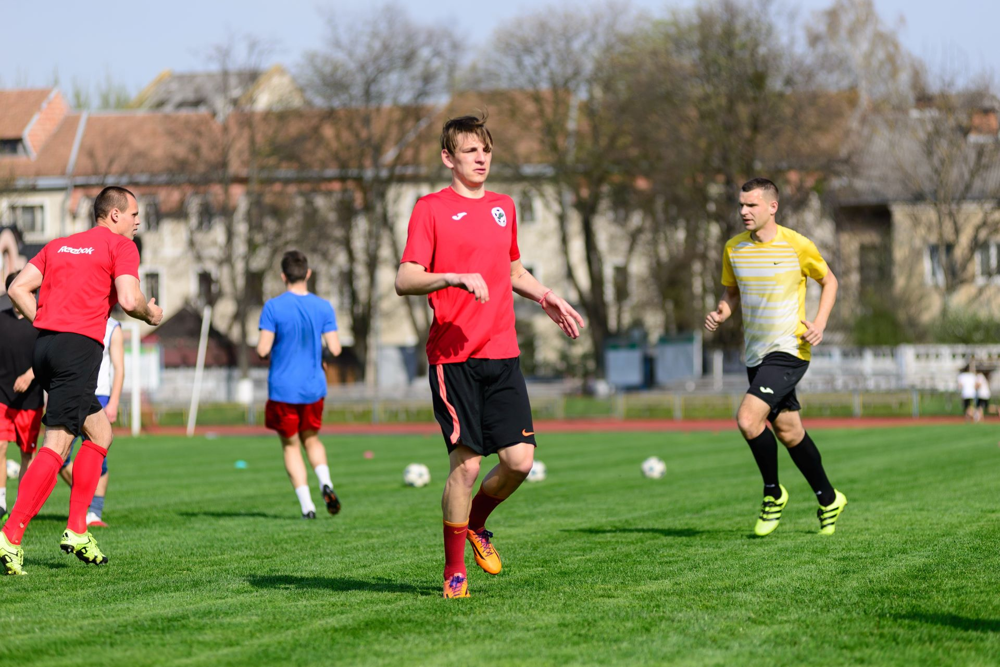
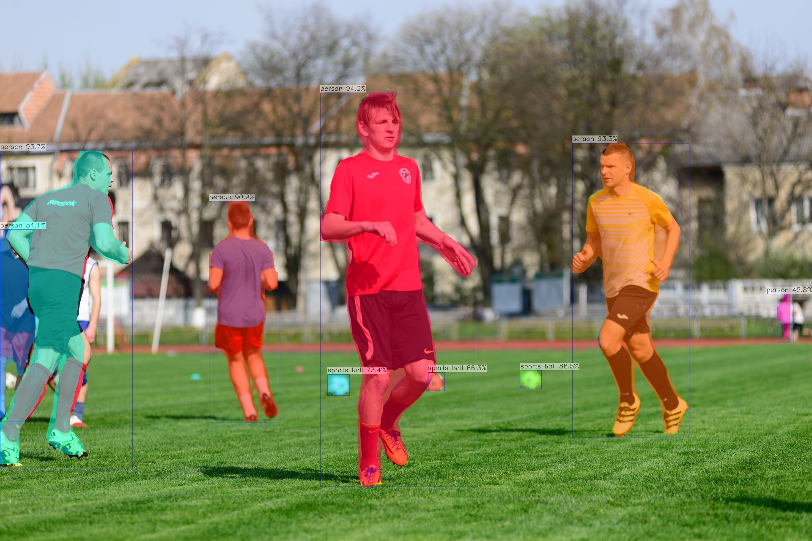

# YOLO11-Seg 部署指南

YOLO11-Seg 用于图像分割。本页说明 M.2 算力卡的接入条件、部署步骤与结果检查方法。本页选择 `ax650/yolo11x-seg.axmodel`。

> 已实测，固定样例已核对。[查看部署效果](#查看部署效果)。

## 准备运行环境

本页效果展示使用 **RK3576 DshanPi A1 + AX8850 8GB M.2**；其他容量或平台需重新确认模型能否加载并正确运行。

在连接算力卡的 Linux 主机终端执行，RK3576 使用 ARM64 环境。首次部署先完成[驱动与设备检查](../../usage/device-check.md)、[编译 AXCL 视觉示例](../../usage/build-samples.md)和[下载工具安装](../../usage/download-models.md#使用-hugging-face-下载)。已完成这些步骤可直接下载模型。

后文使用设备 0，运行前用 `axcl-smi` 确认设备可用。

## 下载模型与样例

本页使用 `AXERA-TECH/YOLO11-Seg` 的固定版本。下面下载本页选用的 2 个文件。

```bash
MODEL_DIR=~/edgeaccel/models/yolo11-seg/5ed6c6e95199
mkdir -p "$MODEL_DIR"
~/edgeaccel/hf-env/bin/hf download AXERA-TECH/YOLO11-Seg \
  "ax650/yolo11x-seg.axmodel" \
  "football.jpg" \
  --revision 5ed6c6e9519930a4a94dd9839d4777399c83fec1 \
  --local-dir "$MODEL_DIR"
cd "$MODEL_DIR"
```

保留当前终端中的 `MODEL_DIR` 变量，后续命令沿用此目录。下载受阻或需要离线复制时，见[下载方式与文件校验](../../usage/download-models.md)。

## 执行图片推理

本页使用 `axcl_yolo11_seg`，模型为 `ax650/yolo11x-seg.axmodel`，输入为 `football.jpg`。`-g` 参数顺序为高、宽。

```bash
cd "$MODEL_DIR"
SAMPLE=~/edgeaccel/src/axcl-samples/build/install/bin/axcl_yolo11_seg
test -x "$SAMPLE"
test -s ax650/yolo11x-seg.axmodel
test -s football.jpg
ldd "$SAMPLE"
set -o pipefail
"$SAMPLE" -m ax650/yolo11x-seg.axmodel -i football.jpg -g 640,640 -r 1 2>&1 | tee run.log
```

依赖中不能出现 `not found`。程序退出码应为 0，日志不应有模型加载或设备错误。检查本次产生的 `yolo11_seg_out.jpg` 的修改时间与画面内容；仓库自带的旧结果图不能作为本次运行证据。

示例源码：[axcl-samples 固定版本](https://github.com/AXERA-TECH/axcl-samples/tree/cbfa4c76891758983ca2b0c99c11d6621d59af39)。

## 查看部署效果

**固定样例已核对** · 2026-09-23 · RK3576 DshanPi A1 + AX8850 8GB M.2。以下输入与输出来自本页固定版本的实际运行。

单张 football.jpg 输出 6 个人物实例、3 个足球实例。主要球员的彩色掩码覆盖头部、躯干和四肢，足球掩码位于对应小球区域，完成实例分割的定性核对。

点击图片可查看原尺寸。

<div className="model-effect-gallery">

<figure>

[](../../../static/validation/effects/yolo11-seg/inputs/football.jpg)

<figcaption>输入图片</figcaption>
</figure>

<figure>

[](../../../static/validation/effects/yolo11-seg/outputs/yolo11_seg_out.jpg)

<figcaption>实际输出</figcaption>
</figure>

</div>

**使用时注意：**

- 远处小目标和左侧遮挡人物未全部覆盖；局部边缘、细长肢体与遮挡区域存在粗糙或不完整现象。
- 未使用像素级真值标注，不能报告 IoU、mAP 或边界精度。

这些结果用于对照部署后的输出，未覆盖完整数据集精度或长期连续运行。

<details>
<summary>查看样例环境与运行耗时</summary>

环境：RK3576 DshanPi A1 + AX8850 8GB M.2。日期：2026-09-23。模型版本：`5ed6c6e9519930a4a94dd9839d4777399c83fec1`。

| 组件 | 版本或配置 |
| --- | --- |
| 主机系统 | Ubuntu 24.04 / Armbian 25.11.0-trunk，aarch64 |
| 内核 | 6.1.115-vendor-rk35xx |
| AXCL / 驱动 | V3.16.0_20260729180218 |
| 固件 / CMM | V3.16.0；CMM 总量 7040 MiB，空闲基线占用 18 MiB |
| C++ 视觉示例提交 | cbfa4c76891758983ca2b0c99c11d6621d59af39 |
| Python 后端 | Python 3.12.3；PyAXEngine 0.1.3.rc3 发布的 0.1.3 wheel；NumPy 1.26.4 / ml-dtypes 0.5.3 |
| AX-LLM 提交 | 8501c22b940f8c5804cb35044c5ffc136918b8f1；Release / AXCL / Linux aarch64 |

| 指标 | 实测值 | 计时或统计范围 |
| --- | --- | --- |
| AXCL Execute 平均耗时 | 38.85 ms | 5 次预热后同图重复 10 次；仅 axclrtEngineExecute，不含显式 H2D/D2H、预后处理 |
| AXCL Execute 最小 / 最大 | 38.42 / 39.21 ms | 与上述平均值使用相同样本和计时范围 |

适用范围：

- 远处小目标和左侧遮挡人物未全部覆盖；局部边缘、细长肢体与遮挡区域存在粗糙或不完整现象。
- 未使用像素级真值标注，不能报告 IoU、mAP 或边界精度。
- 仅一次启动、同一张样例图的 5 次预热和 10 次计时调用；未进行独立数据集精度评测或长时间稳定性测试。

</details>

遇到加载、内存或后端错误时，按[常见问题](../../usage/troubleshooting.md)处理。需要更换输入或接入业务时，按[检查输出与记录结果](../../reference/validation.md)保留自己的结果。

<details>
<summary>查看文件用途与版本信息</summary>

| 文件 / 目录内路径 | 用途 |
| --- | --- |
| [`ax650/yolo11x-seg.axmodel`](https://huggingface.co/AXERA-TECH/YOLO11-Seg/blob/5ed6c6e9519930a4a94dd9839d4777399c83fec1/ax650/yolo11x-seg.axmodel) | 编译模型；按目录区分芯片和规格 |
| [`football.jpg`](https://huggingface.co/AXERA-TECH/YOLO11-Seg/blob/5ed6c6e9519930a4a94dd9839d4777399c83fec1/football.jpg) | 示例输入 |

仓库提交：`5ed6c6e9519930a4a94dd9839d4777399c83fec1`。仓库中的 4 个 `.axmodel` 文件可能包括多个芯片、规格和分片。运行时使用本页指定的配套文件，完整列表见[固定版本目录](https://huggingface.co/AXERA-TECH/YOLO11-Seg/tree/5ed6c6e9519930a4a94dd9839d4777399c83fec1)。

</details>

<details>
<summary>补充说明与版本差异</summary>

- 本次实测使用 axcl-samples 固定版本 cbfa4c76891758983ca2b0c99c11d6621d59af39，参数 -r 10 重复执行模型；日志中的模型耗时与图片读写、预处理和绘图耗时分开解释。

</details>

## 参考资料

- [常用术语](../../reference/glossary.md)：AXCL、CMM、分词器与推理指标。
- [固定版本文件表](https://huggingface.co/AXERA-TECH/YOLO11-Seg/tree/5ed6c6e9519930a4a94dd9839d4777399c83fec1)。
- [模型卡 / 使用说明](https://huggingface.co/AXERA-TECH/YOLO11-Seg/blob/5ed6c6e9519930a4a94dd9839d4777399c83fec1/README.md)。
- [ModelScope 对应资源](https://modelscope.cn/models/AXERA-TECH/YOLO11-Seg)。不同平台的 revision 不通用，另行记录版本。

返回[完整模型目录](../catalog.mdx)。
