# Yolo26-Depth 部署指南

Yolo26-Depth 用于深度估计。本页说明 M.2 算力卡的接入条件、部署步骤与结果检查方法。

> 已实测，效果仍需评估。[查看部署效果](#查看部署效果)。

## 准备运行环境

本页效果展示使用 **RK3576 + AX8850 16GB M.2**；其他容量或平台需重新确认模型能否加载并正确运行。

在连接算力卡的 Linux 主机终端执行，RK3576 使用 ARM64 环境。首次部署先完成[驱动与设备检查](../../usage/device-check.md)、[安装 PyAXEngine](../../usage/python.md)和[下载工具安装](../../usage/download-models.md#使用-hugging-face-下载)。已完成这些步骤可直接下载模型。

后文使用设备 0，运行前用 `axcl-smi` 确认设备可用。

## 下载模型与样例

本页使用 `AXERA-TECH/Yolo26-Depth` 的固定版本。下面下载本页选用的 17 个文件。

```bash
MODEL_DIR=~/edgeaccel/models/yolo26-depth/4c12e1d456fd
mkdir -p "$MODEL_DIR"
~/edgeaccel/hf-env/bin/hf download AXERA-TECH/Yolo26-Depth \
  "README.md" \
  "requirements.txt" \
  "infer_depth.py" \
  "fold_depth_log.py" \
  "ax8850n/config.json" \
  "asserts/bus.jpg" \
  "asserts/ssd_car.jpg" \
  "ax8850n/yolo26n-depth_w8a8_mix.axmodel" \
  "ax8850n/yolo26s-depth_w8a8_mix.axmodel" \
  "ax8850n/yolo26m-depth_w8a8_mix.axmodel" \
  "ax8850n/yolo26l-depth_w8a8_mix.axmodel" \
  "ax8850n/yolo26x-depth_w8a8_mix.axmodel" \
  "onnx/yolo26n-depth.onnx" \
  "onnx/yolo26s-depth.onnx" \
  "onnx/yolo26m-depth.onnx" \
  "onnx/yolo26l-depth.onnx" \
  "onnx/yolo26x-depth.onnx" \
  --revision 4c12e1d456fd05bd8ffa5a8e272916e1d748dcfb \
  --local-dir "$MODEL_DIR"
cd "$MODEL_DIR"
```

保留当前终端中的 `MODEL_DIR` 变量，后续命令沿用此目录。下载受阻或需要离线复制时，见[下载方式与文件校验](../../usage/download-models.md)。

## 安装推理依赖

本页使用 RK3576 + AX8850 16GB M.2 算力卡运行 YOLO26-Depth，生成单张图片的深度预测图。已运行 `ax8850n` 目录下 n、s、m、l、x 五个版本；其他芯片目录及原生可执行程序不属于本次结果。

完成 [Python 接口](../../usage/python.md) 配置后，在 RK3576 主机执行：

```bash
source ~/edgeaccel/python-env/bin/activate
python -m pip install 'numpy==1.26.4' 'opencv-python-headless==4.11.0.86' \
  'onnxruntime==1.20.1'
python -c "import axengine; print(axengine.get_available_providers())"
```

输出须包含 `AXCLRTExecutionProvider`。使用当前 AXCL 环境的 PyAXEngine，不要覆盖安装仓库附带的其他平台 wheel。上方下载步骤固定了权重、图片与推理脚本版本；其中 ONNX 文件用于浮点参考，算力卡运行的是 `.axmodel`。

## 运行深度预测

保留下载步骤中的 `$MODEL_DIR`。下载 [YOLO26-Depth 算力卡示例](../../../static/examples/yolo26_depth_card.py)，保存为 `~/edgeaccel/yolo26_depth_card.py`：

```bash
python ~/edgeaccel/yolo26_depth_card.py \
  --model-dir "$MODEL_DIR" \
  --variant all \
  --output ~/edgeaccel/results/yolo26-depth-01
```

输出目录须尚不存在。程序串行运行五个版本，每个版本处理汽车图、公交图、重复汽车图和空白图，共 20 次算力卡调用。只测试一个版本时，将 `all` 改为 `n`、`s`、`m`、`l` 或 `x`。

退出码为 0 且 `deployment-result.json` 中 `completed: true` 表示所选版本执行完成。以 n 版汽车图为例：

| 文件 | 用途 |
| --- | --- |
| `n-car_depth_heatmap.png` | 左侧输入图片，右侧深度热力图 |
| `n-car_depth_overlay.jpg` | 原图与热力图叠加 |
| `n-car_depth.npy` | 恢复到原图尺寸的深度预测数组 |
| `deployment-result.json` | 模型版本、输入输出文件、预测范围和调用耗时 |

程序还保存原始张量供复核，会增加结果目录大小。五个模型依次释放，不同时占用算力卡。

## 理解深度图

本页使用官方 `default` 几何还原方式。输入按比例缩放并补边到 768×768；算力卡输入为 RGB、NHWC、`uint8`。输出裁去补边后，恢复到原图尺寸。浮点 ONNX 使用 NCHW、FP32、除以 255 的输入，不能直接套用到算力卡输入。

热力图使用预测深度的倒数，经当前图片的第 2、98 百分位归一化后映射为 JET 颜色。一般暖色表示预测较近、冷色表示预测较远；每张图单独归一化，因此不能通过相同颜色比较两张图的绝对距离。

五个版本均完成本次样例推理，重复汽车图的输入、模型输出和生成文件一致。空白图也会产生正的深度预测值；模型没有通过这些值证明画面中存在物体或有效距离。下方展示真实样例、空白图及同版本浮点参考对照。

这些样例没有实测距离标注。`.npy` 是模型的深度预测，不能仅凭数值为正、画面直观或与 FP32 接近就认为测距精度已通过。用于实际测量前，应在目标相机和场景中采集距离标注，单独评估误差。

## 更换输入图片

```bash
python ~/edgeaccel/yolo26_depth_card.py \
  --model-dir "$MODEL_DIR" \
  --variant n \
  --image ~/edgeaccel/images/test.jpg \
  --output ~/edgeaccel/results/yolo26-depth-custom-01
```

指定 `--image` 后只处理该图片，结果前缀为 `n-custom`。本页示例显式选择 AXCL；如果直接使用上游 `infer_depth.py`，运行 `.axmodel` 时必须加 `--axera`，否则它会尝试按 ONNX 文件加载。

本次采用 `default` 后处理，没有将上游 `predictor` 选项的另一套缩放路径混入结果。对比不同权重、浮点参考或其他实现时，应保持输入图片和后处理一致。


## 查看部署效果

**已运行，效果仍需评估** · RK3576 + AX8850 16GB M.2。以下输入与输出来自本页固定版本的实际运行。

16GB 算力卡完成 n/s/m/l/x 五版、20 次深度预测；15 组同版 FP32 差异统计已从原始数组复算。两张实景的平均相对差异为 1.846%–4.508%，并非真实距离误差。热图逐图归一化，空白输入也会生成正值，测距精度仍待验证。

**n 版实际深度图**

左侧为实测输入，右侧为本次预测的逆深度热图。每张图分别用有效逆深度的 2% / 98% 分位数映射颜色；暖色表示该图内更大的逆深度，通常对应模型预测的较近位置。同一种颜色不能跨图片、跨版本比较距离。表内数值是模型预测值，未按真实距离标定。

<div className="model-effect-gallery">

<figure>

[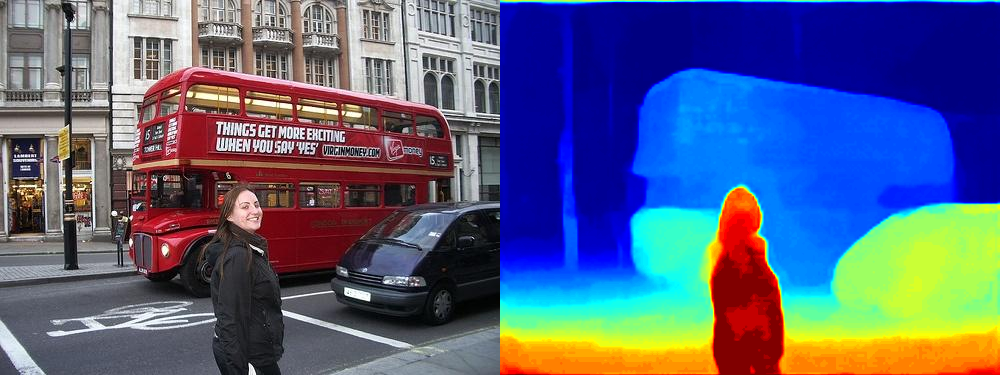](../../../static/validation/effects/yolo26-depth-20260928/n-car_depth_heatmap.png)

<figcaption>n 版 街景（ssd_car.jpg）：左侧输入，右侧本次深度预测</figcaption>
</figure>

<figure>

[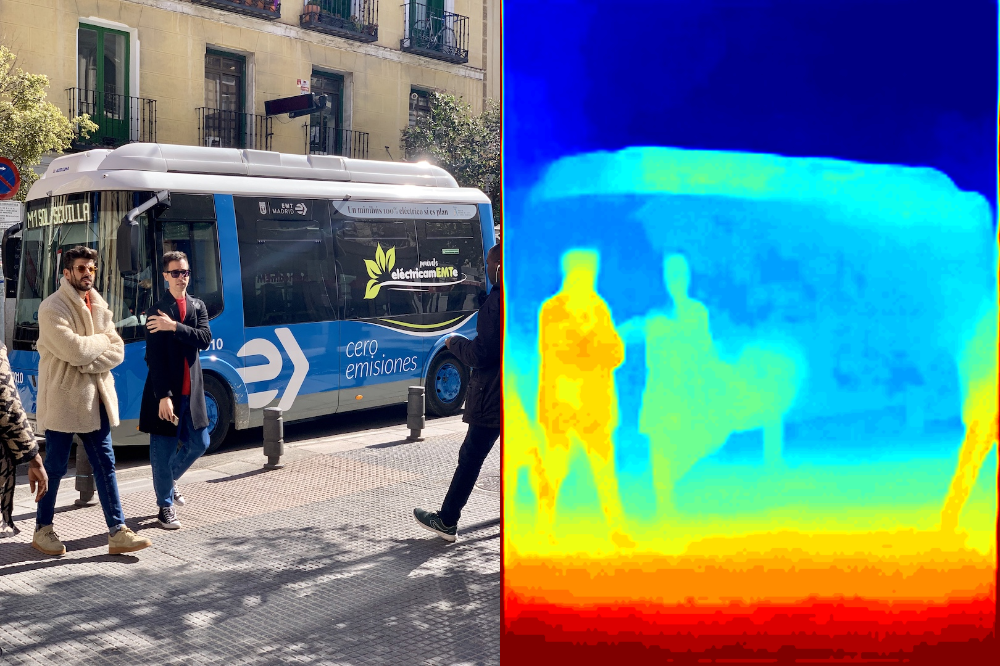](../../../static/validation/effects/yolo26-depth-20260928/n-bus_depth_heatmap.png)

<figcaption>n 版 公交图（bus.jpg）：左侧输入，右侧本次深度预测</figcaption>
</figure>

</div>

| 输入 | 预测最小值 | 预测中位数 | 预测最大值 |
| --- | --- | --- | --- |
| 街景（ssd_car.jpg） | 2.690254 | 8.799232 | 19.095575 |
| 公交图（bus.jpg） | 1.244336 | 4.710700 | 15.100904 |

| 输入 | 逆深度色阶下限（2%） | 逆深度色阶上限（98%） |
| --- | --- | --- |
| 街景 | 0.055984 | 0.321457 |
| 公交图 | 0.074510 | 0.450039 |

**s 版实际深度图**

左侧为实测输入，右侧为本次预测的逆深度热图。每张图分别用有效逆深度的 2% / 98% 分位数映射颜色；暖色表示该图内更大的逆深度，通常对应模型预测的较近位置。同一种颜色不能跨图片、跨版本比较距离。表内数值是模型预测值，未按真实距离标定。

<div className="model-effect-gallery">

<figure>

[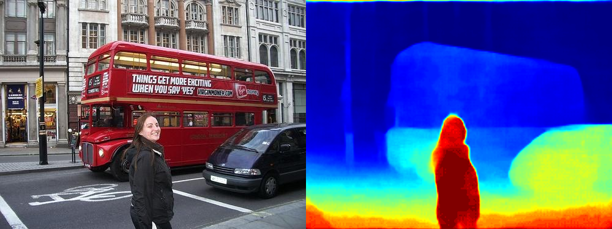](../../../static/validation/effects/yolo26-depth-20260928/s-car_depth_heatmap.png)

<figcaption>s 版 街景（ssd_car.jpg）：左侧输入，右侧本次深度预测</figcaption>
</figure>

<figure>

[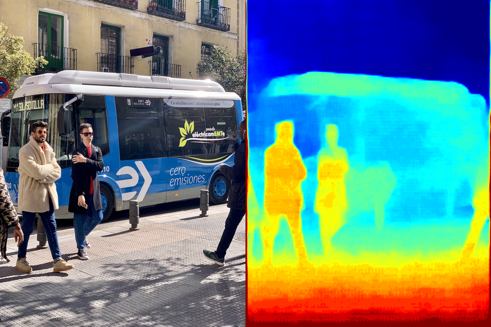](../../../static/validation/effects/yolo26-depth-20260928/s-bus_depth_heatmap.png)

<figcaption>s 版 公交图（bus.jpg）：左侧输入，右侧本次深度预测</figcaption>
</figure>

</div>

| 输入 | 预测最小值 | 预测中位数 | 预测最大值 |
| --- | --- | --- | --- |
| 街景（ssd_car.jpg） | 2.165225 | 8.087750 | 16.239185 |
| 公交图（bus.jpg） | 1.018929 | 3.820985 | 14.109339 |

| 输入 | 逆深度色阶下限（2%） | 逆深度色阶上限（98%） |
| --- | --- | --- |
| 街景 | 0.064896 | 0.448650 |
| 公交图 | 0.086105 | 0.523425 |

**m 版实际深度图**

左侧为实测输入，右侧为本次预测的逆深度热图。每张图分别用有效逆深度的 2% / 98% 分位数映射颜色；暖色表示该图内更大的逆深度，通常对应模型预测的较近位置。同一种颜色不能跨图片、跨版本比较距离。表内数值是模型预测值，未按真实距离标定。

<div className="model-effect-gallery">

<figure>

[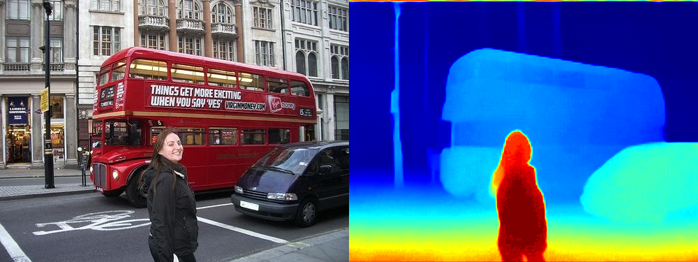](../../../static/validation/effects/yolo26-depth-20260928/m-car_depth_heatmap.png)

<figcaption>m 版 街景（ssd_car.jpg）：左侧输入，右侧本次深度预测</figcaption>
</figure>

<figure>

[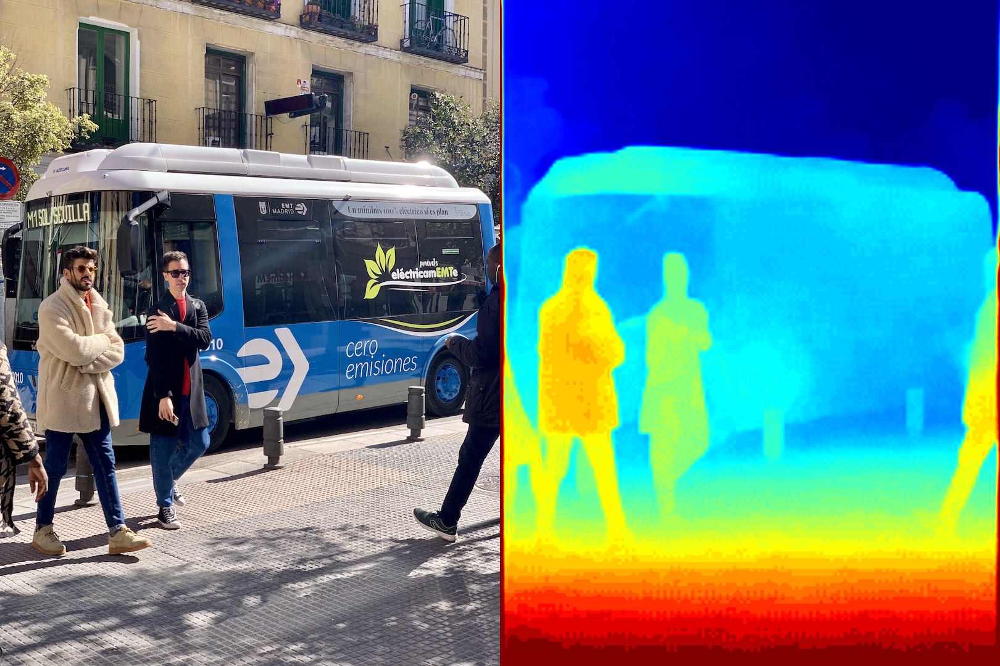](../../../static/validation/effects/yolo26-depth-20260928/m-bus_depth_heatmap.png)

<figcaption>m 版 公交图（bus.jpg）：左侧输入，右侧本次深度预测</figcaption>
</figure>

</div>

| 输入 | 预测最小值 | 预测中位数 | 预测最大值 |
| --- | --- | --- | --- |
| 街景（ssd_car.jpg） | 2.272917 | 7.149768 | 21.382256 |
| 公交图（bus.jpg） | 1.178550 | 4.461652 | 15.150908 |

| 输入 | 逆深度色阶下限（2%） | 逆深度色阶上限（98%） |
| --- | --- | --- |
| 街景 | 0.049411 | 0.421704 |
| 公交图 | 0.073332 | 0.494959 |

**l 版实际深度图**

左侧为实测输入，右侧为本次预测的逆深度热图。每张图分别用有效逆深度的 2% / 98% 分位数映射颜色；暖色表示该图内更大的逆深度，通常对应模型预测的较近位置。同一种颜色不能跨图片、跨版本比较距离。表内数值是模型预测值，未按真实距离标定。

<div className="model-effect-gallery">

<figure>

[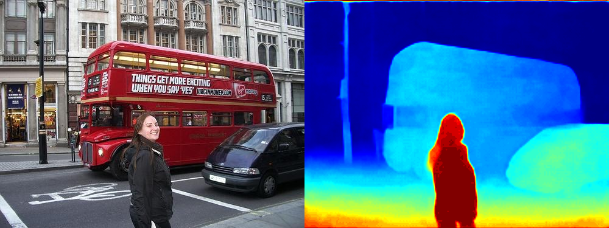](../../../static/validation/effects/yolo26-depth-20260928/l-car_depth_heatmap.png)

<figcaption>l 版 街景（ssd_car.jpg）：左侧输入，右侧本次深度预测</figcaption>
</figure>

<figure>

[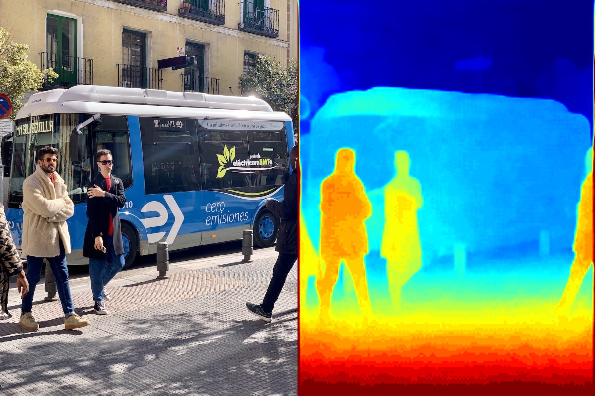](../../../static/validation/effects/yolo26-depth-20260928/l-bus_depth_heatmap.png)

<figcaption>l 版 公交图（bus.jpg）：左侧输入，右侧本次深度预测</figcaption>
</figure>

</div>

| 输入 | 预测最小值 | 预测中位数 | 预测最大值 |
| --- | --- | --- | --- |
| 街景（ssd_car.jpg） | 2.041925 | 6.108911 | 16.089666 |
| 公交图（bus.jpg） | 1.290615 | 4.634753 | 16.081062 |

| 输入 | 逆深度色阶下限（2%） | 逆深度色阶上限（98%） |
| --- | --- | --- |
| 街景 | 0.066414 | 0.415085 |
| 公交图 | 0.071303 | 0.505320 |

**x 版实际深度图**

左侧为实测输入，右侧为本次预测的逆深度热图。每张图分别用有效逆深度的 2% / 98% 分位数映射颜色；暖色表示该图内更大的逆深度，通常对应模型预测的较近位置。同一种颜色不能跨图片、跨版本比较距离。表内数值是模型预测值，未按真实距离标定。

<div className="model-effect-gallery">

<figure>

[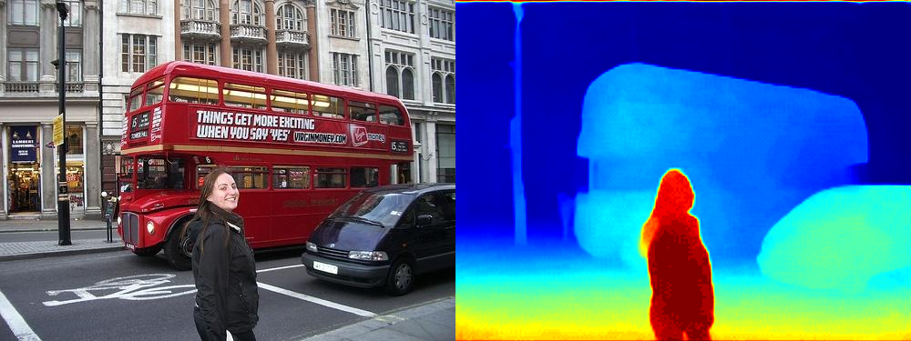](../../../static/validation/effects/yolo26-depth-20260928/x-car_depth_heatmap.png)

<figcaption>x 版 街景（ssd_car.jpg）：左侧输入，右侧本次深度预测</figcaption>
</figure>

<figure>

[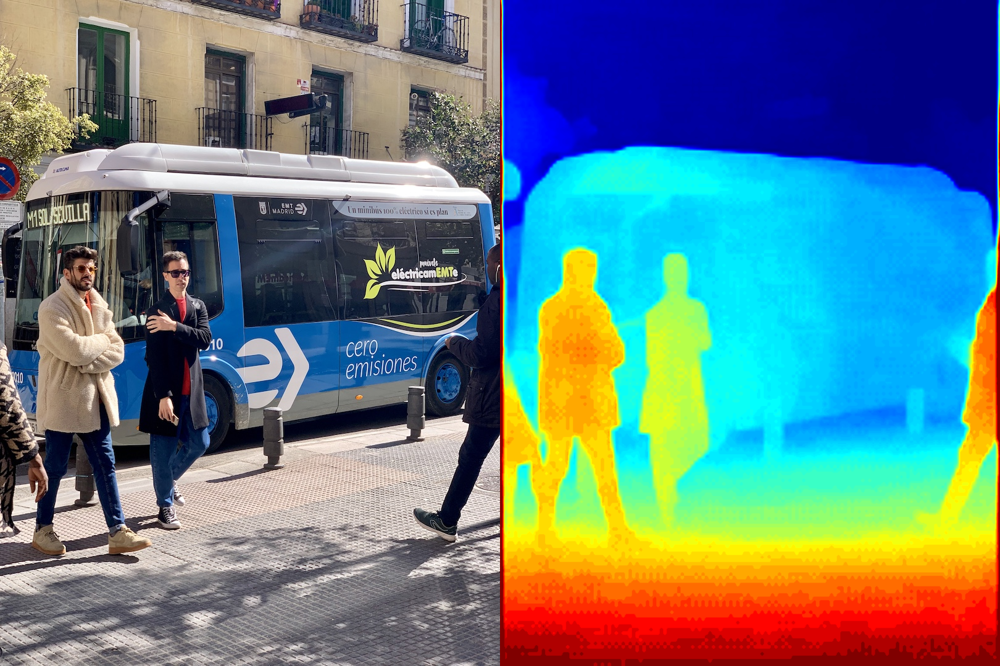](../../../static/validation/effects/yolo26-depth-20260928/x-bus_depth_heatmap.png)

<figcaption>x 版 公交图（bus.jpg）：左侧输入，右侧本次深度预测</figcaption>
</figure>

</div>

| 输入 | 预测最小值 | 预测中位数 | 预测最大值 |
| --- | --- | --- | --- |
| 街景（ssd_car.jpg） | 2.108113 | 6.982100 | 20.384521 |
| 公交图（bus.jpg） | 1.203810 | 4.333717 | 15.627241 |

| 输入 | 逆深度色阶下限（2%） | 逆深度色阶上限（98%） |
| --- | --- | --- |
| 街景 | 0.049950 | 0.445016 |
| 公交图 | 0.070138 | 0.519185 |

**同版本FP32参考对照**

对五个同版ONNX模型在电脑CPU上运行相同输入，采用同样的default几何还原。平均相对差异为逐像素|AXCL−FP32|/FP32的均值；相关系数衡量分布相似性。FP32也是预测值，这些数值不是对真实距离的误差，也不代表质量验收通过。

| 版本 | 输入 | 平均绝对差异 | 平均相对差异 | 相关系数 |
| --- | --- | --- | --- | --- |
| n | car | 0.513636 | 4.508% | 0.997331 |
| n | bus | 0.211825 | 3.332% | 0.997440 |
| s | car | 0.174077 | 2.135% | 0.998512 |
| s | bus | 0.126837 | 3.111% | 0.998893 |
| m | car | 0.191906 | 2.266% | 0.999306 |
| m | bus | 0.197704 | 2.649% | 0.999432 |
| l | car | 0.289426 | 3.894% | 0.998070 |
| l | bus | 0.280875 | 3.411% | 0.998249 |
| x | car | 0.225551 | 2.510% | 0.999222 |
| x | bus | 0.114922 | 1.846% | 0.999132 |

**空白图与重复运行**

五个版本重复街景的输入、输出和生成文件均一致。空白图也产生正值，且与浮点参考差异很大；n、s、m、x版在此输入上输出常值，l版仍呈现空间变化。这里的颜色和预测数值不代表有效物体或测距结果。 全蓝色常值图不等于检测到远处平面；l 版彩色分布也不代表空白画面中存在物体。没有可辨认场景内容时，不应将这些预测解释为有效距离。

<div className="model-effect-gallery">

<figure>

[](../../../static/validation/effects/yolo26-depth-20260928/n-blank_depth_heatmap.png)

<figcaption>n 版空白输入的真实输出</figcaption>
</figure>

<figure>

[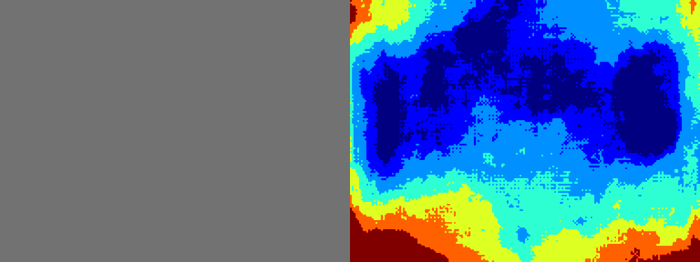](../../../static/validation/effects/yolo26-depth-20260928/l-blank_depth_heatmap.png)

<figcaption>l 版空白输入的真实输出</figcaption>
</figure>

</div>

| 版本 | AXCL空白中位数 | FP32空白中位数 | 平均相对差异 |
| --- | --- | --- | --- |
| n | 22.664688 | 85.424904 | 73.430% |
| s | 16.239185 | 68.170654 | 76.279% |
| m | 21.382256 | 72.022324 | 70.315% |
| l | 1.720820 | 69.802643 | 97.539% |
| x | 20.384521 | 69.994087 | 70.805% |

| 版本 | 空白预测最小值 | 空白预测最大值 | 空间变化 |
| --- | --- | --- | --- |
| n | 22.664688 | 22.664688 | 常值 |
| s | 16.239185 | 16.239185 | 常值 |
| m | 21.382256 | 21.382256 | 常值 |
| l | 1.204574 | 1.978943 | 有变化 |
| x | 20.384521 | 20.384521 | 常值 |

**各版本调用耗时**

每个版本统计4次调用，包含首轮，无预热。时间包含AXCL传输，不含模型加载、CPU图像处理和证据保存；不能直接换算成实时应用帧率。

| 版本 | 调用次数 | 平均AXCL耗时 / ms |
| --- | --- | --- |
| n | 4 | 23.991004 |
| s | 4 | 25.991913 |
| m | 4 | 33.170425 |
| l | 4 | 37.162764 |
| x | 4 | 55.418280 |

**使用时注意：**

- 无实测距离标注；热图采用逐图逆深度归一化，不能跨图按颜色读距离。空白图也产生正值，且 AXCL 与 FP32 差异明显；尚未完成测距精度验收。
- 结果仅来自16GB算力卡，实际8GB、长时视频和目标相机场景仍待验证。

这些结果用于对照部署后的输出，未覆盖完整数据集精度或长期连续运行。

<details>
<summary>查看样例环境与运行耗时</summary>

环境：RK3576 + AX8850 16GB M.2。模型版本：`4c12e1d456fd05bd8ffa5a8e272916e1d748dcfb`。

| 组件 | 版本或配置 |
| --- | --- |
| 主机 / 内核 | RK3576，约 4GB RAM，6.1.115-vendor-rk35xx |
| AXCL / 驱动 | V3.16.0_20260729180218 |
| 固件 / CMM | V3.16.0 / 15232 MiB |
| Python 推理 | Python 3.12 / PyAXEngine 0.1.3.rc3 / NumPy 1.26.4 / AXCLRTExecutionProvider |

| 指标 | 实测值 | 计时或统计范围 |
| --- | --- | --- |
| 实测权重 | n / s / m / l / x | 固定版本ax8850n目录，串行执行20次AXCL调用。 |
| 实景相对FP32差异 | 1.846%～4.508% | 两张官方图片×五版本，逐像素相对差异的均值；非真实距离误差。 |
| 重复运行 | 输入、输出、生成文件一致 | 每版本仅一次重复，不等于长期稳定性。 |

</details>

遇到加载、内存或后端错误时，按[常见问题](../../usage/troubleshooting.md)处理。需要更换输入或接入业务时，按[检查输出与记录结果](../../reference/validation.md)保留自己的结果。

<details>
<summary>查看文件用途与版本信息</summary>

| 文件 / 目录内路径 | 用途 |
| --- | --- |
| [`infer_depth.py`](https://huggingface.co/AXERA-TECH/Yolo26-Depth/blob/4c12e1d456fd05bd8ffa5a8e272916e1d748dcfb/infer_depth.py) | Python 程序 / 前后处理 |
| [`ax8850n/yolo26l-depth_w8a8_mix.axmodel`](https://huggingface.co/AXERA-TECH/Yolo26-Depth/blob/4c12e1d456fd05bd8ffa5a8e272916e1d748dcfb/ax8850n/yolo26l-depth_w8a8_mix.axmodel) | 编译模型；按目录区分芯片和规格 |
| [`ax8850n/yolo26m-depth_w8a8_mix.axmodel`](https://huggingface.co/AXERA-TECH/Yolo26-Depth/blob/4c12e1d456fd05bd8ffa5a8e272916e1d748dcfb/ax8850n/yolo26m-depth_w8a8_mix.axmodel) | 编译模型；按目录区分芯片和规格 |
| [`ax8850n/yolo26n-depth_w8a8_mix.axmodel`](https://huggingface.co/AXERA-TECH/Yolo26-Depth/blob/4c12e1d456fd05bd8ffa5a8e272916e1d748dcfb/ax8850n/yolo26n-depth_w8a8_mix.axmodel) | 编译模型；按目录区分芯片和规格 |
| [`ax8850n/yolo26s-depth_w8a8_mix.axmodel`](https://huggingface.co/AXERA-TECH/Yolo26-Depth/blob/4c12e1d456fd05bd8ffa5a8e272916e1d748dcfb/ax8850n/yolo26s-depth_w8a8_mix.axmodel) | 编译模型；按目录区分芯片和规格 |
| [`ax8850n/yolo26x-depth_w8a8_mix.axmodel`](https://huggingface.co/AXERA-TECH/Yolo26-Depth/blob/4c12e1d456fd05bd8ffa5a8e272916e1d748dcfb/ax8850n/yolo26x-depth_w8a8_mix.axmodel) | 编译模型；按目录区分芯片和规格 |
| [`ax615/config.json`](https://huggingface.co/AXERA-TECH/Yolo26-Depth/blob/4c12e1d456fd05bd8ffa5a8e272916e1d748dcfb/ax615/config.json) | 运行配置 |
| [`ax630c/config.json`](https://huggingface.co/AXERA-TECH/Yolo26-Depth/blob/4c12e1d456fd05bd8ffa5a8e272916e1d748dcfb/ax630c/config.json) | 运行配置 |
| [`ax637/config.json`](https://huggingface.co/AXERA-TECH/Yolo26-Depth/blob/4c12e1d456fd05bd8ffa5a8e272916e1d748dcfb/ax637/config.json) | 运行配置 |
| [`ax8850n/config.json`](https://huggingface.co/AXERA-TECH/Yolo26-Depth/blob/4c12e1d456fd05bd8ffa5a8e272916e1d748dcfb/ax8850n/config.json) | 运行配置 |
| [`config.json`](https://huggingface.co/AXERA-TECH/Yolo26-Depth/blob/4c12e1d456fd05bd8ffa5a8e272916e1d748dcfb/config.json) | 运行配置 |
| [`requirements.txt`](https://huggingface.co/AXERA-TECH/Yolo26-Depth/blob/4c12e1d456fd05bd8ffa5a8e272916e1d748dcfb/requirements.txt) | Python 依赖清单 |

仓库提交：`4c12e1d456fd05bd8ffa5a8e272916e1d748dcfb`。仓库中的 20 个 `.axmodel` 文件可能包括多个芯片、规格和分片。运行时使用本页指定的配套文件，完整列表见[固定版本目录](https://huggingface.co/AXERA-TECH/Yolo26-Depth/tree/4c12e1d456fd05bd8ffa5a8e272916e1d748dcfb)。

</details>

<details>
<summary>补充说明与版本差异</summary>

- 同时处理检测和深度相关输出。仓库按 ax615、ax630c、ax637、ax8850n 分目标，AX650 系列卡应核对 ax8850n 模型的配套要求。

</details>

## 参考资料

- [常用术语](../../reference/glossary.md)：AXCL、CMM、分词器与推理指标。
- [固定版本文件表](https://huggingface.co/AXERA-TECH/Yolo26-Depth/tree/4c12e1d456fd05bd8ffa5a8e272916e1d748dcfb)。
- [模型卡 / 使用说明](https://huggingface.co/AXERA-TECH/Yolo26-Depth/blob/4c12e1d456fd05bd8ffa5a8e272916e1d748dcfb/README.md)。
- [主要程序入口：infer_depth.py](https://huggingface.co/AXERA-TECH/Yolo26-Depth/blob/4c12e1d456fd05bd8ffa5a8e272916e1d748dcfb/infer_depth.py)。

返回[完整模型目录](../catalog.mdx)。
