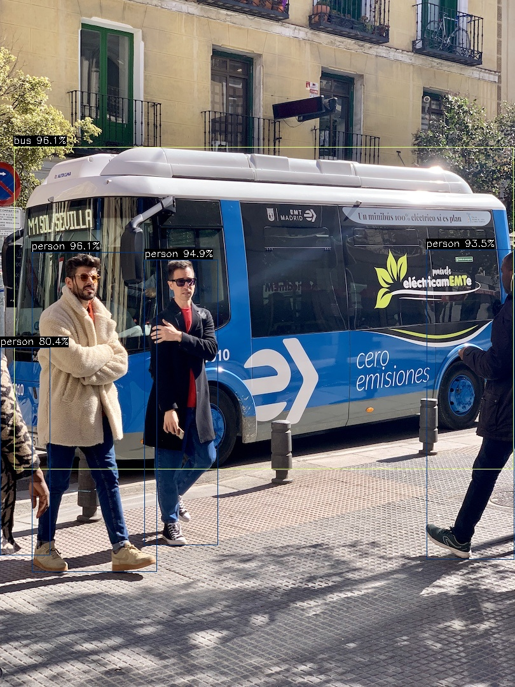
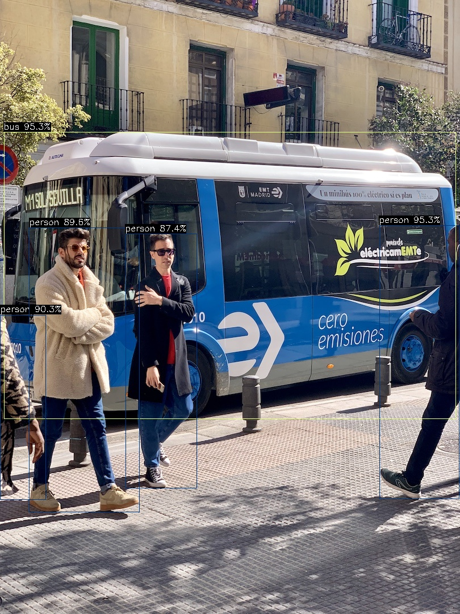

# yolo26 部署指南

yolo26 用于目标检测。本页说明 M.2 算力卡的接入条件、部署步骤与结果检查方法。本页选择 `ax650/yolo26n.axmodel`。

> 已实测，效果仍需评估。[查看部署效果](#查看部署效果)。

## 准备运行环境

本页包含 **RK3576 DshanPi A1 + AX8850 16GB M.2** 与 **RK3576 DshanPi A1 + AX8850 8GB M.2** 的样例。按效果展示中的权重和容量对应使用，不同环境的结果不能互相替代。

在连接算力卡的 Linux 主机终端执行，RK3576 使用 ARM64 环境。首次部署先完成[驱动与设备检查](../../usage/device-check.md)、[编译 AXCL 视觉示例](../../usage/build-samples.md)和[下载工具安装](../../usage/download-models.md#使用-hugging-face-下载)。已完成这些步骤可直接下载模型。

后文使用设备 0，运行前用 `axcl-smi` 确认设备可用。

## 下载模型与样例

本页使用 `AXERA-TECH/yolo26` 的固定版本。下面下载本页选用的 6 个文件。

```bash
MODEL_DIR=~/edgeaccel/models/yolo26/29a97acdbe26
mkdir -p "$MODEL_DIR"
~/edgeaccel/hf-env/bin/hf download AXERA-TECH/yolo26 \
  "bus.jpg" \
  "ax650/yolo26l.axmodel" \
  "ax650/yolo26m.axmodel" \
  "ax650/yolo26s.axmodel" \
  "ax650/yolo26x.axmodel" \
  "ax650/yolo26n.axmodel" \
  --revision 29a97acdbe26f65c2f786bb32fb75023a0714b69 \
  --local-dir "$MODEL_DIR"
cd "$MODEL_DIR"
```

保留当前终端中的 `MODEL_DIR` 变量，后续命令沿用此目录。下载受阻或需要离线复制时，见[下载方式与文件校验](../../usage/download-models.md)。

## 执行图片推理

本页使用 `axcl_yolo26`，模型为 `ax650/yolo26n.axmodel`，输入为 `bus.jpg`。`-g` 参数顺序为高、宽。

```bash
cd "$MODEL_DIR"
SAMPLE=~/edgeaccel/src/axcl-samples/build/install/bin/axcl_yolo26
test -x "$SAMPLE"
test -s ax650/yolo26n.axmodel
test -s bus.jpg
ldd "$SAMPLE"
set -o pipefail
"$SAMPLE" -m ax650/yolo26n.axmodel -i bus.jpg -g 640,640 -r 1 2>&1 | tee run.log
```

依赖中不能出现 `not found`。程序退出码应为 0，日志不应有模型加载或设备错误。检查本次产生的 `yolo26_out.jpg` 的修改时间与画面内容；仓库自带的旧结果图不能作为本次运行证据。

示例源码：[axcl-samples 固定版本](https://github.com/AXERA-TECH/axcl-samples/tree/cbfa4c76891758983ca2b0c99c11d6621d59af39)。

## 运行其他 AX650 权重

前面的下载命令同时包含下表权重。默认入口保留原8GB样例；以下权重在16GB卡上实测。

| 权重 | 本组实测容量 |
| --- | --- |
| `ax650/yolo26l.axmodel` | 16GB |
| `ax650/yolo26m.axmodel` | 16GB |
| `ax650/yolo26s.axmodel` | 16GB |
| `ax650/yolo26x.axmodel` | 16GB |

已按[编译视觉示例](../../usage/build-samples.md)取得固定版本源码后，可单独构建本页程序：

```bash
SRC=~/edgeaccel/src/axcl-samples
git -C "$SRC" rev-parse HEAD
# 确认提交为 cbfa4c76891758983ca2b0c99c11d6621d59af39
cmake -S "$SRC" -B "$SRC/build-variants" \
  -DCMAKE_BUILD_TYPE=Release \
  -DCMAKE_RUNTIME_OUTPUT_DIRECTORY="$SRC/build-variants/bin"
cmake --build "$SRC/build-variants" --target axcl_yolo26 --parallel 1
SAMPLE="$SRC/build-variants/bin/axcl_yolo26"
ldd "$SAMPLE"
```

在同一终端选择上表中的一个权重运行。程序将结果写入当前目录，用不同目录保存每个权重的图片：

```bash
WEIGHT=ax650/yolo26l.axmodel
OUT=~/edgeaccel/results/yolo26/$(basename "$WEIGHT" .axmodel)
mkdir -p "$OUT"
cd "$OUT"
set -o pipefail
"$SAMPLE" -m "$MODEL_DIR/$WEIGHT" \
  -i "$MODEL_DIR/bus.jpg" -g 640,640 -r 10 2>&1 | tee run.log
```

打开新生成的`yolo26_out.jpg`，与下面同一权重的结果对照。原始程序使用置信度阈值0.45、NMS阈值0.45，`-r 10`之外还执行5次预热。运行结束后同时核对日志、图片和设备状态，不能只看退出码。


## 查看部署效果

### 新增AX650权重：16GB卡样例

**已运行，效果仍需评估** · RK3576 DshanPi A1 + AX8850 16GB M.2。以下输入与输出来自本页固定版本的实际运行。

4个新增权重各独立启动两次，每次5次预热和10次推理，原始C++示例生成的图片重复一致。下方展示实际输出及程序记录的目标数量。

**yolo26l**

公交车与四个人物均有检测框，左右边缘人物被画面截断；这里只核对固定样例，不报告数据集精度。

<div className="model-effect-gallery">

<figure>

[](../../../static/validation/effects/yolo26-native-variants-20261005/inputs/bus.jpg)

<figcaption>实际输入：bus.jpg</figcaption>
</figure>

<figure>

[](../../../static/validation/effects/yolo26-native-variants-20261005/outputs/yolo26l.jpg)

<figcaption>实际输出：yolo26l</figcaption>
</figure>

</div>

| 权重 | 程序输出目标数 | 各类别数量 |
| --- | --- | --- |
| yolo26l.axmodel | 5 | bus: 1；person: 4 |

**yolo26m**

公交车与四个人物均有检测框，部分框边界有偏差；单张样例不代表总体准确率。

<div className="model-effect-gallery">

<figure>

[](../../../static/validation/effects/yolo26-native-variants-20261005/inputs/bus.jpg)

<figcaption>实际输入：bus.jpg</figcaption>
</figure>

<figure>

[](../../../static/validation/effects/yolo26-native-variants-20261005/outputs/yolo26m.jpg)

<figcaption>实际输出：yolo26m</figcaption>
</figure>

</div>

| 权重 | 程序输出目标数 | 各类别数量 |
| --- | --- | --- |
| yolo26m.axmodel | 5 | bus: 1；person: 4 |

**yolo26s**

公交车与三个人物有检测框，画面最右侧人物没有被检出；该漏检保留在效果展示中。

<div className="model-effect-gallery">

<figure>

[](../../../static/validation/effects/yolo26-native-variants-20261005/inputs/bus.jpg)

<figcaption>实际输入：bus.jpg</figcaption>
</figure>

<figure>

[](../../../static/validation/effects/yolo26-native-variants-20261005/outputs/yolo26s.jpg)

<figcaption>实际输出：yolo26s</figcaption>
</figure>

</div>

| 权重 | 程序输出目标数 | 各类别数量 |
| --- | --- | --- |
| yolo26s.axmodel | 4 | bus: 1；person: 3 |

**yolo26x**

公交车与四个人物均有检测框，边缘截断人物仍需结合实际场景评估。

<div className="model-effect-gallery">

<figure>

[](../../../static/validation/effects/yolo26-native-variants-20261005/inputs/bus.jpg)

<figcaption>实际输入：bus.jpg</figcaption>
</figure>

<figure>

[](../../../static/validation/effects/yolo26-native-variants-20261005/outputs/yolo26x.jpg)

<figcaption>实际输出：yolo26x</figcaption>
</figure>

</div>

| 权重 | 程序输出目标数 | 各类别数量 |
| --- | --- | --- |
| yolo26x.axmodel | 5 | bus: 1；person: 4 |

**使用时注意：**

- 仅固定单张图片，边缘、遮挡或小目标仍有漏检，目标数量不等于真实目标数量。未计算检测mAP或分割IoU。
- 本组使用16GB卡，不替代这些权重的8GB回归；未采集原始输出张量，不能据此判断逐元素数值精度。

这些结果用于对照部署后的输出，未覆盖完整数据集精度或长期连续运行。

### yolo26n：8GB卡样例

**固定样例已核对** · RK3576 DshanPi A1 + AX8850 8GB M.2。以下输入与输出来自本页固定版本的实际运行。

单张 bus.jpg 输出 1 个 bus、4 个 person。公交车、两名完整可见行人及左右边缘部分行人的框与原图对应，完成定性正确性检查。

点击图片可查看原尺寸。

<div className="model-effect-gallery">

<figure>

[](../../../static/validation/effects/yolo26/inputs/bus.jpg)

<figcaption>输入图片</figcaption>
</figure>

<figure>

[](../../../static/validation/effects/yolo26/outputs/yolo26_out.jpg)

<figcaption>实际输出</figcaption>
</figure>

</div>

**使用时注意：**

- 左右边缘行人被画面裁切；其框只对应可见部分，不能由本图推断遮挡场景下的普遍检出率。
- 仅一次启动、同一张样例图的 5 次预热和 10 次计时调用；未进行独立数据集精度评测或长时间稳定性测试。

这些结果用于对照部署后的输出，未覆盖完整数据集精度或长期连续运行。

**新增AX650权重：16GB卡样例**

<details>
<summary>查看样例环境与运行耗时</summary>

环境：RK3576 DshanPi A1 + AX8850 16GB M.2。模型版本：`29a97acdbe26f65c2f786bb32fb75023a0714b69`。

| 组件 | 版本或配置 |
| --- | --- |
| 主机系统 / 内核 | Ubuntu 24.04 / Armbian；aarch64；6.1.115-vendor-rk35xx |
| AXCL / 驱动 | V3.16.0_20260729180218 |
| 固件 / CMM | V3.16.0；总量15232 MiB，空闲占用18 MiB |
| C++ 示例 | cbfa4c76891758983ca2b0c99c11d6621d59af39；Release；g++13；OpenCV4.6 |
| 前后处理 | 原始C++示例，640×640输入；置信度阈值0.45、NMS阈值0.45。 |
| 重复范围 | 每个权重独立启动两次；每次5次预热、10次计时；同一固定图片。 |

| 指标 | 实测值 | 计时或统计范围 |
| --- | --- | --- |
| yolo26l.axmodel · Execute均值 | 12.116 / 11.828 ms | 两次独立启动，各5次预热后10次axclrtEngineExecute调用；启用API记录，不含显式输入输出复制、预后处理，不代表无插桩吞吐或端到端延迟。 |
| yolo26m.axmodel · Execute均值 | 9.322 / 9.337 ms | 两次独立启动，各5次预热后10次axclrtEngineExecute调用；启用API记录，不含显式输入输出复制、预后处理，不代表无插桩吞吐或端到端延迟。 |
| yolo26s.axmodel · Execute均值 | 3.867 / 3.848 ms | 两次独立启动，各5次预热后10次axclrtEngineExecute调用；启用API记录，不含显式输入输出复制、预后处理，不代表无插桩吞吐或端到端延迟。 |
| yolo26x.axmodel · Execute均值 | 25.059 / 25.076 ms | 两次独立启动，各5次预热后10次axclrtEngineExecute调用；启用API记录，不含显式输入输出复制、预后处理，不代表无插桩吞吐或端到端延迟。 |

</details>

**yolo26n：8GB卡样例**

<details>
<summary>查看样例环境与运行耗时</summary>

环境：RK3576 DshanPi A1 + AX8850 8GB M.2。模型版本：`29a97acdbe26f65c2f786bb32fb75023a0714b69`。

| 组件 | 版本或配置 |
| --- | --- |
| 主机系统 | Ubuntu 24.04 / Armbian 25.11.0-trunk，aarch64 |
| 内核 | 6.1.115-vendor-rk35xx |
| AXCL / 驱动 | V3.16.0_20260729180218 |
| 固件 / CMM | V3.16.0；CMM 总量 7040 MiB，空闲基线占用 18 MiB |
| C++ 视觉示例提交 | cbfa4c76891758983ca2b0c99c11d6621d59af39 |
| Python 后端 | Python 3.12.3；PyAXEngine 0.1.3.rc3 发布的 0.1.3 wheel；NumPy 1.26.4 / ml-dtypes 0.5.3 |
| AX-LLM 提交 | 8501c22b940f8c5804cb35044c5ffc136918b8f1；Release / AXCL / Linux aarch64 |

| 指标 | 实测值 | 计时或统计范围 |
| --- | --- | --- |
| AXCL Execute 平均耗时 | 2.46 ms | 5 次预热后同图重复 10 次；仅 axclrtEngineExecute，不含显式 H2D/D2H、预后处理 |
| AXCL Execute 最小 / 最大 | 2.25 / 2.67 ms | 与上述平均值使用相同样本和计时范围 |

</details>

遇到加载、内存或后端错误时，按[常见问题](../../usage/troubleshooting.md)处理。需要更换输入或接入业务时，按[检查输出与记录结果](../../reference/validation.md)保留自己的结果。

<details>
<summary>查看文件用途与版本信息</summary>

| 文件 / 目录内路径 | 用途 |
| --- | --- |
| [`ax650/yolo26n.axmodel`](https://huggingface.co/AXERA-TECH/yolo26/blob/29a97acdbe26f65c2f786bb32fb75023a0714b69/ax650/yolo26n.axmodel) | 编译模型；按目录区分芯片和规格 |
| [`bus.jpg`](https://huggingface.co/AXERA-TECH/yolo26/blob/29a97acdbe26f65c2f786bb32fb75023a0714b69/bus.jpg) | 示例输入 |

仓库提交：`29a97acdbe26f65c2f786bb32fb75023a0714b69`。仓库中的 15 个 `.axmodel` 文件可能包括多个芯片、规格和分片。运行时使用本页指定的配套文件，完整列表见[固定版本目录](https://huggingface.co/AXERA-TECH/yolo26/tree/29a97acdbe26f65c2f786bb32fb75023a0714b69)。

</details>

<details>
<summary>补充说明与版本差异</summary>

- 本次实测使用 axcl-samples 固定版本 cbfa4c76891758983ca2b0c99c11d6621d59af39，参数 -r 10 重复执行模型；日志中的模型耗时与图片读写、预处理和绘图耗时分开解释。

</details>

## 参考资料

- [常用术语](../../reference/glossary.md)：AXCL、CMM、分词器与推理指标。
- [固定版本文件表](https://huggingface.co/AXERA-TECH/yolo26/tree/29a97acdbe26f65c2f786bb32fb75023a0714b69)。
- [模型卡 / 使用说明](https://huggingface.co/AXERA-TECH/yolo26/blob/29a97acdbe26f65c2f786bb32fb75023a0714b69/README.md)。
- [ModelScope 对应资源](https://modelscope.cn/models/AXERA-TECH/yolo26)。不同平台的 revision 不通用，另行记录版本。

返回[完整模型目录](../catalog.mdx)。
