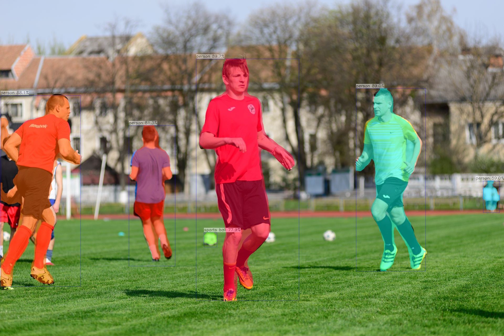

# YOLOv5-Seg 部署指南

YOLOv5-Seg 用于图像分割。本页说明 M.2 算力卡的接入条件、部署步骤与结果检查方法。

> 已实测，效果仍需评估。[查看部署效果](#查看部署效果)。

## 准备运行环境

本页效果展示使用 **RK3576 + AX8850 16GB M.2**；其他容量或平台需重新确认模型能否加载并正确运行。

在连接算力卡的 Linux 主机终端执行，RK3576 使用 ARM64 环境。首次部署先完成[驱动与设备检查](../../usage/device-check.md)、[编译 AXCL 视觉示例](../../usage/build-samples.md)和[下载工具安装](../../usage/download-models.md#使用-hugging-face-下载)。已完成这些步骤可直接下载模型。

后文使用设备 0，运行前用 `axcl-smi` 确认设备可用。

## 下载模型与样例

本页使用 `AXERA-TECH/YOLOv5-Seg` 的固定版本。下面下载本页选用的 3 个文件。

```bash
MODEL_DIR=~/edgeaccel/models/yolov5-seg/cd7b96d24bbb
mkdir -p "$MODEL_DIR"
~/edgeaccel/hf-env/bin/hf download AXERA-TECH/YOLOv5-Seg \
  "README.md" \
  "ax650/yolov5s-seg.axmodel" \
  "football.jpg" \
  --revision cd7b96d24bbb899c6ac03bb448ee5974e9054d60 \
  --local-dir "$MODEL_DIR"
cd "$MODEL_DIR"
```

保留当前终端中的 `MODEL_DIR` 变量，后续命令沿用此目录。下载受阻或需要离线复制时，见[下载方式与文件校验](../../usage/download-models.md)。

## 编译实例分割示例

完成前面的 AXCL 视觉示例环境后，编译本例目标。实测使用 [axcl-samples 固定提交](https://github.com/AXERA-TECH/axcl-samples/tree/cbfa4c76891758983ca2b0c99c11d6621d59af39)：

```bash
cmake --build ~/edgeaccel/src/axcl-samples/build --target axcl_yolov5s_seg -j2
SAMPLE=~/edgeaccel/src/axcl-samples/build/examples/axcl/axcl_yolov5s_seg
test -x "$SAMPLE"
ldd "$SAMPLE"
```

依赖检查不能出现 `not found`。使用 `axcl_yolov5s_seg`，它通过 AXCL 访问算力卡。

## 生成实例掩码

```bash
cd "$MODEL_DIR"
mkdir -p results/football
cd results/football
set -o pipefail
"$SAMPLE" -m "$MODEL_DIR/ax650/yolov5s-seg.axmodel" \
  -i "$MODEL_DIR/football.jpg" -g 640,640 -r 3 2>&1 | tee run.log
```

程序先预热 5 次，再运行并统计 3 次推理，最后保存 `yolov5s_seg_out.jpg`。固定版本源码的检测阈值和 NMS 阈值均为 0.45。

打开输出图，检查每个实例的掩码、检测框和类别是否对应。`detection num` 表示候选实例数量，不是分割准确率；图片中的掩码来自最后一轮推理。


## 查看部署效果

**已运行，效果仍需评估** · 2026-09-27 · RK3576 + AX8850 16GB M.2。以下输入与输出来自本页固定版本的实际运行。

官方足球图片生成本次实例掩码与检测框，共保留 6 个候选实例。

**football**

阈值 0.45，保留 6 个候选框。程序预热 5 次后计时 3 次，图中为最后一轮输出的实例掩码和检测框；未逐轮比较掩码。

<div className="model-effect-gallery">

<figure>

[](../../../static/validation/effects/yolov5-seg-20260927/input.webp)

<figcaption>本次输入 · football</figcaption>
</figure>

<figure>

[](../../../static/validation/effects/yolov5-seg-20260927/output.webp)

<figcaption>本次检测结果 · football</figcaption>
</figure>

</div>

| 类别 | 候选框数 |
| --- | --- |
| 候选实例 | 6 |

**使用时注意：**

- 仅测试一张官方足球图片，未使用像素级标注计算掩码 IoU，也未逐轮比较掩码。
- 仅在 RK3576 + AX8850 16GB 上验证；未测试 8GB、实时视频或长期运行。

这些结果用于对照部署后的输出，未覆盖完整数据集精度或长期连续运行。

<details>
<summary>查看样例环境与运行耗时</summary>

环境：RK3576 + AX8850 16GB M.2。日期：2026-09-27。模型版本：`cd7b96d24bbb899c6ac03bb448ee5974e9054d60`。

| 组件 | 版本或配置 |
| --- | --- |
| 主机系统 | Ubuntu 24.04 / Armbian 25.11.0-trunk，aarch64，主机内存约 4GB |
| 内核 | 6.1.115-vendor-rk35xx |
| AXCL / 驱动 | V3.16.0_20260729180218 |
| 固件 / CMM | V3.16.0；CMM 总量 15232MiB |
| Python / PyAXEngine | Python 3.12；官方 0.1.3.rc3 wheel；AXCLRTExecutionProvider |
| NumPy / OpenCV / Pillow | 1.26.4 / 4.11.0.86 / 11.3.0 |
| Torch / Torchvision | 2.5.1 / 0.20.1 |
| RF-DETR bbox 后处理 | ONNX Runtime 1.20.1 / CPUExecutionProvider / intra-op 2、inter-op 1 |
| C++ 分割示例 | axcl-samples cbfa4c76891758983ca2b0c99c11d6621d59af39 / OpenCV 4.6.0 |

| 指标 | 实测值 | 计时或统计范围 |
| --- | --- | --- |
| AXCL C++ 示例内部统计 | 10.16 ms | 预热 5 次后运行 3 次的示例内部推理计时，不含图片加载、前后处理和保存。 |

适用范围：

- 仅测试一张官方足球图片，未使用像素级标注计算掩码 IoU，也未逐轮比较掩码。
- 仅在 RK3576 + AX8850 16GB 上验证；未测试 8GB、实时视频或长期运行。

</details>

遇到加载、内存或后端错误时，按[常见问题](../../usage/troubleshooting.md)处理。需要更换输入或接入业务时，按[检查输出与记录结果](../../reference/validation.md)保留自己的结果。

<details>
<summary>查看文件用途与版本信息</summary>

| 文件 / 目录内路径 | 用途 |
| --- | --- |
| [`ax650/yolov5s-seg.axmodel`](https://huggingface.co/AXERA-TECH/YOLOv5-Seg/blob/cd7b96d24bbb899c6ac03bb448ee5974e9054d60/ax650/yolov5s-seg.axmodel) | 编译模型；按目录区分芯片和规格 |
| [`config.json`](https://huggingface.co/AXERA-TECH/YOLOv5-Seg/blob/cd7b96d24bbb899c6ac03bb448ee5974e9054d60/config.json) | 运行配置 |
| [`yolov5_seg_config.json`](https://huggingface.co/AXERA-TECH/YOLOv5-Seg/blob/cd7b96d24bbb899c6ac03bb448ee5974e9054d60/yolov5_seg_config.json) | 运行配置 |

仓库提交：`cd7b96d24bbb899c6ac03bb448ee5974e9054d60`。仓库中的 2 个 `.axmodel` 文件可能包括多个芯片、规格和分片。运行时使用本页指定的配套文件，完整列表见[固定版本目录](https://huggingface.co/AXERA-TECH/YOLOv5-Seg/tree/cd7b96d24bbb899c6ac03bb448ee5974e9054d60)。

</details>

## 参考资料

- [常用术语](../../reference/glossary.md)：AXCL、CMM、分词器与推理指标。
- [固定版本文件表](https://huggingface.co/AXERA-TECH/YOLOv5-Seg/tree/cd7b96d24bbb899c6ac03bb448ee5974e9054d60)。
- [模型卡 / 使用说明](https://huggingface.co/AXERA-TECH/YOLOv5-Seg/blob/cd7b96d24bbb899c6ac03bb448ee5974e9054d60/README.md)。
- [ModelScope 对应资源](https://modelscope.cn/models/AXERA-TECH/YOLOv5-Seg)。不同平台的 revision 不通用，另行记录版本。

返回[完整模型目录](../catalog.mdx)。
