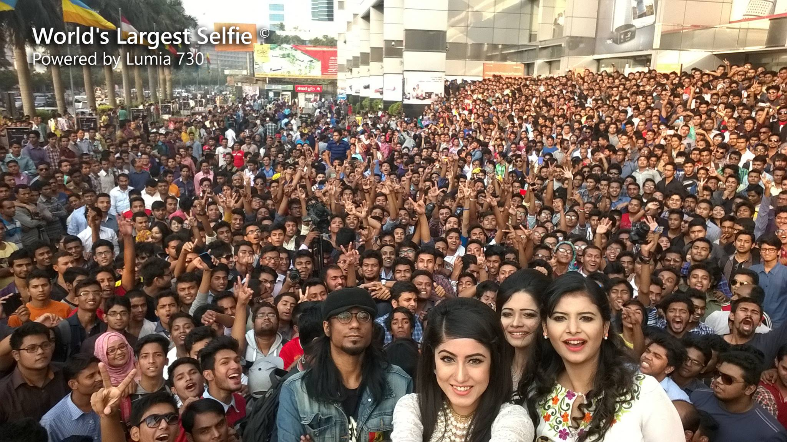
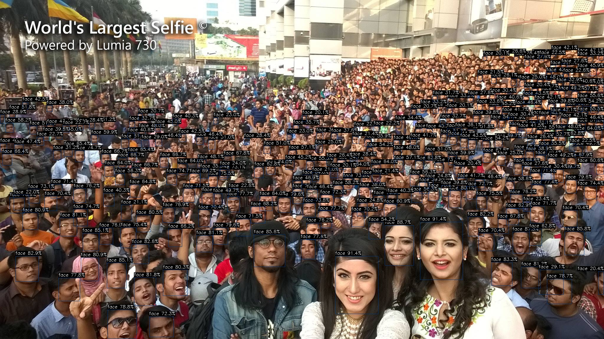

# YOLOv7-Face 部署指南

YOLOv7-Face 用于人脸区域检测。本页说明 M.2 算力卡的接入条件、部署步骤与结果检查方法。

> 已实测，效果仍需评估。[查看部署效果](#查看部署效果)。

## 准备运行环境

本页效果展示使用 **RK3576 + AX8850 16GB M.2**；其他容量或平台需重新确认模型能否加载并正确运行。

在连接算力卡的 Linux 主机终端执行，RK3576 使用 ARM64 环境。首次部署先完成[驱动与设备检查](../../usage/device-check.md)、[编译 AXCL 视觉示例](../../usage/build-samples.md)和[下载工具安装](../../usage/download-models.md#使用-hugging-face-下载)。已完成这些步骤可直接下载模型。

后文使用设备 0，运行前用 `axcl-smi` 确认设备可用。

## 下载模型与样例

本页使用 `AXERA-TECH/YOLOv7-Face` 的固定版本。下面下载本页选用的 4 个文件。

```bash
MODEL_DIR=~/edgeaccel/models/yolov7-face/e4f3f97e87da
mkdir -p "$MODEL_DIR"
~/edgeaccel/hf-env/bin/hf download AXERA-TECH/YOLOv7-Face \
  "README.md" \
  "axcl_aarch64/axcl_yolov7_face" \
  "ax650/yolov7-face.axmodel" \
  "selfie.jpg" \
  --revision e4f3f97e87dad8a31b4e20f452ef312dd102469d \
  --local-dir "$MODEL_DIR"
cd "$MODEL_DIR"
```

保留当前终端中的 `MODEL_DIR` 变量，后续命令沿用此目录。下载受阻或需要离线复制时，见[下载方式与文件校验](../../usage/download-models.md)。

## 编译 AXCL 人脸检测程序

按照[编译 AXCL 视觉示例](../../usage/build-samples.md)准备源码与依赖，使用提交 `cbfa4c76891758983ca2b0c99c11d6621d59af39`。也可只构建本页目标：

```bash
cd ~/edgeaccel/src/axcl-samples
cmake -S . -B build -DCMAKE_BUILD_TYPE=Release
cmake --build build --target axcl_yolov7_face --parallel 2
export FACE_SAMPLE="$PWD/build/examples/axcl/axcl_yolov7_face"
ldd "$FACE_SAMPLE"
```

依赖列表不应出现 `not found`。本页实测使用主机 OpenCV 4.6.0 编译；仓库旧预编译程序依赖 OpenCV 4.5，不能通过随意修改库文件名替代。

## 检测样例中的人脸

```bash
cd "$MODEL_DIR"
test -x "$FACE_SAMPLE"
mkdir -p results/selfie
cd results/selfie
"$FACE_SAMPLE" -m "$MODEL_DIR/ax650/yolov7-face.axmodel" \
  -i "$MODEL_DIR/selfie.jpg" -r 3
```

打开本次生成的 `yolov7_face_out.jpg`，检查人脸框位置。固定示例的置信度阈值为 0.2，NMS 阈值为 0.5，计时前预热 5 次，再统计 3 次推理。该模型用于检测人脸区域，不判断人物身份；候选框数量不等于准确人数。


## 查看部署效果

**已运行，效果仍需评估** · 2026-09-24 · RK3576 + AX8850 16GB M.2。以下输入与输出来自本页固定版本的实际运行。

官方多人样例生成 277 个候选人脸框，保留本次检测图。

**多人样例检测**

阈值 0.2、NMS 0.5，输出 277 个候选框。图中包含低分小目标，需结合业务样本评估漏检与误检。

<div className="model-effect-gallery">

<figure>

[](../../../static/validation/effects/yolov7-face-20260924/yolov7-face-selfie/input.jpg)

<figcaption>官方多人样例</figcaption>
</figure>

<figure>

[](../../../static/validation/effects/yolov7-face-20260924/yolov7-face-selfie/yolov7_face_out.jpg)

<figcaption>本次人脸框检测结果</figcaption>
</figure>

</div>

**使用时注意：**

- 277 是阈值 0.2 下的候选框数，未逐人标注，不代表准确人数；未测试身份识别或 AX630C 权重。
- 结论限于 RK3576 + AX8850 16GB 的上述固定样例，不等同于 8GB 容量验证或长期稳定性测试。

这些结果用于对照部署后的输出，未覆盖完整数据集精度或长期连续运行。

<details>
<summary>查看样例环境与运行耗时</summary>

环境：RK3576 + AX8850 16GB M.2。日期：2026-09-24。模型版本：`e4f3f97e87dad8a31b4e20f452ef312dd102469d`。

| 组件 | 版本或配置 |
| --- | --- |
| 主机系统 | Ubuntu 24.04 / Armbian 25.11.0-trunk，aarch64，主机内存约 4GB |
| 内核 | 6.1.115-vendor-rk35xx |
| AXCL / 驱动 | V3.16.0_20260729180218 |
| 固件 / CMM | V3.16.0；CMM 总量 15232MiB |
| Python / PyAXEngine | Python 3.12；官方 0.1.3.rc3 wheel；AXCLRTExecutionProvider |
| NumPy / OpenCV / Pillow | 1.26.4 / 4.11.0.86 / 11.3.0 |
| Torch / Torchvision | 2.5.1 / 0.20.1 |
| 图文前处理 | Transformers 4.51.3 / Tokenizers 0.21.4；ftfy 6.3.1 / regex 2025.9.18 |
| VAD SDK | silero-vad-axera 0.1.2，复用 SileroAx；权重来自页面固定仓库提交 |
| C++ 检测 | axcl-samples cbfa4c76891758983ca2b0c99c11d6621d59af39 / OpenCV 4.6.0 |

| 指标 | 实测值 | 计时或统计范围 |
| --- | --- | --- |
| YOLOv7-Face C++ 推理 | 13.23 ms | 示例内部统计，预热 5 次后运行 3 次；不含图片前后处理。 |

适用范围：

- 277 是阈值 0.2 下的候选框数，未逐人标注，不代表准确人数；未测试身份识别或 AX630C 权重。
- 结论限于 RK3576 + AX8850 16GB 的上述固定样例，不等同于 8GB 容量验证或长期稳定性测试。

</details>

遇到加载、内存或后端错误时，按[常见问题](../../usage/troubleshooting.md)处理。需要更换输入或接入业务时，按[检查输出与记录结果](../../reference/validation.md)保留自己的结果。

<details>
<summary>查看文件用途与版本信息</summary>

| 文件 / 目录内路径 | 用途 |
| --- | --- |
| [`ax650/yolov7-face.axmodel`](https://huggingface.co/AXERA-TECH/YOLOv7-Face/blob/e4f3f97e87dad8a31b4e20f452ef312dd102469d/ax650/yolov7-face.axmodel) | 编译模型；按目录区分芯片和规格 |
| [`config.json`](https://huggingface.co/AXERA-TECH/YOLOv7-Face/blob/e4f3f97e87dad8a31b4e20f452ef312dd102469d/config.json) | 运行配置 |
| [`yolov7-face_config.json`](https://huggingface.co/AXERA-TECH/YOLOv7-Face/blob/e4f3f97e87dad8a31b4e20f452ef312dd102469d/yolov7-face_config.json) | 运行配置 |

仓库提交：`e4f3f97e87dad8a31b4e20f452ef312dd102469d`。仓库中的 2 个 `.axmodel` 文件可能包括多个芯片、规格和分片。运行时使用本页指定的配套文件，完整列表见[固定版本目录](https://huggingface.co/AXERA-TECH/YOLOv7-Face/tree/e4f3f97e87dad8a31b4e20f452ef312dd102469d)。

</details>

## 参考资料

- [常用术语](../../reference/glossary.md)：AXCL、CMM、分词器与推理指标。
- [固定版本文件表](https://huggingface.co/AXERA-TECH/YOLOv7-Face/tree/e4f3f97e87dad8a31b4e20f452ef312dd102469d)。
- [模型卡 / 使用说明](https://huggingface.co/AXERA-TECH/YOLOv7-Face/blob/e4f3f97e87dad8a31b4e20f452ef312dd102469d/README.md)。
- [ModelScope 对应资源](https://modelscope.cn/models/AXERA-TECH/YOLOv7-Face)。不同平台的 revision 不通用，另行记录版本。

返回[完整模型目录](../catalog.mdx)。
