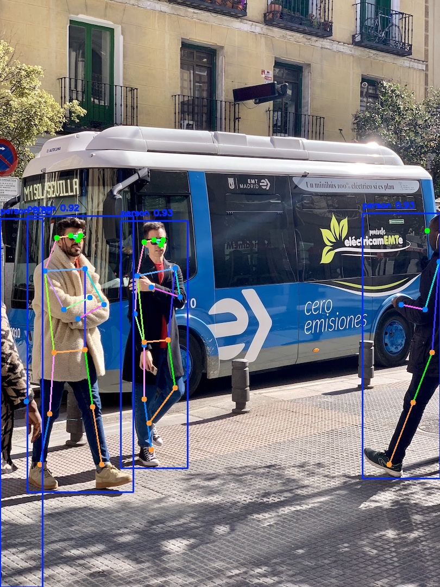
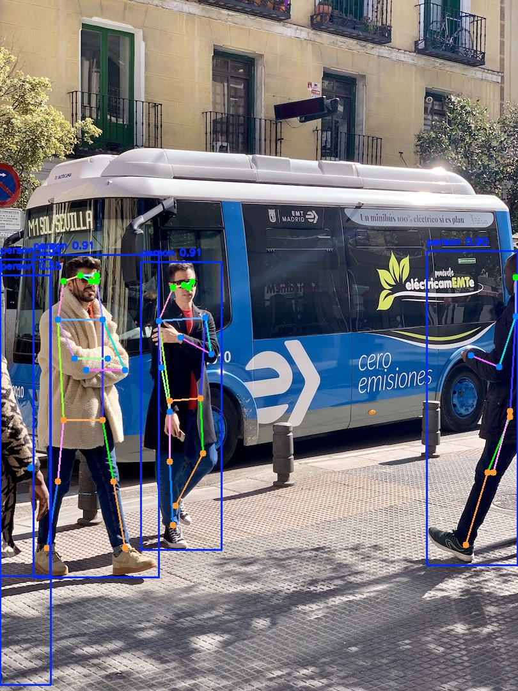
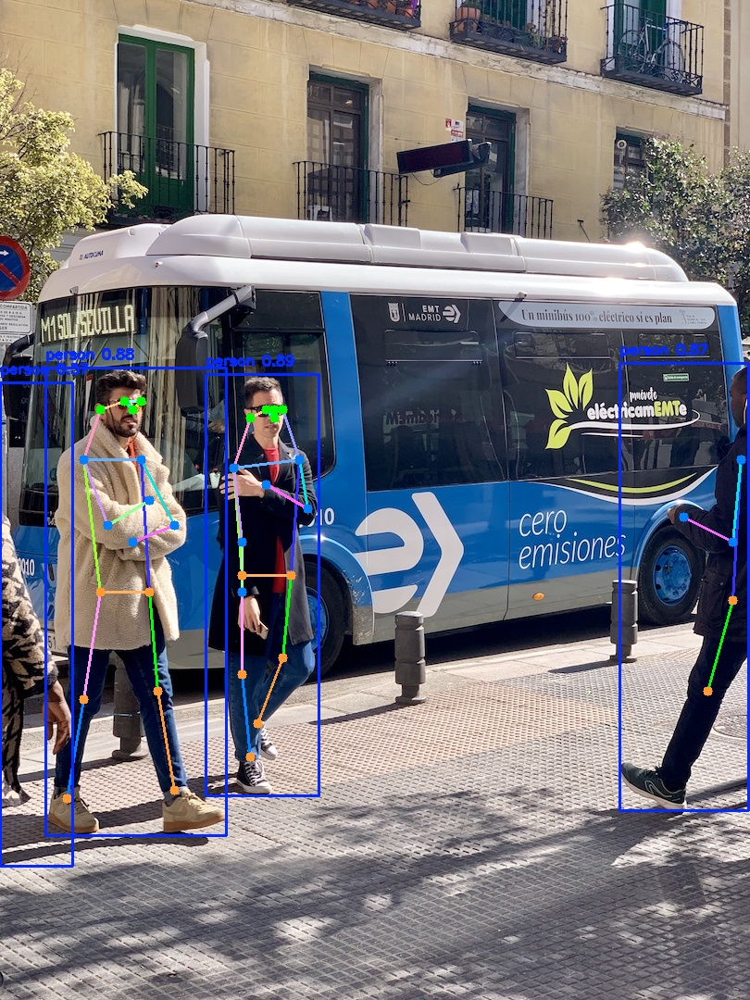
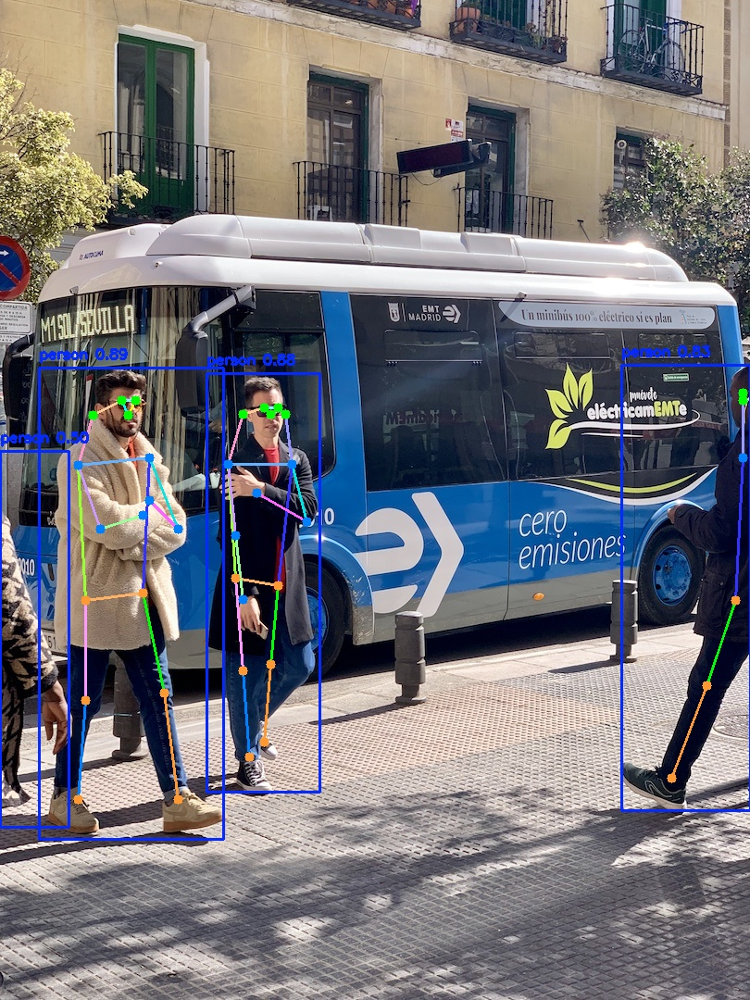

# YOLOv8-Pose 部署指南

YOLOv8-Pose 用于人体姿态估计。本页说明 M.2 算力卡的接入条件、部署步骤与结果检查方法。本页选择 `AX650/yolov8n-pose_640x640_npu3.axmodel`。

> 已实测，效果仍需评估。[查看部署效果](#查看部署效果)。

## 准备运行环境

本页包含 **RK3576 DshanPi A1 + AX8850 16GB M.2** 与 **RK3576 DshanPi A1 + AX8850 8GB M.2** 的样例。按效果展示中的权重和容量对应使用，不同环境的结果不能互相替代。

在连接算力卡的 Linux 主机终端执行，RK3576 使用 ARM64 环境。首次部署先完成[驱动与设备检查](../../usage/device-check.md)、[安装 PyAXEngine](../../usage/python.md)和[下载工具安装](../../usage/download-models.md#使用-hugging-face-下载)。已完成这些步骤可直接下载模型。

后文使用设备 0，运行前用 `axcl-smi` 确认设备可用。

## 下载模型与样例

本页使用 `AXERA-TECH/YOLOv8-Pose` 的固定版本。下面下载本页选用的 12 个文件。

```bash
MODEL_DIR=~/edgeaccel/models/yolov8-pose/f8bd38d5e1bd
mkdir -p "$MODEL_DIR"
~/edgeaccel/hf-env/bin/hf download AXERA-TECH/YOLOv8-Pose \
  "ax_infer.py" \
  "bus.jpg" \
  "AX650/yolov8l-pose_640x640_npu1.axmodel" \
  "AX650/yolov8l-pose_640x640_npu3.axmodel" \
  "AX650/yolov8m-pose_640x640_npu1.axmodel" \
  "AX650/yolov8m-pose_640x640_npu3.axmodel" \
  "AX650/yolov8n-pose_640x640_npu1.axmodel" \
  "AX650/yolov8s-pose_640x640_npu1.axmodel" \
  "AX650/yolov8s-pose_640x640_npu3.axmodel" \
  "AX650/yolov8x-pose_640x640_npu1.axmodel" \
  "AX650/yolov8x-pose_640x640_npu3.axmodel" \
  "AX650/yolov8n-pose_640x640_npu3.axmodel" \
  --revision f8bd38d5e1bd439ac22e1503c314ea16a3b4a885 \
  --local-dir "$MODEL_DIR"
cd "$MODEL_DIR"
```

保留当前终端中的 `MODEL_DIR` 变量，后续命令沿用此目录。下载受阻或需要离线复制时，见[下载方式与文件校验](../../usage/download-models.md)。

## 配置 Python 后端

激活已安装 PyAXEngine 的主机虚拟环境。先检查可用 provider：

```bash
source ~/edgeaccel/python-env/bin/activate
python -c "import axengine; print(axengine.get_available_providers())"
```

必须包含 `AXCLRTExecutionProvider`。保留已安装的 PyAXEngine，按下面命令安装本例依赖。

在已激活的环境中安装该入口直接使用的依赖；以下依赖用于本页的命令行示例：

```bash
python -m pip install numpy==1.26.4 ml-dtypes==0.5.3 opencv-python-headless==4.11.0.86
```


该脚本支持 `--providers`，下面的命令已显式选择 AXCL。

## 运行模型

在模型根目录执行，输入与权重使用该提交的实际路径：

```bash
cd "$MODEL_DIR"
test -s AX650/yolov8n-pose_640x640_npu3.axmodel
test -s bus.jpg
set -o pipefail
python ax_infer.py --model-path AX650/yolov8n-pose_640x640_npu3.axmodel --test-img bus.jpg --providers AXCLRTExecutionProvider 2>&1 | tee run.log
```

日志中的实际执行后端应为 `AXCLRTExecutionProvider`。检查 `result_yolov8_pose.jpg` 是本次新生成的文件，内容与输入相符。使用仓库现成结果图或只检查程序退出码均不足以判断效果。

参数依据：[`ax_infer.py` 源码](https://huggingface.co/AXERA-TECH/YOLOv8-Pose/blob/f8bd38d5e1bd439ac22e1503c314ea16a3b4a885/ax_infer.py)。

## 选择其他 AX650 权重

前面的下载命令包含本页实测的十个AX650权重。默认入口使用n规格NPU3；需要切换规模时，选择下表中的文件。仓库内其他芯片目录不用于本页AX8850算力卡。

| 权重（位于AX650目录） | 本组实测容量 |
| --- | --- |
| `yolov8l-pose_640x640_npu1.axmodel` | 16GB |
| `yolov8l-pose_640x640_npu3.axmodel` | 16GB |
| `yolov8m-pose_640x640_npu1.axmodel` | 16GB |
| `yolov8m-pose_640x640_npu3.axmodel` | 16GB |
| `yolov8n-pose_640x640_npu1.axmodel` | 16GB |
| `yolov8s-pose_640x640_npu1.axmodel` | 16GB |
| `yolov8s-pose_640x640_npu3.axmodel` | 16GB |
| `yolov8x-pose_640x640_npu1.axmodel` | 16GB |
| `yolov8x-pose_640x640_npu3.axmodel` | 16GB |

在同一模型目录执行，修改`WEIGHT`选择一个文件：

```bash
cd "$MODEL_DIR"
WEIGHT=AX650/yolov8l-pose_640x640_npu1.axmodel
OUT=~/edgeaccel/results/yolov8-pose
mkdir -p "$OUT"
python ax_infer.py --model-path "$WEIGHT" --test-img bus.jpg \
  --providers AXCLRTExecutionProvider \
  --img-save-path "$OUT/$(basename "$WEIGHT" .axmodel).jpg"
```

打开`OUT`目录中的输出图，与下方同规模、同NPU配置的实测结果对照。NPU1与NPU3是编译配置；不表示需要连接一张或三张算力卡。保持默认置信度阈值0.25和NMS阈值0.7，以便复现下方样例。


## 查看部署效果

### 其余9个AX650权重：16GB卡样例

**已运行，效果仍需评估** · RK3576 DshanPi A1 + AX8850 16GB M.2。以下输入与输出来自本页固定版本的实际运行。

9个AX650权重各独立运行两次，原始输出及效果图可重复。下方展示五种规模的姿态结果；同规模NPU1/NPU3输出图完全相同时合并展示。

**yolov8l · NPU1 / NPU3**

四个人物框均有输出，中央两人的骨架大体随身体展开；左侧截断人物框延伸至画面底部，左右边缘人物仅显示部分关键点。 NPU1与NPU3输出图的文件内容相同，因此合并展示。

<div className="model-effect-gallery">

<figure>

[](../../../static/validation/effects/yolov8-pose-variants-20261005/inputs/bus.jpg)

<figcaption>固定输入：bus.jpg</figcaption>
</figure>

<figure>

[](../../../static/validation/effects/yolov8-pose-variants-20261005/outputs/yolov8l.jpg)

<figcaption>实际骨架输出：yolov8l</figcaption>
</figure>

</div>

| 权重 | 程序输出人物框数 | 从左到右各人物显示关键点数（最多17） |
| --- | --- | --- |
| yolov8l-pose_640x640_npu1.axmodel | 4 | 2 / 16 / 16 / 7 |
| yolov8l-pose_640x640_npu3.axmodel | 4 | 2 / 16 / 16 / 7 |

**yolov8m · NPU1 / NPU3**

中央两人的骨架可见；最左侧截断人物出现两个重叠框，其中一个延伸到路面，程序5个人物框不代表5个真实人物。 NPU1与NPU3输出图的文件内容相同，因此合并展示。

<div className="model-effect-gallery">

<figure>

[](../../../static/validation/effects/yolov8-pose-variants-20261005/outputs/yolov8m.jpg)

<figcaption>实际骨架输出：yolov8m</figcaption>
</figure>

</div>

| 权重 | 程序输出人物框数 | 从左到右各人物显示关键点数（最多17） |
| --- | --- | --- |
| yolov8m-pose_640x640_npu1.axmodel | 5 | 1 / 0 / 17 / 16 / 9 |
| yolov8m-pose_640x640_npu3.axmodel | 5 | 1 / 0 / 17 / 16 / 9 |

**yolov8n · NPU1**

四个人物框均有输出，中央两人可见躯干和肢体关键点；左侧截断人物未见完整骨架，右侧仅有部分关键点，不能据显示点数推断定位精度。

<div className="model-effect-gallery">

<figure>

[](../../../static/validation/effects/yolov8-pose-variants-20261005/outputs/yolov8n.jpg)

<figcaption>实际骨架输出：yolov8n</figcaption>
</figure>

</div>

| 权重 | 程序输出人物框数 | 从左到右各人物显示关键点数（最多17） |
| --- | --- | --- |
| yolov8n-pose_640x640_npu1.axmodel | 4 | 0 / 16 / 17 / 6 |

**yolov8s · NPU1 / NPU3**

四个人物框均有输出，中央两人可见躯干与肢体骨架；左侧截断人物仅显示少量关键点，右侧人物骨架不完整。 NPU1与NPU3输出图的文件内容相同，因此合并展示。

<div className="model-effect-gallery">

<figure>

[](../../../static/validation/effects/yolov8-pose-variants-20261005/outputs/yolov8s.jpg)

<figcaption>实际骨架输出：yolov8s</figcaption>
</figure>

</div>

| 权重 | 程序输出人物框数 | 从左到右各人物显示关键点数（最多17） |
| --- | --- | --- |
| yolov8s-pose_640x640_npu1.axmodel | 4 | 0 / 16 / 17 / 5 |
| yolov8s-pose_640x640_npu3.axmodel | 4 | 0 / 16 / 17 / 5 |

**yolov8x · NPU1 / NPU3**

中央两人的骨架大体随身体展开，右侧人物显示部分关键点；左侧截断人物框延伸至画面底部，不能将框和显示点数作为精度结论。 NPU1与NPU3输出图的文件内容相同，因此合并展示。

<div className="model-effect-gallery">

<figure>

[](../../../static/validation/effects/yolov8-pose-variants-20261005/outputs/yolov8x.jpg)

<figcaption>实际骨架输出：yolov8x</figcaption>
</figure>

</div>

| 权重 | 程序输出人物框数 | 从左到右各人物显示关键点数（最多17） |
| --- | --- | --- |
| yolov8x-pose_640x640_npu1.axmodel | 4 | 2 / 16 / 17 / 9 |
| yolov8x-pose_640x640_npu3.axmodel | 4 | 2 / 16 / 17 / 9 |

**使用时注意：**

- 固定单张街景图，两侧截断人物的骨架不完整；部分规模左侧人物框向下延伸到路面，m规格还出现重复人物框。未用人工关键点标注计算OKS或姿态AP。
- 关键点置信度超过0.5时才绘制，显示点数不等于正确点数。本组使用16GB卡，不替代这些权重的8GB容量回归；仓库内其他芯片目录不在本组AX8850验证范围。

这些结果用于对照部署后的输出，未覆盖完整数据集精度或长期连续运行。

### n · NPU3：8GB卡样例

**固定样例已核对** · RK3576 DshanPi A1 + AX8850 8GB M.2。以下输入与输出来自本页固定版本的实际运行。

bus.jpg 输出 4 个人体框；中间两名完整可见行人的骨架与躯干及肢体大致对应，左右边缘人物仅有部分身体可见，完成单样本姿态结果核对。

点击图片可查看原尺寸。

<div className="model-effect-gallery">

<figure>

[](../../../static/validation/effects/yolov8-pose/inputs/bus.jpg)

<figcaption>输入图片</figcaption>
</figure>

<figure>

[](../../../static/validation/effects/yolov8-pose/outputs/result_yolov8_pose.jpg)

<figcaption>实际输出</figcaption>
</figure>

</div>

**使用时注意：**

- 画面两侧人物被裁切，骨架不完整；没有关键点真值，不能报告 PCK、OKS 或每个关键点均正确。
- 仅一个样例、一次程序启动；没有独立数据集精度评测或长时间稳定性测试。

这些结果用于对照部署后的输出，未覆盖完整数据集精度或长期连续运行。

**其余9个AX650权重：16GB卡样例**

<details>
<summary>查看样例环境与运行耗时</summary>

环境：RK3576 DshanPi A1 + AX8850 16GB M.2。模型版本：`f8bd38d5e1bd439ac22e1503c314ea16a3b4a885`。

| 组件 | 版本或配置 |
| --- | --- |
| 主机系统 / 内核 | Ubuntu 24.04 / Armbian；aarch64；6.1.115-vendor-rk35xx |
| AXCL / 驱动 | V3.16.0_20260729180218 |
| 固件 / CMM | V3.16.0；总量15232 MiB，空闲占用18 MiB |
| Python后端 | AXCLRTExecutionProvider；NumPy 1.26.4；OpenCV 4.11.0 |
| 前后处理 | 固定版本原始ax_infer.py，RGB uint8输入，置信度阈值0.25、NMS阈值0.7，640×640 NHWC输入，关键点绘制阈值0.5 |

| 指标 | 实测值 | 计时或统计范围 |
| --- | --- | --- |
| yolov8l-pose_640x640_npu1.axmodel | 87.578 / 87.838 ms | 两个独立进程各一次session.run墙钟；含传输，不含加载、输出存盘和后处理，无预热，不代表持续吞吐。 |
| yolov8l-pose_640x640_npu3.axmodel | 52.822 / 52.941 ms | 两个独立进程各一次session.run墙钟；含传输，不含加载、输出存盘和后处理，无预热，不代表持续吞吐。 |
| yolov8m-pose_640x640_npu1.axmodel | 66.326 / 62.422 ms | 两个独立进程各一次session.run墙钟；含传输，不含加载、输出存盘和后处理，无预热，不代表持续吞吐。 |
| yolov8m-pose_640x640_npu3.axmodel | 38.944 / 43.900 ms | 两个独立进程各一次session.run墙钟；含传输，不含加载、输出存盘和后处理，无预热，不代表持续吞吐。 |
| yolov8n-pose_640x640_npu1.axmodel | 37.163 / 38.570 ms | 两个独立进程各一次session.run墙钟；含传输，不含加载、输出存盘和后处理，无预热，不代表持续吞吐。 |
| yolov8s-pose_640x640_npu1.axmodel | 44.044 / 45.962 ms | 两个独立进程各一次session.run墙钟；含传输，不含加载、输出存盘和后处理，无预热，不代表持续吞吐。 |
| yolov8s-pose_640x640_npu3.axmodel | 39.108 / 38.088 ms | 两个独立进程各一次session.run墙钟；含传输，不含加载、输出存盘和后处理，无预热，不代表持续吞吐。 |
| yolov8x-pose_640x640_npu1.axmodel | 120.601 / 124.286 ms | 两个独立进程各一次session.run墙钟；含传输，不含加载、输出存盘和后处理，无预热，不代表持续吞吐。 |
| yolov8x-pose_640x640_npu3.axmodel | 71.899 / 64.524 ms | 两个独立进程各一次session.run墙钟；含传输，不含加载、输出存盘和后处理，无预热，不代表持续吞吐。 |

</details>

**n · NPU3：8GB卡样例**

<details>
<summary>查看样例环境与运行耗时</summary>

环境：RK3576 DshanPi A1 + AX8850 8GB M.2。模型版本：`f8bd38d5e1bd439ac22e1503c314ea16a3b4a885`。

| 组件 | 版本或配置 |
| --- | --- |
| 主机系统 | Ubuntu 24.04 / Armbian 25.11.0-trunk，aarch64 |
| 内核 | 6.1.115-vendor-rk35xx |
| AXCL / 驱动 | V3.16.0_20260729180218 |
| 固件 / CMM | V3.16.0；CMM 总量 7040 MiB，空闲基线占用 18 MiB |
| C++ 视觉示例提交 | cbfa4c76891758983ca2b0c99c11d6621d59af39 |
| Python 后端 | Python 3.12.3；PyAXEngine 0.1.3.rc3 发布的 0.1.3 wheel；NumPy 1.26.4 / ml-dtypes 0.5.3 |
| AX-LLM 提交 | 8501c22b940f8c5804cb35044c5ffc136918b8f1；Release / AXCL / Linux aarch64 |

| 指标 | 实测值 | 计时或统计范围 |
| --- | --- | --- |
| session.run：yolov8n-pose_640x640_npu3.axmodel | 33.415 ms / 1 次 | 实际 AXCL Python 调用墙钟，含数据复制；不含返回后的张量统计。含首次调用，非统一预热基准；多阶段模型各自计时 |

适用范围：

- 只采集到 1 次 session.run 调用，不能视为预热后的平均性能。

</details>

遇到加载、内存或后端错误时，按[常见问题](../../usage/troubleshooting.md)处理。需要更换输入或接入业务时，按[检查输出与记录结果](../../reference/validation.md)保留自己的结果。

<details>
<summary>查看文件用途与版本信息</summary>

| 文件 / 目录内路径 | 用途 |
| --- | --- |
| [`ax_infer.py`](https://huggingface.co/AXERA-TECH/YOLOv8-Pose/blob/f8bd38d5e1bd439ac22e1503c314ea16a3b4a885/ax_infer.py) | Python 程序 / 前后处理 |
| [`AX650/yolov8n-pose_640x640_npu3.axmodel`](https://huggingface.co/AXERA-TECH/YOLOv8-Pose/blob/f8bd38d5e1bd439ac22e1503c314ea16a3b4a885/AX650/yolov8n-pose_640x640_npu3.axmodel) | 编译模型；按目录区分芯片和规格 |
| [`bus.jpg`](https://huggingface.co/AXERA-TECH/YOLOv8-Pose/blob/f8bd38d5e1bd439ac22e1503c314ea16a3b4a885/bus.jpg) | 示例输入 |

仓库提交：`f8bd38d5e1bd439ac22e1503c314ea16a3b4a885`。仓库中的 31 个 `.axmodel` 文件可能包括多个芯片、规格和分片。运行时使用本页指定的配套文件，完整列表见[固定版本目录](https://huggingface.co/AXERA-TECH/YOLOv8-Pose/tree/f8bd38d5e1bd439ac22e1503c314ea16a3b4a885)。

</details>

## 参考资料

- [常用术语](../../reference/glossary.md)：AXCL、CMM、分词器与推理指标。
- [固定版本文件表](https://huggingface.co/AXERA-TECH/YOLOv8-Pose/tree/f8bd38d5e1bd439ac22e1503c314ea16a3b4a885)。
- [模型卡 / 使用说明](https://huggingface.co/AXERA-TECH/YOLOv8-Pose/blob/f8bd38d5e1bd439ac22e1503c314ea16a3b4a885/README.md)。
- [主要程序入口：ax_infer.py](https://huggingface.co/AXERA-TECH/YOLOv8-Pose/blob/f8bd38d5e1bd439ac22e1503c314ea16a3b4a885/ax_infer.py)。
- [ModelScope 对应资源](https://modelscope.cn/models/AXERA-TECH/YOLOv8-Pose)。不同平台的 revision 不通用，另行记录版本。

返回[完整模型目录](../catalog.mdx)。
