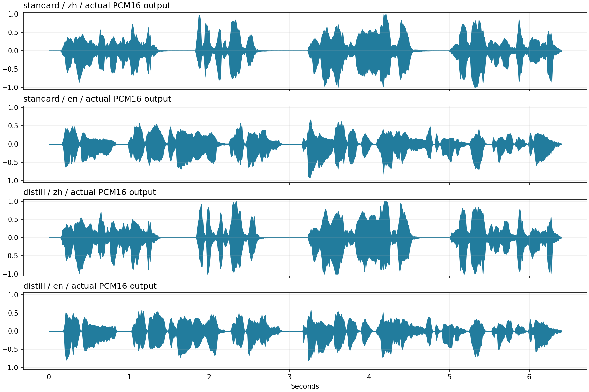

# ZipVoice.AXERA 部署指南

ZipVoice.AXERA 用于语音合成。本页说明 M.2 算力卡的接入条件、部署步骤与结果检查方法。

> 已实测，效果仍需评估。[查看部署效果](#查看部署效果)。

## 准备运行环境

本页效果展示使用 **RK3576 + AX8850 16GB M.2**；其他容量或平台需重新确认模型能否加载并正确运行。

在连接算力卡的 Linux 主机终端执行，RK3576 使用 ARM64 环境。首次部署先完成[驱动与设备检查](../../usage/device-check.md)、[安装 PyAXEngine](../../usage/python.md)和[下载工具安装](../../usage/download-models.md#使用-hugging-face-下载)。已完成这些步骤可直接下载模型。

后文使用设备 0，运行前用 `axcl-smi` 确认设备可用。

## 下载模型与样例

本页使用 `AXERA-TECH/ZipVoice.AXERA` 的固定版本。下面下载本页选用的 34 个文件。

```bash
MODEL_DIR=~/edgeaccel/models/zipvoice-axera/aa48d14426f5
mkdir -p "$MODEL_DIR"
~/edgeaccel/hf-env/bin/hf download AXERA-TECH/ZipVoice.AXERA \
  "README.md" \
  "assets/moss_prompts/en_4_4p5s.wav" \
  "assets/moss_prompts/zh_1_4p5s.wav" \
  "assets/paragraphs/en_scavenger.txt" \
  "assets/paragraphs/zh_ginkgo.txt" \
  "infer_zipvoice_axera.py" \
  "models/vocoder/vocos_full.axmodel" \
  "models/zipvoice_ax650/decoder4_split_manifest.json" \
  "models/zipvoice_ax650/decoder_part0.axmodel" \
  "models/zipvoice_ax650/decoder_part1.axmodel" \
  "models/zipvoice_ax650/decoder_part2.axmodel" \
  "models/zipvoice_ax650/decoder_part3.axmodel" \
  "models/zipvoice_ax650/encoder.axmodel" \
  "models/zipvoice_ax650/runtime_config.json" \
  "models/zipvoice_distill_ax650/decoder4_split_manifest.json" \
  "models/zipvoice_distill_ax650/decoder_part0.axmodel" \
  "models/zipvoice_distill_ax650/decoder_part1.axmodel" \
  "models/zipvoice_distill_ax650/decoder_part2.axmodel" \
  "models/zipvoice_distill_ax650/decoder_part3.axmodel" \
  "models/zipvoice_distill_ax650/encoder.axmodel" \
  "models/zipvoice_distill_ax650/runtime_config.json" \
  "requirements.txt" \
  "resources/zipvoice_hf/zipvoice/tokens.txt" \
  "scripts/__init__.py" \
  "scripts/common_infer.py" \
  "scripts/local_audio.py" \
  "scripts/local_tokenizer.py" \
  "scripts/local_vocos.py" \
  "scripts/text_processing.py" \
  "scripts/zipvoice_decoder4_runtime.py" \
  "scripts/zipvoice_decoder4_runtime_encoder_onnx.py" \
  "scripts/zipvoice_decoder4_runtime_part0_onnx.py" \
  "scripts/zipvoice_decoder4_runtime_part3_onnx.py" \
  "scripts/zipvoice_runtime.py" \
  --revision aa48d14426f528a63ccb0720edb79651597e5316 \
  --local-dir "$MODEL_DIR"
cd "$MODEL_DIR"
```

保留当前终端中的 `MODEL_DIR` 变量，后续命令沿用此目录。下载受阻或需要离线复制时，见[下载方式与文件校验](../../usage/download-models.md)。

## 安装 Python 依赖

本页在 RK3576 主机与 AX8850 16GB M.2 算力卡上运行 ZipVoice 普通版、蒸馏版及 AXCL 声码器，使用官方中英文参考录音生成新句子。

先按 [Python 接口](../../usage/python.md) 安装 PyAXEngine，在 RK3576 主机执行：

```bash
source ~/edgeaccel/python-env/bin/activate
python -m pip install 'numpy==1.26.4' 'torch==2.5.1' 'soundfile==0.13.1' 'jieba==0.42.1' 'pypinyin==0.55.0'
python -c "import axengine; print(axengine.get_available_providers())"
```

输出须包含 `AXCLRTExecutionProvider`。本次 Python 为 3.12；模型使用 `AX650` 目录中的权重，经 AXCL 在 AX8850 算力卡执行。不要换成 AX630C 权重。

## 安装英文音素工具

下载 [Piper 音素工具构建脚本](../../../static/examples/build_piper_phonemizer.sh)，保存为 `~/edgeaccel/build_piper_phonemizer.sh`，执行：

```bash
sudo apt-get update
sudo apt-get install -y build-essential cmake curl
bash ~/edgeaccel/build_piper_phonemizer.sh
```

脚本校验并编译 [固定版本 Piper phonemize](https://github.com/rhasspy/piper-phonemize/tree/ba3cc06c5248215928821f1393b2b854a936991a)，随后执行自测。自测应全部通过，末尾 JSON 中的 `phonemes` 应非空。默认安装到 `~/edgeaccel/toolchains/piper-phonemize-ba3cc06c5248`，已安装时直接复用该目录。

运行示例调用官方命令行工具取得英文音素，再交给原始 tokenizer；不依赖 Python 3.12 的 Piper 扩展轮子。首次构建需要联网下载编译依赖，代理按上方下载说明配置。

## 运行普通版和蒸馏版

完成上方固定版本下载后，保留 `$MODEL_DIR`。下载 [ZipVoice 算力卡示例](../../../static/examples/zipvoice_card.py)，保存为 `~/edgeaccel/zipvoice_card.py`，串行执行：

```bash
PHONEMIZER="$HOME/edgeaccel/toolchains/piper-phonemize-ba3cc06c5248"

python ~/edgeaccel/zipvoice_card.py \
  --model-dir "$MODEL_DIR" --variant standard \
  --phonemizer-prefix "$PHONEMIZER" \
  --output ~/edgeaccel/results/zipvoice-standard-01

python ~/edgeaccel/zipvoice_card.py \
  --model-dir "$MODEL_DIR" --variant distill \
  --phonemizer-prefix "$PHONEMIZER" \
  --output ~/edgeaccel/results/zipvoice-distill-01
```

输出目录须尚不存在。普通版使用官方 10 步、引导系数 1.0；蒸馏版使用 4 步、引导系数 3.0，随机种子均为 42。每版依次处理中文、英文及重复中文输入。编码器、四段解码器和声码器均在算力卡运行，分词、频谱变换及波形重建由主机完成。

成功时进程退出码为 0，`deployment-result.json` 中 `completed` 为 `true`，目录中生成 `zh.wav`、`en.wav`、`zh-repeat.wav`。本次每段输出均为 24 kHz 单声道、约 6.411 秒；普通版共调用模型 126 次，蒸馏版 54 次。

## 查看生成语音

下方提供参考录音与两版实际生成音频。中文目标文本为：

> 今天午后天气很好，我打开窗户，听见远处有人聊天，水杯也轻轻晃了一下。

英文目标文本为：

> This morning, a small train left the station, carrying sleepy passengers toward a bright coastal town.

结果记录保存文本、参考录音校验值、模型调用及音频信息。`raw-*.npz` 保存用于数值复核的编码器、声码器、解码器首段输入和末段输出；解码器中间输出保留校验值。重复中文的模型输入输出及 WAV 校验值完全一致。

本次沿用官方 PCM16 保存方式，没有对展示音频额外调低增益。普通版中文有 8 个采样点、蒸馏版中文有 26 个采样点超出 PCM16 可表示幅度后被截断；英文未出现此情况。下方表格保留该差异，试听时应关注失真、漏字与断句。尚未进行听感、识别错误率或音色相似度验收。

处理耗时包含模型加载、主机前后处理和原始数据压缩写入，重复输入会复用相同证据文件。不能直接把该耗时当作纯模型速度或实时性能。

## 更换文本与参考录音

示例的 `jobs` 列表定义参考 WAV 文件名、对应参考文本和目标文本。需要修改时，使用与参考文本准确对应的 24 kHz 单声道 WAV，并保留所用文本与文件。当前示例以仓库约 4.5 秒的参考录音完成验证。

官方流程限制最多 384 个 token、1024 帧特征；声码器单段最多接收 620 帧生成特征。不同参考长度、长文本分段、标点及混合语言会改变分段结果，须重新检查输出内容和时长。本次仅验证两个短句及其重复，未覆盖长篇合成、CPU 声码器备选路径或真实 8GB 卡容量。


## 查看部署效果

**已运行，效果仍需评估** · 2026-09-28 · RK3576 + AX8850 16GB M.2。以下输入与输出来自本页固定版本的实际运行。

普通版和蒸馏版均完成中英文短句及中文重复测试，11个独立权重实际运行，下方可对照参考录音与生成音频。

**普通版：10步 · 中文**

今天午后天气很好，我打开窗户，听见远处有人聊天，水杯也轻轻晃了一下。

| 项目 | 本次结果 |
| --- | --- |
| 输出格式 | 24 kHz / 单声道 / PCM16 |
| 生成时长 | 6.410667 s |
| 实际 AXCL 调用 | 42 次 |
| AXCL 调用累计 | 5.646453 s |
| 完整处理耗时 | 24.095168 s（含加载与证据写入） |
| 保存前浮点峰值 | 1.123989 |
| PCM16 截断采样 | 8 / 153856 |

中文：官方参考录音

<audio controls preload="metadata" src="/validation/effects/zipvoice-axera-20260928/zh_1_4p5s.wav" aria-label="中文：官方参考录音"></audio>

[下载音频](../../../static/validation/effects/zipvoice-axera-20260928/zh_1_4p5s.wav)

普通版：10步 中文：本次实际生成结果

<audio controls preload="metadata" src="/validation/effects/zipvoice-axera-20260928/standard-zh.wav" aria-label="普通版：10步 中文：本次实际生成结果"></audio>

[下载音频](../../../static/validation/effects/zipvoice-axera-20260928/standard-zh.wav)

**普通版：10步 · 英文**

This morning, a small train left the station, carrying sleepy passengers toward a bright coastal town.

| 项目 | 本次结果 |
| --- | --- |
| 输出格式 | 24 kHz / 单声道 / PCM16 |
| 生成时长 | 6.410667 s |
| 实际 AXCL 调用 | 42 次 |
| AXCL 调用累计 | 5.651278 s |
| 完整处理耗时 | 21.147011 s（含加载与证据写入） |
| 保存前浮点峰值 | 0.909234 |
| PCM16 截断采样 | 0 / 153856 |

英文：官方参考录音

<audio controls preload="metadata" src="/validation/effects/zipvoice-axera-20260928/en_4_4p5s.wav" aria-label="英文：官方参考录音"></audio>

[下载音频](../../../static/validation/effects/zipvoice-axera-20260928/en_4_4p5s.wav)

普通版：10步 英文：本次实际生成结果

<audio controls preload="metadata" src="/validation/effects/zipvoice-axera-20260928/standard-en.wav" aria-label="普通版：10步 英文：本次实际生成结果"></audio>

[下载音频](../../../static/validation/effects/zipvoice-axera-20260928/standard-en.wav)

**蒸馏版：4步 · 中文**

今天午后天气很好，我打开窗户，听见远处有人聊天，水杯也轻轻晃了一下。

| 项目 | 本次结果 |
| --- | --- |
| 输出格式 | 24 kHz / 单声道 / PCM16 |
| 生成时长 | 6.410667 s |
| 实际 AXCL 调用 | 18 次 |
| AXCL 调用累计 | 1.024863 s |
| 完整处理耗时 | 16.752182 s（含加载与证据写入） |
| 保存前浮点峰值 | 1.202389 |
| PCM16 截断采样 | 26 / 153856 |

中文：官方参考录音

<audio controls preload="metadata" src="/validation/effects/zipvoice-axera-20260928/zh_1_4p5s.wav" aria-label="中文：官方参考录音"></audio>

[下载音频](../../../static/validation/effects/zipvoice-axera-20260928/zh_1_4p5s.wav)

蒸馏版：4步 中文：本次实际生成结果

<audio controls preload="metadata" src="/validation/effects/zipvoice-axera-20260928/distill-zh.wav" aria-label="蒸馏版：4步 中文：本次实际生成结果"></audio>

[下载音频](../../../static/validation/effects/zipvoice-axera-20260928/distill-zh.wav)

**蒸馏版：4步 · 英文**

This morning, a small train left the station, carrying sleepy passengers toward a bright coastal town.

| 项目 | 本次结果 |
| --- | --- |
| 输出格式 | 24 kHz / 单声道 / PCM16 |
| 生成时长 | 6.410667 s |
| 实际 AXCL 调用 | 18 次 |
| AXCL 调用累计 | 1.034205 s |
| 完整处理耗时 | 13.447597 s（含加载与证据写入） |
| 保存前浮点峰值 | 0.804717 |
| PCM16 截断采样 | 0 / 153856 |

英文：官方参考录音

<audio controls preload="metadata" src="/validation/effects/zipvoice-axera-20260928/en_4_4p5s.wav" aria-label="英文：官方参考录音"></audio>

[下载音频](../../../static/validation/effects/zipvoice-axera-20260928/en_4_4p5s.wav)

蒸馏版：4步 英文：本次实际生成结果

<audio controls preload="metadata" src="/validation/effects/zipvoice-axera-20260928/distill-en.wav" aria-label="蒸馏版：4步 英文：本次实际生成结果"></audio>

[下载音频](../../../static/validation/effects/zipvoice-axera-20260928/distill-en.wav)

**波形与重复结果**

两版中文重复运行的全部模型输入输出及最终WAV校验值完全一致。波形用于观察幅度与时长，不作为内容正确性或音质评分。

<div className="model-effect-gallery">

<figure>

[](../../../static/validation/effects/zipvoice-axera-20260928/waveforms.png)

<figcaption>四段实际PCM16输出的10毫秒幅度包络，使用同一幅度刻度</figcaption>
</figure>

</div>

**使用时注意：**

- 中文普通版/蒸馏版分别有8/26个采样点保存为PCM16时截断；展示文件沿用官方保存方式。
- 未完成听感、文字准确率、音色相似度或浮点参考模型对照；仅两个短句，长文本与更多语言待验证。

这些结果用于对照部署后的输出，未覆盖完整数据集精度或长期连续运行。

<details>
<summary>查看样例环境与运行耗时</summary>

环境：RK3576 + AX8850 16GB M.2。日期：2026-09-28。模型版本：`aa48d14426f528a63ccb0720edb79651597e5316`。

| 组件 | 版本或配置 |
| --- | --- |
| 主机 / 内核 | RK3576，约 4GB RAM，6.1.115-vendor-rk35xx |
| AXCL / 驱动 | V3.16.0_20260729180218 |
| 固件 / CMM | V3.16.0 / 15232 MiB |
| Python 推理 | Python 3.12 / PyAXEngine 0.1.3.rc3 / NumPy 1.26.4 / AXCLRTExecutionProvider |

| 指标 | 实测值 | 计时或统计范围 |
| --- | --- | --- |
| 实际调用 | 180 次 | 普通版126次、蒸馏版54次，含编码器、四段解码器和共同的AXCL声码器。 |
| 生成结果 | 6 段 × 6.411 s | 两版各中文、英文与中文重复；页面展示4段非重复音频。 |
| 数值复核 | 通过 | 核对文本token、Mel前处理、分段解码调用链、逐步ODE、声码器IRFFT与PCM16转换；不等同于音质验收。 |
| 中文重复 | 逐调用及音频完全一致 | 相同输入、固定种子42，仅本次两次重复。 |

适用范围：

- 中文普通版/蒸馏版分别有8/26个采样点保存为PCM16时截断；展示文件沿用官方保存方式。
- 未完成听感、文字准确率、音色相似度或浮点参考模型对照；仅两个短句，长文本与更多语言待验证。
- 本次16GB卡结果，不能替代真实8GB容量回归。AX630C及CPU声码器备选路径不在本次范围。

</details>

遇到加载、内存或后端错误时，按[常见问题](../../usage/troubleshooting.md)处理。需要更换输入或接入业务时，按[检查输出与记录结果](../../reference/validation.md)保留自己的结果。

<details>
<summary>查看文件用途与版本信息</summary>

| 文件 / 目录内路径 | 用途 |
| --- | --- |
| [`run_axcl.sh`](https://huggingface.co/AXERA-TECH/ZipVoice.AXERA/blob/aa48d14426f528a63ccb0720edb79651597e5316/run_axcl.sh) | 启动或构建脚本 |
| [`infer_zipvoice_axera.py`](https://huggingface.co/AXERA-TECH/ZipVoice.AXERA/blob/aa48d14426f528a63ccb0720edb79651597e5316/infer_zipvoice_axera.py) | Python 程序 / 前后处理 |
| [`models/zipvoice_ax650/decoder_part0.axmodel`](https://huggingface.co/AXERA-TECH/ZipVoice.AXERA/blob/aa48d14426f528a63ccb0720edb79651597e5316/models/zipvoice_ax650/decoder_part0.axmodel) | 编译模型；按目录区分芯片和规格 |
| [`models/zipvoice_ax650/decoder_part1.axmodel`](https://huggingface.co/AXERA-TECH/ZipVoice.AXERA/blob/aa48d14426f528a63ccb0720edb79651597e5316/models/zipvoice_ax650/decoder_part1.axmodel) | 编译模型；按目录区分芯片和规格 |
| [`models/zipvoice_ax650/decoder_part2.axmodel`](https://huggingface.co/AXERA-TECH/ZipVoice.AXERA/blob/aa48d14426f528a63ccb0720edb79651597e5316/models/zipvoice_ax650/decoder_part2.axmodel) | 编译模型；按目录区分芯片和规格 |
| [`models/zipvoice_ax650/decoder_part3.axmodel`](https://huggingface.co/AXERA-TECH/ZipVoice.AXERA/blob/aa48d14426f528a63ccb0720edb79651597e5316/models/zipvoice_ax650/decoder_part3.axmodel) | 编译模型；按目录区分芯片和规格 |
| [`models/zipvoice_ax650/encoder.axmodel`](https://huggingface.co/AXERA-TECH/ZipVoice.AXERA/blob/aa48d14426f528a63ccb0720edb79651597e5316/models/zipvoice_ax650/encoder.axmodel) | 编译模型；按目录区分芯片和规格 |
| [`config.json`](https://huggingface.co/AXERA-TECH/ZipVoice.AXERA/blob/aa48d14426f528a63ccb0720edb79651597e5316/config.json) | 运行配置 |
| [`models/zipvoice_ax650/runtime_config.json`](https://huggingface.co/AXERA-TECH/ZipVoice.AXERA/blob/aa48d14426f528a63ccb0720edb79651597e5316/models/zipvoice_ax650/runtime_config.json) | 运行配置 |
| [`models/zipvoice_distill_ax630C/runtime_config.json`](https://huggingface.co/AXERA-TECH/ZipVoice.AXERA/blob/aa48d14426f528a63ccb0720edb79651597e5316/models/zipvoice_distill_ax630C/runtime_config.json) | 运行配置 |
| [`models/zipvoice_distill_ax650/runtime_config.json`](https://huggingface.co/AXERA-TECH/ZipVoice.AXERA/blob/aa48d14426f528a63ccb0720edb79651597e5316/models/zipvoice_distill_ax650/runtime_config.json) | 运行配置 |
| [`requirements.txt`](https://huggingface.co/AXERA-TECH/ZipVoice.AXERA/blob/aa48d14426f528a63ccb0720edb79651597e5316/requirements.txt) | Python 依赖清单 |
| [`resources/zipvoice_hf/zipvoice/tokens.txt`](https://huggingface.co/AXERA-TECH/ZipVoice.AXERA/blob/aa48d14426f528a63ccb0720edb79651597e5316/resources/zipvoice_hf/zipvoice/tokens.txt) | 分词器 / 字典，必须配套 |
| [`run_ax630c.sh`](https://huggingface.co/AXERA-TECH/ZipVoice.AXERA/blob/aa48d14426f528a63ccb0720edb79651597e5316/run_ax630c.sh) | 启动或构建脚本 |

仓库提交：`aa48d14426f528a63ccb0720edb79651597e5316`。仓库中的 26 个 `.axmodel` 文件可能包括多个芯片、规格和分片。运行时使用本页指定的配套文件，完整列表见[固定版本目录](https://huggingface.co/AXERA-TECH/ZipVoice.AXERA/tree/aa48d14426f528a63ccb0720edb79651597e5316)。

</details>

## 参考资料

- [常用术语](../../reference/glossary.md)：AXCL、CMM、分词器与推理指标。
- [固定版本文件表](https://huggingface.co/AXERA-TECH/ZipVoice.AXERA/tree/aa48d14426f528a63ccb0720edb79651597e5316)。
- [模型卡 / 使用说明](https://huggingface.co/AXERA-TECH/ZipVoice.AXERA/blob/aa48d14426f528a63ccb0720edb79651597e5316/README.md)。
- [主要程序入口：infer_zipvoice_axera.py](https://huggingface.co/AXERA-TECH/ZipVoice.AXERA/blob/aa48d14426f528a63ccb0720edb79651597e5316/infer_zipvoice_axera.py)。
- [ModelScope 对应资源](https://modelscope.cn/models/AXERA-TECH/ZipVoice.AXERA)。不同平台的 revision 不通用，另行记录版本。

返回[完整模型目录](../catalog.mdx)。
