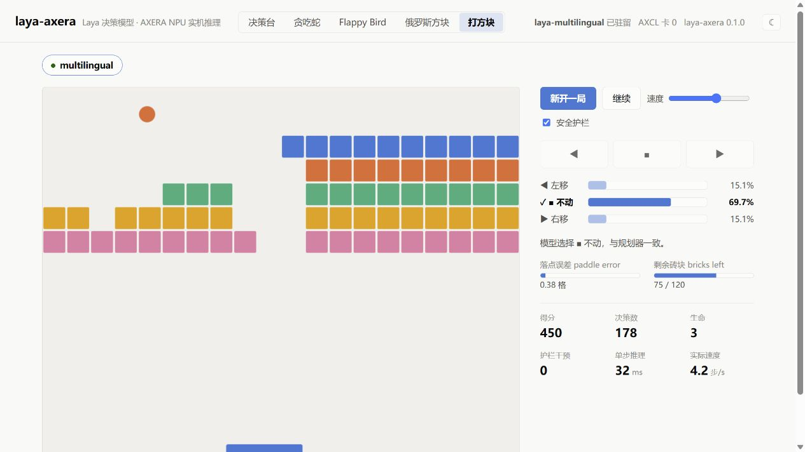
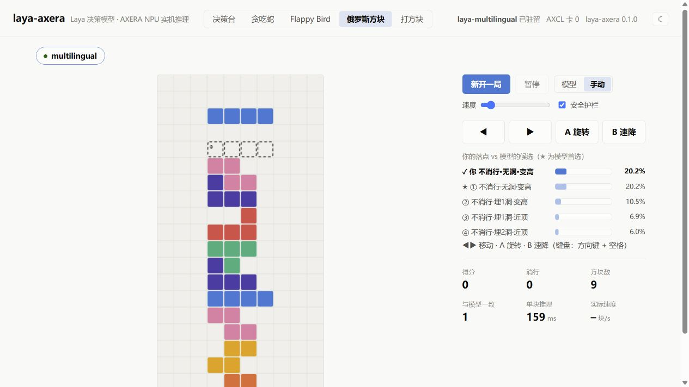

# 部署 Laya 游戏实验室

通过 [ZHEQIUSHUI/laya-axera](https://github.com/ZHEQIUSHUI/laya-axera) 在桌面观察 Laya 的真实决策。项目包含决策台、打方块、Flappy Bird、俄罗斯方块和贪吃蛇；俄罗斯方块还支持亲自操作，让模型评价落点。

本例使用 RK3576 + AX8850 16GB M.2、AXCL 3.16.0、Python 3.12，运行 multilingual 检查点。游戏规则负责计算候选动作及其后果，Laya 在算力卡上完成选择或评分；启用安全护栏后，规则可以纠正危险动作，界面会统计干预次数。

## 准备环境和程序

在 RK3576 主机执行。先完成 [AXCL 设备检查](../usage/device-check.md)，并按 [PyAXEngine 安装说明](../usage/python.md)准备官方 `axengine-0.1.3-py3-none-any.whl`。停止其他占用同一张卡的推理程序。

下载本次使用的项目提交并创建独立环境：

```bash
mkdir -p ~/edgeaccel
cd ~/edgeaccel
git clone https://github.com/ZHEQIUSHUI/laya-axera.git
cd laya-axera
git checkout 208332636fff1329153f7ec14db44a4456e6c1fa

python3 -m venv ~/edgeaccel/laya-games-env
source ~/edgeaccel/laya-games-env/bin/activate
python -m pip install \
  ~/axcl-setup/axengine-0.1.3-py3-none-any.whl \
  'numpy==2.5.3' 'tokenizers==0.23.2' 'ml-dtypes==0.6.0' \
  'fastapi==0.141.1' 'uvicorn==0.53.0' 'pydantic==2.13.5' \
  '.[web]'
python -m pip check
```

检查结果应为 `No broken requirements found`。本项目直接使用 Rust 分词器和 AXCL，不需要安装 PyTorch 或 Transformers。

## 下载 multilingual 检查点

```bash
~/edgeaccel/laya-games-env/bin/hf download AXERA-TECH/Laya \
  --revision 4f02f411fb9b9b09b4a4842b4486177b9594ba9e \
  --include 'multilingual/*' \
  --local-dir ~/edgeaccel/models/Laya
```

该检查点约 568 MB。保留 `multilingual/config.json`、`model.axmodel`、`tokenizer/` 和两个 `sample_*.json` 文件。已有同一固定版本时可以复用，不需要重复下载其他语言的权重。

## 运行决策样例

```bash
~/edgeaccel/laya-games-env/bin/laya-axera run \
  ~/edgeaccel/models/Laya/multilingual \
  --provider AXCLRTExecutionProvider --device 0 \
  --input ~/edgeaccel/models/Laya/multilingual/sample_request.json
```

输出中的 `engine.provider` 应为 `AXCLRTExecutionProvider`，处理部门应为 `billing`。这是一次真实的算力卡推理，不只是网页服务启动检查。

## 打开游戏页面

```bash
~/edgeaccel/laya-games-env/bin/laya-axera serve \
  --model "multilingual=$HOME/edgeaccel/models/Laya/multilingual" \
  --host 127.0.0.1 --port 8010 \
  --provider AXCLRTExecutionProvider --device 0
```

在开发板桌面浏览器打开 `http://127.0.0.1:8010/`。第一次请求加载模型后，页头会显示“已驻留”和“AXCL 卡 0”。

推荐按下面的顺序体验：

1. 在“决策台”点击“载入官方示例”，再点击“在 NPU 上运行”，确认四个问题均返回结果。
2. 打开“打方块”，点击“新开一局”。右侧显示左移、不动、右移的概率，以及实际执行动作和单步耗时。
3. 在“俄罗斯方块”选择“手动”，点击“新开一局”，使用方向键或界面按钮移动、旋转，按空格或“B 速降”落子。右侧对比自己的落点与模型首选。
4. 分别尝试 Flappy Bird 和贪吃蛇，观察模型选择、游戏状态和护栏干预数。

自动模式可随时暂停和继续。这个版本切换游戏标签不会自动停止原来的游戏；切换前先暂停，手动模式结束时可刷新页面。演示时每次只运行一个游戏，避免不同页面同时请求同一张卡。

## 查看实测效果

2026-09-24，在上述 RK3576 + AX8850 16GB 环境完成官方样例对照和四个游戏的连续推理。官方样例各概率、分值与参考输出的最大绝对差为 `0.0000497`，项目自带的 13 项测试全部通过。

以下为固定随机种子 `20260924`、开启护栏的实际结果：

| 游戏 | 完成决策步数 | 测试结束时得分 | 平均每步推理耗时 | 护栏干预 |
| --- | ---: | ---: | ---: | ---: |
| 打方块 | 400 | 580 | 34.4 ms | 0 |
| Flappy Bird | 120 | 4 | 34.7 ms | 0 |
| 俄罗斯方块 | 80 | 3800 | 136.4 ms | 0 |
| 贪吃蛇 | 120 | 2 | 117.5 ms | 0 |

另对每个游戏关闭护栏运行 20 步，并完成一次手动落点评分，均取得有效结果。合计 800 个自动决策步骤和 1 次手动落点评分。表中的四局都在达到预设步数时结束测试，不能理解为通关或长期稳定性验证；本次没有触发护栏纠正，也不代表所有局面都不需要保护。

每步的问题数量不同：打方块和 Flappy Bird 为 1 个，俄罗斯方块通常为 4 个，贪吃蛇为 3 个。耗时取自各游戏返回的 `inference_ms`，不同游戏的计时范围略有差异，不能直接换算成画面帧率。

下图为浏览器中的另一次实际运行，随机种子与表格不同，画面中的分数不用于替代表格统计。



手动模式可以看到玩家落点与模型评分的差别：



下载 [游戏实测结果](../../static/projects/laya-games/results.json)和 [官方样例对照结果](../../static/projects/laya-games/sample-comparison.json)可查看具体数据。游戏使用规则描述和模型决策相结合的方式；这些结果不表示模型直接从游戏画面识别局势或独立学习了游戏策略。

## 添加桌面入口

先退出前台服务。下载 [桌面启动脚本](../../static/examples/laya-games-launch.sh)，保存为 `~/edgeaccel/laya-axera/launch-desktop.sh`，再执行：

```bash
chmod +x ~/edgeaccel/laya-axera/launch-desktop.sh
mkdir -p ~/.local/share/applications
cat > ~/.local/share/applications/laya-games.desktop <<EOF
[Desktop Entry]
Type=Application
Name=Laya 游戏实验室
Exec=bash $HOME/edgeaccel/laya-axera/launch-desktop.sh
Icon=applications-games
Terminal=false
Categories=Game;Education;
EOF
cp ~/.local/share/applications/laya-games.desktop "$(xdg-user-dir DESKTOP)/"
chmod +x "$(xdg-user-dir DESKTOP)/laya-games.desktop"
```

双击桌面“Laya 游戏实验室”。若提示未信任启动器，右键选择“允许启动”。脚本优先使用 Chromium，也支持板上已有的 Firefox。

默认程序、环境和模型分别位于 `~/edgeaccel/laya-axera`、`~/edgeaccel/laya-games-env`、`~/edgeaccel/models/Laya`。模型放在其他位置时，在程序目录的 `desktop.env` 中设置 `MODEL_DIR=/实际模型根目录/Laya`。

启动器运行用户级临时服务，不设置开机自启。关闭网页会停止该页面的游戏请求，但模型继续驻留。需要释放算力卡时执行：

```bash
systemctl --user stop laya-games
```

## 从电脑访问

在电脑终端建立 SSH 转发，保持连接后访问电脑上的 `http://127.0.0.1:8010/`：

```bash
ssh -L 8010:127.0.0.1:8010 用户名@开发板IP
```

网页交互在电脑上完成，分词和算力卡推理仍在 RK3576 上执行。服务按本例仅监听回环地址，适合本机和 SSH 转发的单用户演示。
