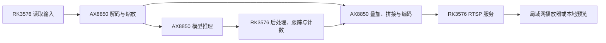

# AX8850 六路 AI 视频推流

使用 RK3576 主机与 AX8850 算力卡，同时展示目标检测、实例分割、相对深度、目标跟踪和过线计数。输出包括六条单路视频与一路 1920×1080 六宫格总览，可通过局域网 RTSP 或开发板本地 VLC 观看。

**项目源码：[dshanpi/ax8850-multistream-demo](https://github.com/dshanpi/ax8850-multistream-demo)。** 新部署请从该仓库获取项目，按仓库 README 准备依赖、校验资源并启动。

## 核对既有部署

下表保留两套既有环境的操作记录。先核对主机上的目录、配置文件与服务名，再选择对应说明；从 GitHub 新获取的项目以仓库 README 为准。

| 部署 | 主机目录 | 服务 | 操作入口 |
|---|---|---|---|
| 开发版 | `~/ax-pipeline/six` | `ax-six-rtsp`、`ax-six-local-preview` | [启动、观看与录制](../ax650n/applications/six-streams/usage.md) |
| 预装演示环境 | `~/ax8850-multistream-demo` | `ax8850-multistream`、`ax8850-local-preview`，以及用户服务 `ax8850-vlc-preview` | [预装服务管理](../usage/services.md)；仅适用于包含 `deploy/8GB-开机自启说明.md` 的既有部署 |

两套部署可能使用相同端口和算力卡资源，不应同时启动。路径、脚本与服务名必须成套使用。源码、帧率优化和 2026-09-16 性能记录对应开发版的 **RK3576 + AX8850 16GB** 环境，不作为演示版或其他容量卡的性能结论。

新部署的安装与运行要求见[仓库 README](https://github.com/dshanpi/ax8850-multistream-demo#readme)。网站中的源码附件用于对照原测试版本，相关入口见[资料与源码](#资料与源码)。

## 按目标阅读

| 目标 | 阅读顺序 |
|---|---|
| 观看开发版演示 | [启动与观看](../ax650n/applications/six-streams/usage.md) → [本地预览与输入视频](../ax650n/applications/six-streams/local-preview.md) |
| 释放演示版占用的设备资源 | [演示版服务管理](../usage/services.md) |
| 修改开发版模型或配置 | [模型配置与构建](../ax650n/applications/six-streams/implementation.md) → 核对画面与日志 |
| 了解处理流程与性能 | [视频处理与帧率优化](../ax650n/applications/six-streams/frame-rate.md) → [推理性能优化](../ax650n/applications/six-streams/inference.md) → [实测结果与范围](../ax650n/applications/six-streams/validation.md) |
| 播放中断或画面停止 | [VLC 播放排查](../ax650n/applications/six-streams/vlc-troubleshooting.md) |

## 理解主机与算力卡分工

视频更新与模型推理独立进行，标注使用最近完成的推理结果。六宫格编码约 30 FPS 不表示每一路模型都达到 30 FPS；快速运动时标注可能滞后。深度热力图表示相对远近，过线计数用于演示，不能直接当作距离测量或固定路口流量统计。

## 资料与源码

- [项目源码仓库](https://github.com/dshanpi/ax8850-multistream-demo)：获取项目与查看使用说明。
- [程序源码](https://github.com/dshanpi/ax8850-multistream-demo/tree/main/src)、[项目配置](https://github.com/dshanpi/ax8850-multistream-demo/tree/main/configs)、[构建脚本](https://github.com/dshanpi/ax8850-multistream-demo/blob/main/build.sh)。
- [实测结果与截图](../ax650n/applications/six-streams/validation.md)：包含原测试条件和可播放的总览录像。
- [原始附件目录](../reference/original-files.md)：保留原开发版的源码快照、程序、媒体及记录，供版本对照。

原始附件中的构建脚本包含原测试主机的绝对路径，启动脚本包含原用户名；这些限制针对归档副本。GitHub 版本按仓库内的构建与启动说明使用，迁移环境后重新验证输入输出。
