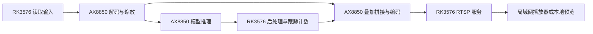

# AX8850 六路 AI 视频推流

在 RK3576 上部署六路 AI 视频演示，由 AX8850 算力卡完成视频处理和模型推理。部署完成后，可通过局域网播放器查看六路独立画面及一路 1920×1080 六宫格总览，也可在开发板桌面观看、录制结果。

**项目源码：[dshanpi/ax8850-multistream-demo](https://github.com/dshanpi/ax8850-multistream-demo)。** 本指南基于提交 `2aa772bbf16b8a904ee6ca57877c0e602208bf49`，统一使用该仓库的目录、脚本和服务名。

*在 RK3576 + AX8850 16GB 上取得的实测截图。六宫格展示检测、分割、跟踪、相对深度和计数结果。*

[观看本次实测录像](../ax650n/applications/six-streams/local-preview.md#查看部署效果)，或从下方第一步开始部署。

## 按顺序完成部署

首次部署依次完成前六步；更换视频、观察性能和排错放在基础演示运行之后。

| 步骤 | 完成的操作 | 进入下一步前检查 |
|---|---|---|
| [1. 准备环境](../ax650n/applications/six-streams/prepare.md) | 检查算力卡、依赖、磁盘与端口 | `axcl-smi` 可识别设备，资源充足 |
| [2. 获取项目与准备程序](../ax650n/applications/six-streams/implementation.md) | 下载源码、LFS 资源，选择预编译或源码构建 | 资源校验通过，运行库完整 |
| [3. 启动并检查](../ax650n/applications/six-streams/usage.md) | 启动推流与本地预览服务 | 六路计数持续增长 |
| [4. 观看与录制](../ax650n/applications/six-streams/local-preview.md) | 播放总览、单路画面并保存录像 | 画面更新，录像可解码 |
| [5. 效果与验收](../ax650n/applications/six-streams/validation.md) | 检查七路输出与 AI 效果 | 输出可解码，标注符合任务 |
| [6. 停止与重启](../usage/services.md) | 释放资源，重新加载配置 | 服务停止后可再次正常启动 |
| [7. 更换视频与配置](../ax650n/applications/six-streams/frame-rate.md) | 修改输入、帧率与模型配置 | 配置校验通过，重新验收 |
| [8. 测量帧率与资源](../ax650n/applications/six-streams/inference.md) | 区分视频帧率、推理帧率和资源占用 | 在相同条件下比较结果 |
| [9. 部署与播放排错](../ax650n/applications/six-streams/vlc-troubleshooting.md) | 按资源、服务、输出和播放器定位问题 | 恢复完整播放链路 |

## 了解六路任务

| 输出名称 | 展示任务 | 默认输入 | 模型 |
|---|---|---|---|
| `pcd` | 人、车等目标检测 | `traffic.mp4` | `pcd.axmodel` |
| `vehicle` | 车辆检测 | `traffic4.mp4` | `vehicle.axmodel` |
| `seg` | 实例分割 | `traffic3_slow_0p5x.mp4` | `seg.axmodel` |
| `driving` | 目标检测与跟踪 | `traffic7_slow_0p5x.mp4` | `yolo26n.axmodel` |
| `depth` | 相对深度热力图 | `traffic5.mp4` | `depth.axmodel` |
| `count` | 车辆过线计数 | `traffic6.mp4` | `vehicle.axmodel` |

视频文件位于 `videos/`，模型位于 `models/`；`overview` 将六路画面拼接为总览。深度结果表示相对远近，不是米制距离；移动视角下的计数仅用于演示，不能直接作为固定路口流量统计。

## 理解处理流程

画面更新与模型推理独立进行，画面使用最近完成的推理结果。因此，总览约 30 FPS 不代表六个模型都以 30 FPS 推理。

## 资料与源码

- [仓库 README](https://github.com/dshanpi/ax8850-multistream-demo/blob/2aa772bbf16b8a904ee6ca57877c0e602208bf49/README.md)：项目入口。
- [默认配置](https://github.com/dshanpi/ax8850-multistream-demo/blob/2aa772bbf16b8a904ee6ca57877c0e602208bf49/configs/six.json)：六路输入、模型与输出。
- [仓库验证记录](https://github.com/dshanpi/ax8850-multistream-demo/blob/2aa772bbf16b8a904ee6ca57877c0e602208bf49/docs/VALIDATION.md)：已记录的环境与验证范围。

仓库中的 `provenance/original-deployment/` 用于追溯旧部署。新部署从仓库根目录执行脚本，不使用归档中的绝对路径或旧服务名。
