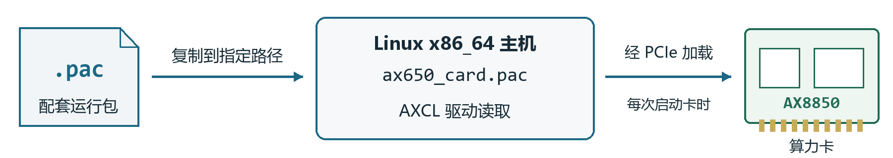

# AX8850 算力卡快速上手

Linux x86_64 主机　以 Ubuntu 22.04 为例　8GB 与 16GB 版本

适用于 Intel / AMD 64位Linux主机和已完成出厂配置的算力卡。

**命令在连接算力卡的物理主机 Linux 中执行。** 首次安装先不接卡，完成软件和PAC部署后再断电接卡。每一步确认无报错后再继续。

## 1 准备安装文件

按卡容量进入下载目录，选择文件名含 **x86_64**、后缀为 **.deb** 的安装包。

| 卡容量 | 安装包下载入口 |
|---|---|
| 8GB | [打开 8GB 下载目录](https://huggingface.co/AXERA-TECH/AXCL/tree/main/V3.16.0_8G) |
| 16GB | [打开 16GB 下载目录](https://huggingface.co/AXERA-TECH/AXCL/tree/main/V3.16.0_16G) |

在主机创建工作目录，将安装包和**随卡配套 PAC**放入其中，分别命名为 `axcl-x86_64.deb` 和 `card-runtime.pac`。

```sh
mkdir -p ~/axcl-setup
cd ~/axcl-setup
```

安装包与PAC均按卡版本选择，8GB与16GB的PAC不能混用。不要选择aarch64包；RPM系统应使用对应的 `.rpm` 和原厂安装流程。

## 2 检查环境并安装依赖

```sh
uname -m
uname -r
sudo apt update
sudo apt install -y build-essential patch kmod udev pciutils \
  libssl-dev bc flex bison libelf-dev mokutil
sudo apt install -y "linux-headers-$(uname -r)"
gcc --version
mokutil --sb-state
```

**检查结果**：架构应为 `x86_64`；headers匹配当前内核；GCC至少9.4，并满足当前内核的编译要求。若日志提示编译器不匹配，安装该内核要求的GCC版本后重试。

原厂当前驱动要求关闭Secure Boot。UEFI主机应显示 **SecureBoot disabled**；若已启用，到UEFI BIOS关闭后重新启动。传统BIOS主机可能提示不支持EFI变量，不能把该提示当作驱动故障。

headers找不到或安装报错时，先解决内核与软件源的匹配问题。本文以Ubuntu 22.04为例，其他发行版和内核版本需另行确认兼容性。[原厂安装说明](https://axcl-docs.readthedocs.io/zh-cn/latest/doc_guide_setup.html)

## 3 安装 AXCL 主机软件

```sh
cd ~/axcl-setup
sudo apt install -y ./axcl-x86_64.deb
dpkg-query -W -f='${Status} ${Version}\n' axclhost
modinfo -F vermagic axcl_host
```

**成功标志**：状态为 **install ok installed**，模块信息中的内核版本与 `uname -r` 一致。安装包提供驱动、运行库和工具，无需另行复制SDK中的 `.ko` 文件。

## 4 部署配套 PAC



将随卡提供的PAC复制到指定路径即可，无需解包或烧录。首次安装无需备份默认PAC。

```sh
cd ~/axcl-setup
sudo cp card-runtime.pac /lib/firmware/axcl/ax650_card.pac
sudo sync
cmp card-runtime.pac /lib/firmware/axcl/ax650_card.pac
```

**成功标志**：cmp没有输出且没有报错，表示两个文件相同。目标名称必须为 **ax650_card.pac**；复制或检查报错时先处理再继续。

新PAC在下次启动卡时加载，后续开机无需重复复制。重新安装或升级AXCL包后，需再次部署配套PAC。[原厂 PAC 说明](https://axcl-docs.readthedocs.io/zh-cn/latest/doc_guide_faq.html)

## 5 接卡启动并检查状态

```sh
sudo poweroff
```

主机关机后断电，将卡接入支持PCIe的M.2插槽或合适的转接板，固定散热片并接好风扇，再一起上电。仅支持SATA的M.2接口不适用。

```sh
lspci -nn | grep -iE 'axera|1f4b:0650'
sudo /usr/bin/axcl/axcl-smi
```

**成功标志**：能够发现PCIe设备，axcl-smi显示卡、温度和CMM信息，且没有初始化错误。


状态字段示意，以本机输出为准。随卡配套PAC的CMM总量参考：**8GB为7040MiB，16GB为15232MiB**；设备名称和已用量可能随版本与应用变化。

## 6 运行模型验证

将兼容AX650 / AXCL的模型放入 `~/axcl-setup`，命名为 `model.axmodel`，执行：

```sh
cd ~/axcl-setup
sudo /usr/bin/axcl/axcl_run_model -m ./model.axmodel -r 10
echo $?
```

**成功标志**：程序输出推理时间，退出码为 **0**。这表示基本运行通过，业务效果仍需实际输入验证；ONNX等文件不能直接代替 `.axmodel`。

### 常见问题

**安装失败**：查看 `sudo tail -n 80 /var/log/axclhost-install.log`，优先核对headers、GCC和Secure Boot。

**有PCIe但SMI无设备**：检查配套PAC，保存 `sudo dmesg` 输出交给供货方。卡端未启动时，不要反复查询SMI。

**多卡运行性能偏低**：再按原厂说明检查irqbalance及IOMMU；AXCL 3.16已支持IOMMU，首次使用无需默认修改GRUB。

运行时保持风扇工作，并在桌面电源设置中关闭自动睡眠。升级主机内核后重新匹配headers和驱动。[模型工具说明](https://axcl-docs.readthedocs.io/zh-cn/latest/doc_guide_quick_start.html)
