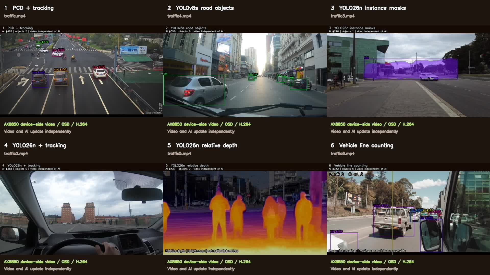

# 六路推流帧率优化验证

2026-09-16；RK3576 主机 `192.168.1.44`，AX8850 16GB 算力卡。

六路视频恢复到接近各自源帧率，总览由 10 提升到约 30 FPS。检测、分割、深度和跟踪模型沿用原配置。

## 实测帧率

本次统计窗口 **100.2 秒**，采样时程序已运行 120.3 秒。下表均为墙钟时间内计数器增量，随场景和其他负载变化。

| 通道 | 优化前真实画面/推理 FPS | 优化后真实画面 FPS | 优化后推理 FPS | 优化后编码 FPS |
|---|---:|---:|---:|---:|
| 1 pcd | 6.97 | 12.00 | 12.00 | 12.00 |
| 2 vehicle | 3.86 | 25.03 | 8.95 | 25.04 |
| 3 seg | 2.34 | 30.03 | 6.00 | 30.03 |
| 4 driving | 4.03 | 30.06 | 9.60 | 30.06 |
| 5 depth | 4.20 | 24.00 | 10.60 | 24.00 |
| 6 count | 3.76 | 24.08 | 8.45 | 24.07 |

旧版编码约 10 FPS，但重复使用最近一张完成推理的图像，因此真实画面更新只有约 2–7 FPS。新版每次处理新的解码帧，真实视频帧率不再受推理完成速度限制。第一路源视频本身为 12 FPS。

总览编码：**30.00 FPS**。总览中的低帧率输入格子仍按自身源帧率更新。

**视频帧率不等于推理帧率。** 标注使用最近完成的推理结果；快速运动时检测框、掩码和热力图可能稍滞后于当前画面。这次没有把六路推理都提高到 30 FPS。

## 检查结果

- 六路输入持续解码；六路视频及总览持续 H.264 编码、RTSP 输出。
- 统计期渲染队列替换、编码丢帧、提交错误、复用器错误均为 0。
- 七条 RTSP 分别拉流并解码 30 帧成功；Windows 客户端访问全部返回 RTSP 200，SDP 为 H.264。
- 检测框、分割掩码、深度热力图和过线计数经过抽帧检查；计数产生 11 次过线事件。
- 合并录像：1920×1080，约 30 FPS，1783 帧，59.43 秒；整段解码无错误。
- 主机应用 CPU 从约 380% 降到 222.8%（单核为 100%，8 核主机）；系统总忙碌率本次约 28.1%。这是短时采样。

[观看优化版录像](六路AI总览_帧率优化版_1080p30.mp4)

原始记录：`evidence/perf/validation-summary.json`、`runtime-final.log`、`rtsp-validation.json`、`lan-rtsp.json`、`recording-final.json` 和 `axcl-smi-final.txt`。

这是当前单卡的功能与性能验证，未进行多卡长时间稳定性验收。相对深度不代表米制距离；移动视角过线次数不等于固定路口车流量。
