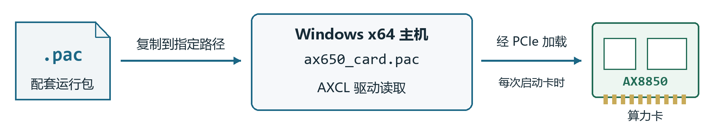

# AX8850 算力卡快速上手

Windows x64 主机　AXCL V3.16.0 Beta

适用于 Intel / AMD 64位Windows主机和已完成出厂配置的算力卡。按以下步骤准备环境、部署PAC并运行模型，无需烧录固件。

**命令使用管理员权限的64位PowerShell执行。** 本文以AXCL安装目录 `C:\AXCL` 为例。首次安装无需备份默认PAC。

## 1 检查系统并准备文件

按 **Win＋R**，输入 `winver` 查看系统版本。原厂支持Windows 10 22H2、Windows 11 23H2及以上的64位版本。

| 卡容量 | Windows 安装包 |
|---|---|
| 8GB | [下载 8GB Windows 安装器](https://huggingface.co/AXERA-TECH/AXCL/blob/main/V3.16.0_8G/axcl_win64_setup_V3.16.0_20260731020156_NO5288.exe) |
| 16GB | 使用供货方确认的Windows安装包与16GB配套PAC |

公开的16GB目录当前仅有Linux包。8GB安装器与16GB PAC的组合需供货方确认，不能仅按版本号相同判断兼容。

在资源管理器中创建 `C:\axcl-setup`，放入下载的安装器和**随卡配套PAC**，将PAC命名为 `card-runtime.pac`。Windows使用 `.exe` 安装器，不安装 `.deb` 或 `.rpm`。

## 2 准备环境并连接硬件

- 下载 [Microsoft Visual C++ x64 运行库](https://aka.ms/vs/17/release/vc_redist.x64.exe)，右键选择“以管理员身份运行”并安装。普通使用无需安装完整Visual Studio。
- 在“设置 → 系统 → 电源”中，将接通电源时的自动睡眠设为“从不”，保持散热片和风扇工作。
- 正常关机后断电，将AX8850接入支持PCIe的M.2插槽或合适的转接板，再一起上电。不要带电插拔。

按 **Win＋R**，输入 `devmgmt.msc` 打开设备管理器。安装驱动前可能显示“多媒体视频控制器”或未知设备；在“属性 → 详细信息 → 硬件ID”中查找 **VEN_1F4B**，默认设备ID为 **DEV_0650**。

**检查结果**：系统能够枚举到设备，再进入下一步。若主机已安装旧版AXCL，应先按原厂流程卸载旧版，再部署新的配套PAC。[原厂 Windows 说明](https://axcl-docs.readthedocs.io/zh-cn/latest/doc_guide_win_setup.html)

## 3 先部署配套 PAC



**先放好PAC，再安装驱动。** Windows固定加载系统目录中的 `System32\drivers\ax650_card.pac`，通常为 `C:\Windows\System32\drivers\ax650_card.pac`。

以管理员身份打开PowerShell，执行：

```powershell
cd C:\axcl-setup
Copy-Item .\card-runtime.pac "$env:windir\System32\drivers\ax650_card.pac" -Force
fc.exe /b .\card-runtime.pac "$env:windir\System32\drivers\ax650_card.pac"
```

`$env:windir` 表示本机Windows目录。**成功标志**：fc.exe提示未发现差异。复制或检查报错时先处理，不继续安装驱动。

## 4 安装 AXCL 主机软件

右键安装器，选择“以管理员身份运行”。在组件选择页按下表设置：

| 组件 | 设置 |
|---|---|
| AXCL Core Files | 保留勾选 |
| Windows Driver | 保留勾选 |
| AX650 Card Firmware | **取消勾选**，保留第3步的配套PAC |

安装目录选择 **C:\AXCL**。完成安装后重新启动Windows；如果使用其他安装目录，后续命令中的路径需相应调整。

取消固件组件是为了避免默认PAC覆盖随卡版本，不影响前两项的驱动和工具安装。上述组件名称适用于本指南链接的V3.16.0安装器；供货方重新打包的版本按随包说明操作。

**成功标志**：安装完成且没有驱动安装错误。

## 5 检查设备状态

重新打开设备管理器，在“系统设备”中查找 **Axera NPU Accelerator Device**，确认没有黄色警告标志。

以管理员身份打开PowerShell，执行：

```powershell
cd C:\AXCL\axcl\out\axcl_win_x64\bin
.\axcl-smi.exe
```

**成功标志**：显示卡、温度和CMM信息，且没有初始化错误。工具在安装目录中运行，不依赖系统PATH。


状态字段示意，以本机输出为准。8GB配套PAC的CMM总量参考为 **7040MiB**；16GB按供货方确认的PAC布局核对，不能用主机任务管理器判断卡端容量。

## 6 运行模型验证

将AX650 / AXCL兼容模型放入 `C:\axcl-setup`，命名为 `model.axmodel`。继续在上方工具目录执行：

```powershell
.\axcl_run_model.exe -m C:\axcl-setup\model.axmodel -r 10
$LASTEXITCODE
```

**成功标志**：程序输出推理时间，退出码为 **0**。这表示基本运行通过，业务效果仍需实际输入验证；ONNX等文件不能直接代替 `.axmodel`。

### 常见问题

**找不到工具或DLL**：检查实际安装目录，在完整的bin目录中运行；不要单独复制exe。缺少VC运行库时重新安装x64运行库。

**设备有黄色警告或SMI无设备**：记录设备状态中的错误码，检查配套PAC和安装器组件选项，并提供给供货方。不要反复运行SMI或自行关闭系统签名保护。

**PAC更新后未生效**：停止相关应用，重新复制配套PAC并重启Windows。重新安装AXCL时仍需避免默认固件组件覆盖配套PAC。

运行时保持风扇工作和系统不睡眠。Windows驱动目前由原厂标注为Beta，正式部署前应验证目标主机与实际业务。[原厂 Windows 说明](https://axcl-docs.readthedocs.io/zh-cn/latest/doc_guide_win_setup.html)
